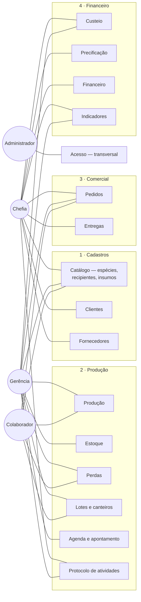
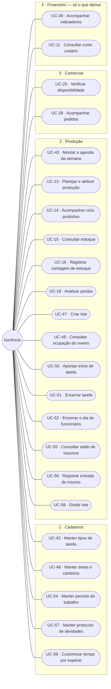
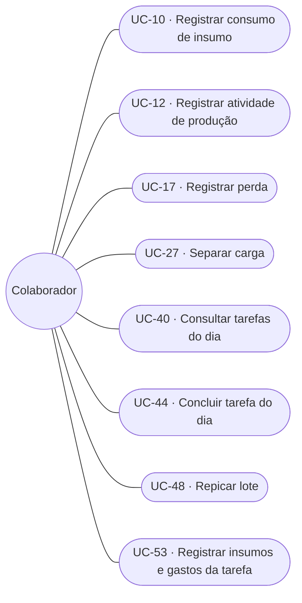
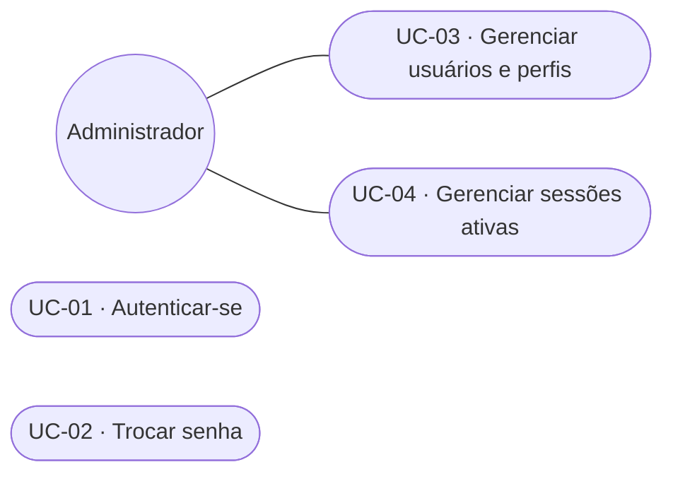

# C1: Diagrama de casos de uso

> **Artefato:** Diagrama de casos de uso (UML) · **Bloco:** C, Modelagem
> **Destino no TCC:** Capítulo 4, seção 4.4, Modelagem do sistema
> **Fundamentação:** Sommerville (2011) define o caso de uso como cenário que descreve o que o
> usuário espera do sistema, representando uma interação externa. Pressman e Maxim (2016) indicam
> que a construção parte da **definição dos atores**: todo elemento externo que se comunica com o
> sistema e possui uma meta ao utilizá-lo.

---

## 1. Atores

Os atores derivam diretamente da estrutura organizacional da empresa. A correspondência entre função
real e papel no sistema é a mesma registrada em
[`A1`](../A-fundacao/A1-documento-de-visao.md) e detalhada em
[`D4`](../D-arquitetura/D4-matriz-rbac.md).

| Ator | Meta ao utilizar o sistema | Nº de pessoas |
|---|---|---|
| **Chefia** | Vender com margem conhecida, decidir com base em dado e não em memória | 1 |
| **Gerência** | Coordenar a operação e saber o que existe, o que falta e o que está por vir | 2 |
| **Colaborador** | Registrar o que fez em campo, com o mínimo de interrupção do trabalho | 6 |
| **Administrador** | Manter o sistema operante e o acesso correto | 1 (acumulado pela gerência) |

**Sobre o administrador:** trata-se de **papel técnico**, não de função da empresa. Ele não participa
de nenhuma rotina de negócio e seus casos de uso limitam-se à gestão de usuários e permissões. É
representado à parte para que os casos de uso de negócio reflitam exclusivamente a operação real do
viveiro.

**Atores externos ao sistema**: sistemas com os quais há troca de informação, sem serem operados por
usuário do viveiro: o **emissor de nota fiscal** (sistema fiscal externo, que recebe os dados da
venda e devolve o número da nota), o **serviço de mensageria** (WhatsApp, por onde a negociação
ocorre) e o **serviço de geocodificação** (que converte cidade e estado do fornecedor em coordenadas).

---

## 2. Visão geral: atores e subsistemas

Os subsistemas estão agrupados nos **quatro módulos** do sistema
(`docs/rotinas/00-mapa-de-rotinas.md`). Acesso fica de fora porque atravessa os quatro.

Três leituras que o diagrama torna imediatas:

- **O colaborador toca cinco subsistemas, sempre pela ponta do registro.** Ele alimenta o sistema e
  não consulta resultado: não acessa preço, custo nem indicador. É o que justifica o rigor dos
  requisitos não funcionais de usabilidade: para esse ator, o sistema **é** o formulário. Lotes
  entrou nessa lista sem mudar a regra: ele **escolhe** o lote em que trabalhou, e o único lote que
  chega a **criar** é o que nasce da repicagem, dentro do gesto de encerrar a tarefa.
- **Custeio e precificação são do Financeiro, não da Produção.** A gerência toca o custeio para
  consultar, mas quem o alimenta é o extrato bancário, e é por isso que o preço do viveiro
  é estimativa enquanto o módulo 4 não rodar.
- **O subsistema Financeiro conecta-se a um único ator.** Não é omissão do diagrama, é regra de
  negócio: a base bancária mistura gasto do viveiro com gasto pessoal da família, e o acesso é
  restrito à chefia. Repare que **o módulo 4 não é restrito por inteiro**: a gerência toca
  Custeio, Precificação e Indicadores, que dele derivam sem o expor. A restrição é do recurso,
  não da porta do módulo ([`D4 §3.2`](../D-arquitetura/D4-matriz-rbac.md)).

---

## 3. Casos de uso por ator

> **Esta seção é por ator, e é de propósito.** A seção 2 agrupa por módulo, e o catálogo da seção 4
> traz a coluna **Módulo**: são três cortes do mesmo conjunto, e não resíduo da taxonomia anterior
> ao reagrupamento de 19/08/2026. Quem quer saber *o que este perfil faz* lê aqui; quem quer saber
> *o que este módulo contém* lê a seção 2. Registrado em 26/08/2026 para não ser "corrigido" numa
> próxima passada (achado K da [auditoria](../../auditoria-divergencias.md)).

### 3.1 Chefia

```mermaid
graph LR
  CH(("Chefia"))

  subgraph M1["1 · Cadastros"]
    UC05(["UC-05 · Manter catálogo de espécies"])
    UC06(["UC-06 · Manter recipientes"])
    UC07(["UC-07 · Manter insumos"])
    UC21(["UC-21 · Cadastrar cliente rápido"])
    UC22(["UC-22 · Manter cadastro de cliente"])
    UC23(["UC-23 · Consultar cliente"])
    UC31(["UC-31 · Manter fornecedor"])
    UC41(["UC-41 · Manter cadastro de funcionário"])
    UC45(["UC-45 · Manter centros de custo"])
  end

  subgraph M2["2 · Produção"]
    UC09(["UC-09 · Registrar coleta de sementes"])
    UC18(["UC-18 · Analisar perdas"])
  end

  subgraph M3["3 · Comercial"]
    UC24(["UC-24 · Cadastrar pedido"])
    UC26(["UC-26 · Fechar pedido"])
    UC28(["UC-28 · Acompanhar pedidos"])
    UC32(["UC-32 · Emitir cotação"])
    UC33(["UC-33 · Escolher proposta"])
    UC34(["UC-34 · Consultar mapa"])
    UC29(["UC-29 · Organizar agenda de entregas"])
    UC30(["UC-30 · Confirmar entrega"])
  end

  subgraph M4["4 · Financeiro"]
    UC08(["UC-08 · Registrar custos fixos"])
    UC11(["UC-11 · Consultar custo unitário"])
    UC19(["UC-19 · Definir margem por canal"])
    UC20(["UC-20 · Consultar preço por canal"])
    UC35(["UC-35 · Importar extrato bancário"])
    UC36(["UC-36 · Classificar lançamentos"])
    UC37(["UC-37 · Fechar o mês"])
    UC39(["UC-39 · Acompanhar indicadores"])
  end

  CH --- UC05
  CH --- UC06
  CH --- UC07
  CH --- UC08
  CH --- UC09
  CH --- UC21
  CH --- UC22
  CH --- UC23
  CH --- UC24
  CH --- UC26
  CH --- UC28
  CH --- UC19
  CH --- UC20
  CH --- UC11
  CH --- UC31
  CH --- UC41
  CH --- UC45
  CH --- UC32
  CH --- UC33
  CH --- UC34
  CH --- UC29
  CH --- UC30
  CH --- UC35
  CH --- UC36
  CH --- UC37
  CH --- UC18
  CH --- UC39
```

A concentração é acentuada: **vinte e sete dos cinquenta e nove casos de uso pertencem à chefia.** Não é
falha de distribuição: é o retrato de uma microempresa em que uma única pessoa responde por venda,
preço, compra, finanças e decisão. O sistema não redistribui responsabilidade; ele torna
verificável a que já existe.

### 3.2 Gerência

A gerência concentra-se no que **só é possível estando no viveiro**: contar estoque, planejar
produção e verificar disponibilidade. Nenhuma dessas tarefas pode ser executada à distância sem
virar adivinhação registrada como fato: que é precisamente o problema que o sistema existe para
eliminar.

### 3.3 Colaborador

Oito casos de uso, todos de registro ou consulta operacional. É deliberado: cada caso adicional
atribuído a esse ator aumenta a chance de que nenhum seja executado.

**Os dois que entraram nesta revisão são gestos, não telas.** Repicar (UC-48) e lançar insumo e
gasto (UC-53) acontecem **dentro** do encerramento da tarefa, e não em menu próprio: aparecem
aqui porque têm regra e pós-condição próprias, não porque acrescentem um item de navegação à
vida do colaborador.

**Quem opera o apontamento é a gerência** (UC-50, UC-51 e UC-52), não o colaborador. Uma pessoa
coordena a equipe inteira de um aparelho só: é ela quem marca que Rogério saiu da repicagem e foi
para a irrigação. UC-44 continua existindo para o colaborador que confirma a própria tarefa.

### 3.4 Administrador

**UC-01** e **UC-02** são comuns a todos os atores e, por isso, não se repetem nos diagramas
anteriores: todo caso de uso do sistema tem como pré-condição uma sessão autenticada.

---

## 4. Catálogo completo de casos de uso

A coluna **requisitos** faz a ligação com [`B2`](../B-requisitos/B2-especificacao-requisitos.md) e
alimenta a matriz de rastreabilidade [`B5`](../B-requisitos/B5-matriz-rastreabilidade.md). A coluna
**módulo** situa cada caso de uso na taxonomia de quatro módulos descrita em
[`00-mapa-de-rotinas`](../../rotinas/00-mapa-de-rotinas.md).

| Código | Caso de uso | Módulo | Ator principal | Requisitos | Detalhado em C2 |
|---|---|---|---|---|---|
| **UC-01** | Autenticar-se | Acesso | Todos | RF-01 | - |
| **UC-02** | Trocar senha | Acesso | Todos | RF-02 | - |
| **UC-03** | Gerenciar usuários e perfis | Acesso | Administrador | RF-05, RF-06 | - |
| **UC-04** | Gerenciar sessões ativas | Acesso | Todos | RF-03, RF-04, RF-07 | - |
| **UC-05** | Manter catálogo de espécies | 1 · Cad. | Chefia | RF-08, RF-09 | - |
| **UC-06** | Manter recipientes | 1 · Cad. | Chefia | RF-10 | - |
| **UC-07** | Manter insumos | 1 · Cad. | Chefia | RF-11 | - |
| **UC-08** | Registrar custos fixos | 4 · Fin. | Chefia | RF-12 | - |
| **UC-09** | Registrar coleta de sementes | 2 · Prod. | Chefia | RF-13 | - |
| **UC-10** | Registrar consumo de insumo | 2 · Prod. | Colaborador | RF-14 | - |
| **UC-11** | Consultar custo unitário | 4 · Fin. | Chefia, Gerência | RF-15, RF-16, RF-17, RF-18 | - |
| **UC-12** | Registrar atividade de produção | 2 · Prod. | Colaborador | RF-19 | - |
| **UC-13** | Planejar e atribuir produção | 2 · Prod. | Gerência | RF-20 | - |
| **UC-14** | Acompanhar ciclo produtivo | 2 · Prod. | Gerência | RF-21 | - |
| **UC-15** | Consultar estoque | 2 · Prod. | Chefia, Gerência | RF-22, RF-24 | - |
| **UC-16** | Registrar contagem de estoque | 2 · Prod. | Gerência | RF-23, RF-25 | - |
| **UC-17** | Registrar perda | 2 · Prod. | Colaborador | RF-26 | **✔ sim** |
| **UC-18** | Analisar perdas | 2 · Prod. | Gerência, Chefia | RF-27, RF-28, RF-29, RF-30 | - |
| **UC-19** | Definir margem por canal | 4 · Fin. | Chefia | RF-31 | - |
| **UC-20** | Consultar preço por canal | 4 · Fin. | Chefia, Gerência | RF-32, RF-33, RF-34, RF-35 | - |
| **UC-21** | Cadastrar cliente rápido | 1 · Cad. | Chefia | RF-36 | - |
| **UC-22** | Manter cadastro completo de cliente | 1 · Cad. | Chefia | RF-37, RF-38, RF-40 | - |
| **UC-23** | Consultar cliente | 1 · Cad. | Chefia | RF-39 | - |
| **UC-24** | Cadastrar pedido | 3 · Com. | Chefia | RF-41, RF-66, RF-67 | **✔ sim** |
| **UC-25** | Verificar disponibilidade | 3 · Com. | Gerência | RF-42, RF-43, RF-68 | **✔ sim** |
| **UC-26** | Fechar pedido | 3 · Com. | Chefia | RF-44, RF-45, RF-46 | **✔ sim** |
| **UC-27** | Separar carga | 3 · Com. | Colaborador | RF-47 | **✔ sim** |
| **UC-28** | Acompanhar pedidos | 3 · Com. | Chefia, Gerência | RF-48, RF-49 | - |
| **UC-29** | Organizar agenda de entregas | 3 · Com. | Chefia | RF-50 | - |
| **UC-30** | Confirmar entrega | 3 · Com. | Chefia | RF-51 | - |
| **UC-31** | Manter fornecedor | 1 · Cad. | Chefia | RF-52 | - |
| **UC-32** | Emitir cotação | 3 · Com. | Chefia | RF-53 | **✔ sim** |
| **UC-33** | Escolher proposta | 3 · Com. | Chefia | RF-54 | **✔ sim** |
| **UC-34** | Consultar mapa de fornecedores | 3 · Com. | Chefia | RF-55 | - |
| **UC-35** | Importar extrato bancário | 4 · Fin. | Chefia | RF-56 | - |
| **UC-36** | Classificar lançamentos | 4 · Fin. | Chefia | RF-57, RF-58, RF-59 | **✔ sim** |
| **UC-37** | Fechar o mês | 4 · Fin. | Chefia | RF-60, RF-61 | - |
| **UC-38** | Consultar faturamento | 4 · Fin. | Chefia | RF-61, RF-62 | - |
| **UC-39** | Acompanhar indicadores | 4 · Fin. | Chefia, Gerência | RF-63, RF-64, RF-65 | - |
| **UC-40** | Consultar tarefas do dia | 2 · Prod. | Colaborador | RF-74 | - |
| **UC-41** | Manter cadastro de funcionário | 1 · Cad. | Chefia | RF-69 | - |
| **UC-42** | Manter catálogo de tipos de tarefa | 1 · Cad. | Gerência | RF-70, RF-82 | - |
| **UC-43** | Montar a agenda da semana | 2 · Prod. | Gerência | RF-71, RF-72, RF-73, RF-75 | - |
| **UC-44** | Concluir tarefa do dia | 2 · Prod. | Colaborador | RF-74 | - |
| **UC-45** | Manter centros de custo | 1 · Cad. | Chefia | RF-77, RF-78, RF-79 | - |
| **UC-46** | Manter áreas e canteiros | 1 · Cad. | Gerência | RF-80, RF-81 | - |
| **UC-47** | Criar lote | 2 · Prod. | Gerência | RF-84, RF-90 | **✔ sim** |
| **UC-48** | Repicar lote | 2 · Prod. | Colaborador | RF-86, RF-87, RF-88 | **✔ sim** |
| **UC-49** | Consultar ocupação do viveiro | 2 · Prod. | Gerência | RF-85, RF-87, RF-89 | - |
| **UC-50** | Apontar início de tarefa | 2 · Prod. | Gerência | RF-94, RF-95, RF-97 | **✔ sim** |
| **UC-51** | Encerrar tarefa | 2 · Prod. | Gerência | RF-98, RF-99, RF-100, RF-101, RF-107 | **✔ sim** |
| **UC-52** | Encerrar o dia do funcionário | 2 · Prod. | Gerência | RF-96, RF-100 | - |
| **UC-53** | Registrar insumos e gastos da tarefa | 2 · Prod. | Colaborador | RF-101, RF-104, RF-105 | - |
| **UC-54** | Manter período de trabalho | 1 · Cad. | Gerência | RF-83 | - |
| **UC-55** | Consultar saldo de insumos | 2 · Prod. | Gerência | RF-102, RF-103 | - |
| **UC-56** | Registrar entrada de insumo | 2 · Prod. | Gerência | RF-106 | - |
| **UC-57** | Manter protocolo de atividades | 1 · Cad. | Gerência | RF-121, RF-122, RF-123, RF-124, RF-125 | **✔ sim** |
| **UC-58** | Dividir lote | 2 · Prod. | Gerência | RF-135 | **✔ sim** |
| **UC-59** | Customizar tempo de etapa por espécie | 1 · Cad. | Gerência | RF-133 | **✔ sim** |

**59 casos de uso.** Os quinze marcados são especificados em detalhe em
[`C2`](C2-especificacao-casos-de-uso.md): são os que concentram fluxos alternativos e exceções, e
aqueles cujo erro tem maior custo operacional.

**Os três últimos entraram em 26/08/2026, com o protocolo de atividades por lote.** UC-57 e UC-59
são de cadastro e, pela regra de seleção, não seriam especificados; estão marcados assim mesmo
porque o erro neles é **silencioso e diferido**: âncora escolhida errada só aparece semanas depois,
no lote que foi classificado cedo demais.

---
## 5. Nota sobre a notação

O Mermaid, empregado para versionar os diagramas em texto junto ao código, não implementa a notação
UML de caso de uso (ator como figura de palito, caso como elipse, sistema como retângulo delimitador).
Os diagramas acima representam **atores como círculos** e **casos de uso como formas arredondadas**,
preservando a semântica (ator, caso, associação e fronteira de subsistema) ainda que não a
representação gráfica canônica.

As figuras publicadas no trabalho são geradas em notação UML padrão a partir do mesmo conteúdo, e
ficam em [`../word/img/`](../word/img/).
