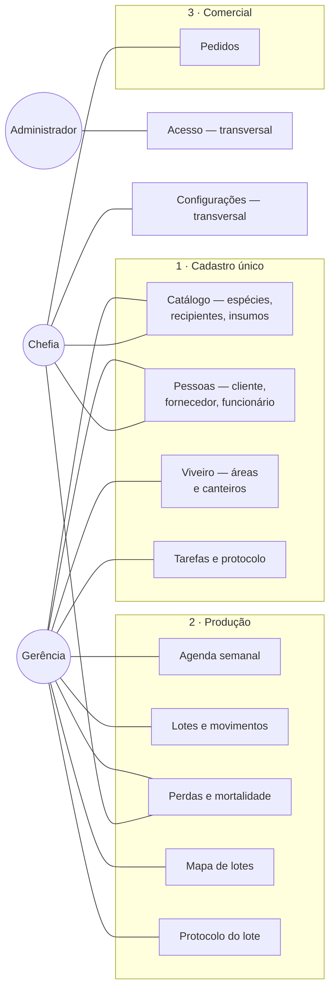
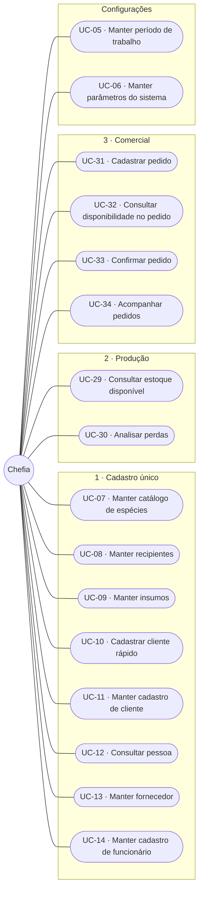
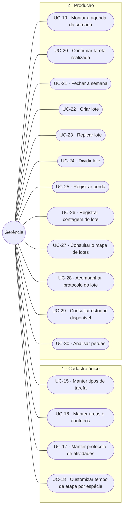
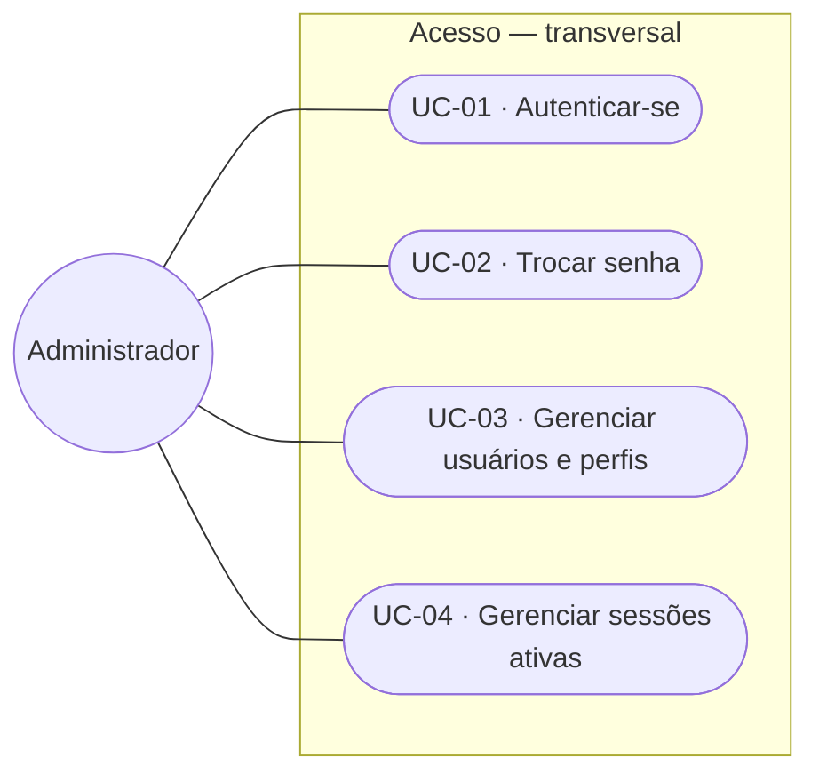

# C1: Diagrama de casos de uso

> **Artefato:** Diagrama de casos de uso (UML) · **Bloco:** C, Modelagem
> **Destino no TCC:** Capítulo 4, seção 4.4, Modelagem do sistema
> **Fundamentação:** Sommerville (2011) define o caso de uso como cenário que descreve o que o
> usuário espera do sistema, representando uma interação externa. Pressman e Maxim (2016) indicam
> que a construção parte da **definição dos atores**: todo elemento externo que se comunica com o
> sistema e possui uma meta ao utilizá-lo.

---

## 1. Atores

Os atores derivam diretamente da estrutura organizacional da empresa. A correspondência entre função
real e papel no sistema é a mesma registrada em
[`A1`](../A-fundacao/A1-documento-de-visao.md) e detalhada em
[`D4`](../D-arquitetura/D4-matriz-rbac.md).

| Ator | Meta ao utilizar o sistema | Nº de pessoas |
|---|---|---|
| **Chefia** | Vender e registrar o pedido, decidir com base em dado e não em memória | 1 |
| **Gerência** | Coordenar a operação e saber o que existe, o que falta e o que está por vir | 2 |
| **Administrador** | Manter o sistema operante e o acesso correto | 1 (acumulado pela gerência) |

**Sobre o administrador:** trata-se de **papel técnico**, não de função da empresa. Ele não participa
de nenhuma rotina de negócio e seus casos de uso limitam-se à gestão de usuários e permissões. É
representado à parte para que os casos de uso de negócio reflitam exclusivamente a operação real do
viveiro.

**Os colaboradores de campo não são atores do sistema.** São seis pessoas, e o trabalho delas é o
que a agenda organiza: aparecem como **funcionário**, o dado que a gerência atribui e confirma, e
não como quem opera uma tela. É a decisão de escopo registrada em
[`A1` §5](../A-fundacao/A1-documento-de-visao.md), e é o que explica por que nenhum caso de uso
abaixo tem o campo como origem: quem digita é sempre quem coordena.

**Atores externos ao sistema**: sistemas com os quais há troca de informação, sem serem operados por
usuário do viveiro: o **emissor de nota fiscal** (sistema fiscal externo, que recebe os dados
cadastrais do cliente) e o **serviço de mensageria** (WhatsApp, por onde a negociação ocorre antes
de o pedido ser registrado).

---

## 2. Visão geral: atores e subsistemas

Os subsistemas estão agrupados nas **três áreas de negócio** do sistema
(`docs/rotinas/00-mapa-de-rotinas.md`). Acesso e Configurações ficam de fora porque atravessam as
três.

Três leituras que o diagrama torna imediatas:

- **A gerência toca quase tudo, e é o traço central do sistema reduzido.** Com o campo fora do
  sistema, quem planeja é quem registra: a mesma pessoa monta a semana, confirma o que foi feito,
  cria o lote e olha o mapa. É o que justifica o rigor dos requisitos não funcionais de
  usabilidade, porque para esse ator o sistema **é** a rotina de coordenação.
- **O Cadastro único é o que as duas outras áreas consomem.** Nenhuma seta sai dele para a Produção
  ou para o Comercial no diagrama, e é justamente esse o ponto: ele não executa, ele alimenta. A
  espécie cadastrada uma vez vira tarefa, vira lote e vira item de pedido.
- **O Comercial conecta-se a um único ator.** Não é omissão do diagrama: quem vende é a chefia, e o
  pedido é o único ponto em que o sistema registra dinheiro. A gerência não precisa dele para
  operar, e o que ela produz chega ao pedido pelo saldo de muda pronta, e não por uma tela
  compartilhada.

---

## 3. Casos de uso por ator

> **Esta seção é por ator, e é de propósito.** A seção 2 agrupa por área, e o catálogo da seção 4
> traz a coluna **Área**: são três cortes do mesmo conjunto. Quem quer saber *o que este perfil
> faz* lê aqui; quem quer saber *o que esta área contém* lê a seção 2.

### 3.1 Chefia

### 3.2 Gerência

### 3.3 Administrador

**UC-01, UC-02 e UC-04 são de todos os perfis**, e aparecem no diagrama do administrador apenas
porque é ele quem responde pelo subsistema. Autenticar-se e trocar a senha são de quem tem login,
e ver as próprias sessões também.

---

## 4. Catálogo completo de casos de uso

A coluna **requisitos** faz a ligação com [`B2`](../B-requisitos/B2-especificacao-requisitos.md) e
alimenta a matriz de rastreabilidade [`B5`](../B-requisitos/B5-matriz-rastreabilidade.md). A coluna
**área** situa cada caso de uso na taxonomia descrita em
[`00-mapa-de-rotinas`](../../rotinas/00-mapa-de-rotinas.md).

| Código | Caso de uso | Área | Ator principal | Requisitos | Detalhado em C2 |
|---|---|---|---|---|---|
| **UC-01** | Autenticar-se | Acesso | Todos | RF-01 | - |
| **UC-02** | Trocar senha | Acesso | Todos | RF-02 | - |
| **UC-03** | Gerenciar usuários e perfis | Acesso | Administrador | RF-05, RF-06 | - |
| **UC-04** | Gerenciar sessões ativas | Acesso | Todos | RF-03, RF-04, RF-07 | - |
| **UC-05** | Manter período de trabalho | Config. | Chefia | RF-08 | - |
| **UC-06** | Manter parâmetros do sistema | Config. | Chefia | RF-09 | - |
| **UC-07** | Manter catálogo de espécies | 1 · Cad. | Chefia | RF-10 | - |
| **UC-08** | Manter recipientes | 1 · Cad. | Chefia | RF-11 | - |
| **UC-09** | Manter insumos | 1 · Cad. | Chefia | RF-12 | - |
| **UC-10** | Cadastrar cliente rápido | 1 · Cad. | Chefia | RF-15 | - |
| **UC-11** | Manter cadastro completo de cliente | 1 · Cad. | Chefia | RF-16, RF-17 | - |
| **UC-12** | Consultar pessoa | 1 · Cad. | Chefia | RF-18, RF-14 | - |
| **UC-13** | Manter fornecedor | 1 · Cad. | Chefia | RF-19 | - |
| **UC-14** | Manter cadastro de funcionário | 1 · Cad. | Chefia | RF-20 | - |
| **UC-15** | Manter catálogo de tipos de tarefa | 1 · Cad. | Gerência | RF-21 | - |
| **UC-16** | Manter áreas e canteiros | 1 · Cad. | Gerência | RF-13 | - |
| **UC-17** | Manter protocolo de atividades | 1 · Cad. | Gerência | RF-22, RF-23, RF-24 | **✔ sim** |
| **UC-18** | Customizar tempo de etapa por espécie | 1 · Cad. | Gerência | RF-25 | **✔ sim** |
| **UC-19** | Montar a agenda da semana | 2 · Prod. | Gerência | RF-27, RF-28, RF-29, RF-26 | - |
| **UC-20** | Confirmar tarefa realizada | 2 · Prod. | Gerência | RF-30, RF-31, RF-32 | **✔ sim** |
| **UC-21** | Fechar a semana | 2 · Prod. | Gerência | RF-33 | - |
| **UC-22** | Criar lote | 2 · Prod. | Gerência | RF-34, RF-50 | **✔ sim** |
| **UC-23** | Repicar lote | 2 · Prod. | Gerência | RF-36, RF-37, RF-38 | **✔ sim** |
| **UC-24** | Dividir lote | 2 · Prod. | Gerência | RF-42 | **✔ sim** |
| **UC-25** | Registrar perda | 2 · Prod. | Gerência | RF-40, RF-39 | **✔ sim** |
| **UC-26** | Registrar contagem do lote | 2 · Prod. | Gerência | RF-41 | - |
| **UC-27** | Consultar o mapa de lotes | 2 · Prod. | Gerência, Chefia | RF-35, RF-47, RF-48, RF-49 | - |
| **UC-28** | Acompanhar protocolo do lote | 2 · Prod. | Gerência | RF-55, RF-56, RF-57 | - |
| **UC-29** | Consultar estoque disponível | 2 · Prod. | Chefia, Gerência | RF-46 | - |
| **UC-30** | Analisar perdas | 2 · Prod. | Gerência, Chefia | RF-43, RF-44, RF-45 | - |
| **UC-31** | Cadastrar pedido | 3 · Com. | Chefia | RF-58, RF-59 | **✔ sim** |
| **UC-32** | Consultar disponibilidade no pedido | 3 · Com. | Chefia | RF-60 | **✔ sim** |
| **UC-33** | Confirmar pedido | 3 · Com. | Chefia | RF-61 | **✔ sim** |
| **UC-34** | Acompanhar pedidos | 3 · Com. | Chefia | RF-62 | - |

**34 casos de uso.** Os dez marcados são especificados em detalhe em
[`C2`](C2-especificacao-casos-de-uso.md): são os que concentram fluxos alternativos e exceções, e
aqueles cujo erro tem maior custo operacional.

**UC-17 e UC-18 são de cadastro e, pela regra de seleção, não seriam especificados**; estão
marcados assim mesmo porque o erro neles é **silencioso e diferido**: âncora escolhida errada só
aparece semanas depois, no lote que foi classificado cedo demais.

### 4.1 Os seis requisitos que não têm ator

Seis requisitos funcionais descrevem o que o sistema faz **sozinho**, sem ninguém acionar. Não têm
ator, e inventar um seria registrar uma interação que não existe.

| RF | O que o sistema faz sem ator | Caso de uso | Onde o resultado aparece |
|---|---|---|---|
| RF-44 | Calcula a taxa de mortalidade do lote | UC-30 | no próprio UC-30 |
| RF-48 | Classifica o lote em saudável, atenção e crítico | UC-27 | no próprio UC-27 |
| RF-51 | Gera as ordens de tarefa do protocolo na agenda | *nenhum* | UC-19 |
| RF-52 | Avança a fase do lote ao concluir etapa sequencial | *nenhum* | UC-28 |
| RF-53 | Conta a ocorrência seguinte a partir da execução real | *nenhum* | UC-28 |
| RF-54 | Mantém no máximo uma ordem em aberto por etapa | *nenhum* | UC-28 |

O padrão é o mesmo nos seis: **o valor é derivado, e derivar é o que dispensa a digitação**. É a
razão de o protocolo existir, e por isso a ausência de ator aqui é resultado, e não lacuna.

**Sem ator e sem caso de uso não são a mesma coisa, e a distinção decide um número do trabalho.**
RF-44 e RF-48 pertencem a um caso de uso, porque há alguém consultando a tela em que o valor
aparece, ainda que não seja essa pessoa quem dispara a conta. Os outros quatro não pertencem a
nenhum: rodam sem que ninguém abra tela alguma, e o resultado só se vê depois, no caso de uso de
outra pessoa. Por isso o contador de [`B5` §6](../B-requisitos/B5-matriz-rastreabilidade.md) diz
**58 de 62 requisitos com caso de uso**, e não 56.

---

## 5. Nota sobre a notação

O Mermaid, empregado para versionar os diagramas em texto junto ao código, não implementa a notação
UML de caso de uso (ator como figura de palito, caso como elipse, sistema como retângulo delimitador).
Os diagramas acima representam **atores como círculos** e **casos de uso como formas arredondadas**,
preservando a semântica (ator, caso, associação e fronteira de subsistema) ainda que não a
representação gráfica canônica.

As figuras publicadas no trabalho são geradas em notação UML padrão a partir do mesmo conteúdo, e
ficam em [`../word/img/`](../word/img/).
