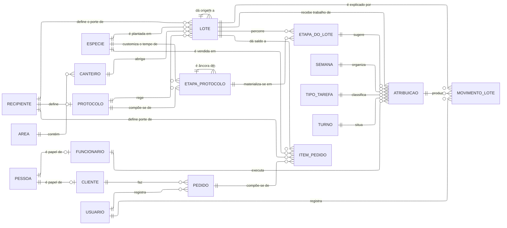
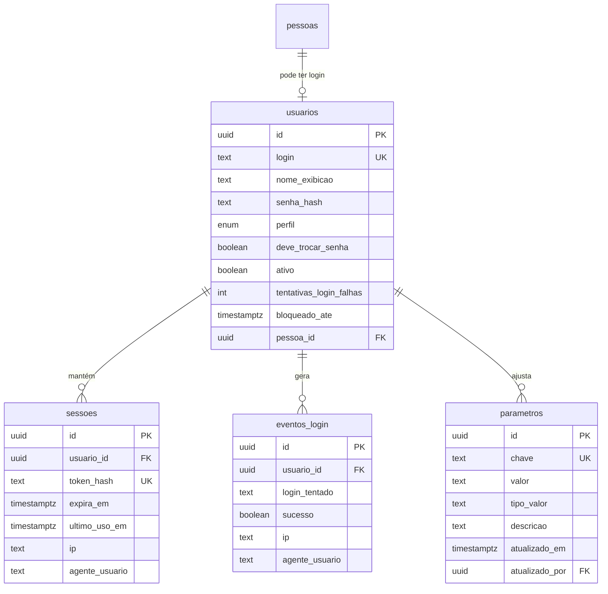
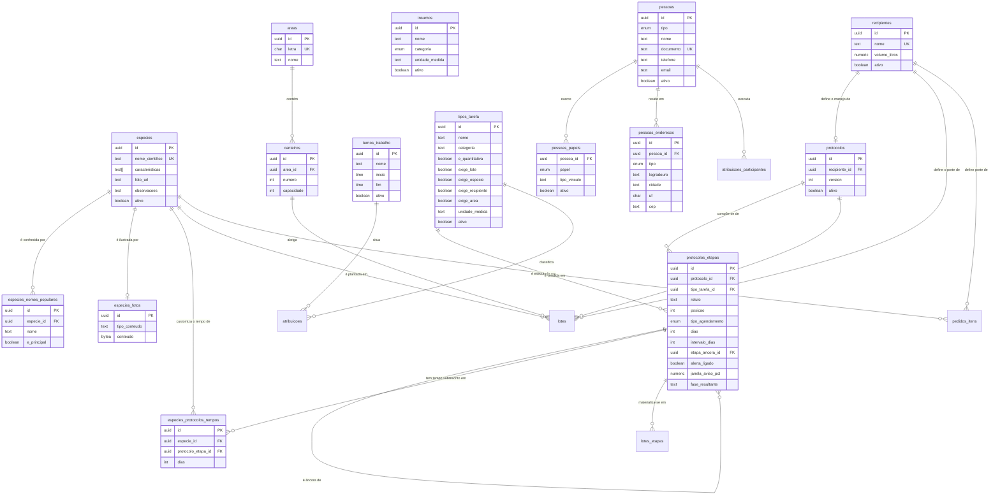
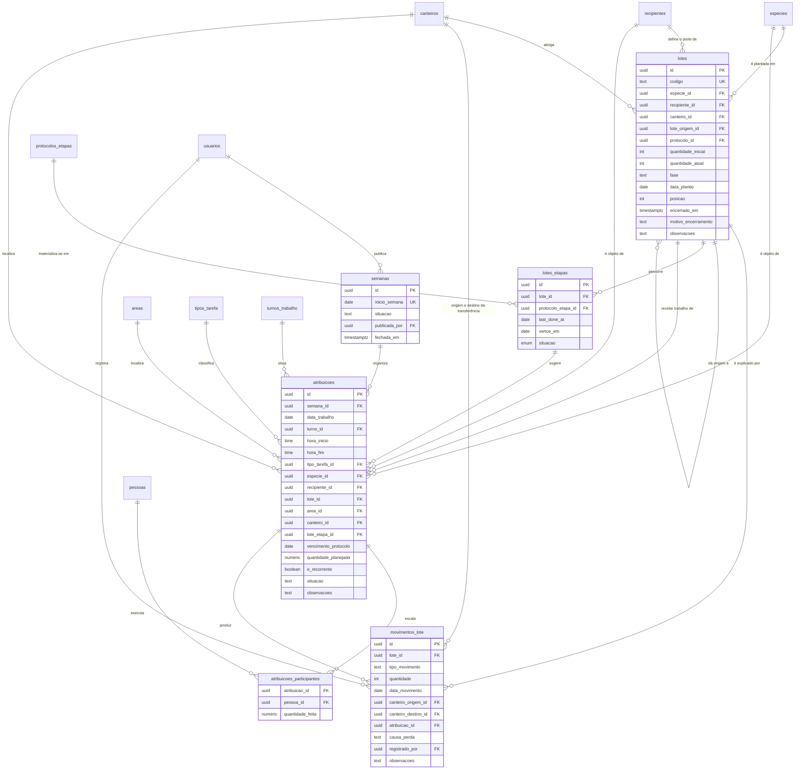
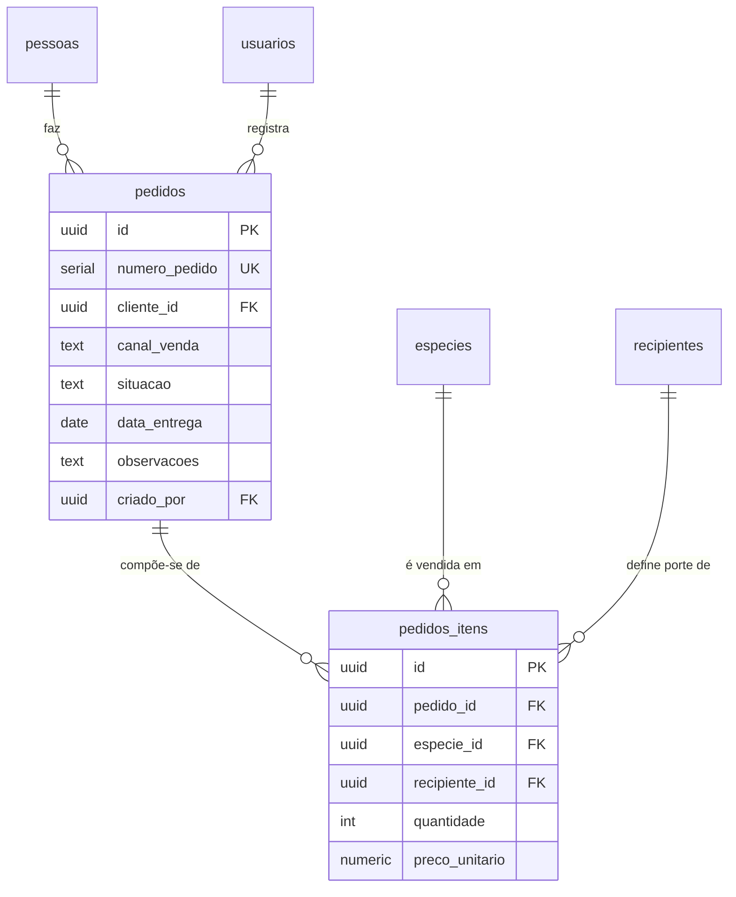

# C6: Modelo Entidade-Relacionamento

> **Artefato:** MER conceitual, lógico e físico · **Bloco:** C, Modelagem
> **Destino no TCC:** Capítulo 4, seção 4.5, Modelagem de dados
> **Fundamentação:** Elmasri e Navathe (2011) definem o modelo Entidade-Relacionamento como modelo
> conceitual de alto nível que abstrai objetos do mundo real em entidades descritas por atributos.
> A progressão conceitual → lógico → físico e os critérios de normalização seguem os mesmos autores.

> ⚠️ **Alterou este documento? O [`modelo-dados-pt`](../modelo-dados-pt/README.md) muda junto.**
> Ele é o mesmo modelo com tabelas e colunas em português, e é **fonte separada, renderizada à
> mão**: nenhum script o regenera. Entidade, atributo, chave ou cardinalidade que muda aqui muda
> lá, no `.mmd` da figura correspondente, com o `.png` regerado pelo comando do README de lá.

---

## 1. Estratégia de modelagem

**A espécie é a entidade central.** Lote, atribuição de tarefa, etapa de protocolo e item de pedido
referenciam-na por chave estrangeira. Essa centralidade não é preferência de projeto: é a tradução
direta da regra de negócio de que tudo no viveiro gira em torno da espécie (RN-01).

O modelo é apresentado em **quatro agrupamentos**: as três áreas de negócio do sistema, mais o
Acesso, que atravessa todas. Usar aqui o mesmo agrupamento dos requisitos
([`B2 §2`](../B-requisitos/B2-especificacao-requisitos.md)) e da matriz de acesso
([`D4 §2`](../D-arquitetura/D4-matriz-rbac.md)) permite ler os três documentos lado a lado sem
traduzir de um para o outro.

| Agrupamento | Entidades | Papel |
|---|---:|---|
| *(transversal)* **Acesso e configurações** | 4 | Autenticação, sessão, auditoria e parâmetros do sistema |
| **1 · Cadastro único** | 15 | Catálogo de produção, endereço do viveiro, identidade das pessoas e protocolo de manejo: não consome nada, alimenta tudo |
| **2 · Produção** | 6 | Agenda da semana, lote, movimento e percurso pelo protocolo |
| **3 · Comercial** | 2 | Pedido e item |
| **Total** | **27** | mais 2 visões derivadas (`situacao_lote` e `lotes_etapas_vencimento`), documentadas em [`C8`](C8-dicionario-de-dados.md) |

**O preço da escolha, declarado:** agrupar por propósito faz relacionamentos cruzarem a fronteira
do diagrama: `atribuicoes` é da Produção e aponta para `especies`, `recipientes`, `tipos_tarefa` e
`turnos_trabalho`, que são do Cadastro único. A convenção do §3 resolve isso sem duplicar conteúdo: a
entidade estrangeira aparece como **caixa vazia**, só para a aresta existir.

Uma realocação merece nota, porque contraria a intuição de onde a entidade nasceu:

- **O esquema `cadastro` (`pessoas`, `pessoas_papeis`, `pessoas_enderecos`) resolve um problema anterior ao de
  qualquer módulo.** Cliente, fornecedor e funcionário são papéis de **uma identidade só**, e o
  viveiro tem gente que é os três ao mesmo tempo. Modelar três tabelas de pessoa produziria três
  verdades sobre o mesmo telefone.

Convenções adotadas, conforme Elmasri e Navathe (2011): tabelas nomeadas no **plural**, chaves
primárias e estrangeiras declaradas explicitamente, e identificadores universais como chave
primária: o que permite gerar a chave no cliente antes da gravação, requisito do funcionamento sem
conexão (RNF-05).

---

## 2. Modelo conceitual: visão geral

Apenas entidades e relacionamentos, sem atributos. É a visão que responde "de que o sistema trata".

O diagrama conceitual apresenta **dezenove entidades**, e não as vinte e sete do modelo
completo. A redução é deliberada: Sommerville (2011) observa que a ausência de detalhe excessivo é
característica central do modelo, cujo objetivo é destacar o mais relevante e não especificar por
inteiro. Entidades associativas, de histórico e de auditoria aparecem apenas nos modelos lógicos por
área, na seção seguinte.

Seis leituras que o modelo conceitual já entrega:

- **A espécie participa de quatro relacionamentos e está presente nas três áreas**: o lote e a
  etapa do protocolo na Produção, o item de pedido no Comercial, e o próprio catálogo no Cadastro
  único. É a confirmação estrutural da centralidade declarada em RN-01. Um deles é de outra
  natureza que os demais: em `ESPECIE customiza o tempo de ETAPA_PROTOCOLO`, a espécie deixa de
  apenas participar do ciclo produtivo e passa a **parametrizá-lo**, decidindo em quantos dias
  cada etapa do manejo vence naquela espécie (RN-36).
- **O modelo tem duas entidades reflexivas.** `LOTE dá origem a LOTE` é a repicagem: a leva que
  muda de recipiente vira outra leva, ligada à primeira. Percorrer essa cadeia responde de quantas
  sementes semeadas saiu cada muda vendida, que é a pergunta que o viveiro nunca pôde responder. É
  também a entidade que dá **lugar** à muda: até 24/08/2026 o modelo dizia o que a muda era e não
  onde ela estava. A outra reflexiva é `ETAPA_PROTOCOLO é âncora de ETAPA_PROTOCOLO`, e ela diz
  **quando**: uma etapa do protocolo conta o prazo a partir da conclusão de outra, que não precisa
  ser a imediatamente anterior (RN-31).
- **O protocolo é o que liga a receita ao relógio.** `RECIPIENTE define PROTOCOLO`: o manejo é
  determinado pelo vasilhame em que a muda cresce (RN-30). É o que permite ao lote cobrar sozinho o
  que tem de receber, em vez de depender de alguém lembrar de lançar a tarefa.
- **O lote é o único caminho entre a Produção e o Comercial.** `LOTE dá saldo a ITEM_PEDIDO` é uma
  aresta de leitura, e não de chave estrangeira: o item não guarda de qual lote a muda saiu, ele
  consulta quanto existe. É a tradução no modelo do que o sistema existe para provar, e é
  deliberado que seja a única: nenhuma outra entidade das duas áreas se toca.
- **Nada aponta para dinheiro.** O preço é atributo do item de pedido, digitado por quem registra,
  e não há entidade de custo, de margem ou de lançamento. O sistema guarda por quanto se vendeu, e
  o que se gastou continua fora dele.
- **A pessoa é uma, e os papéis é que se multiplicam.** `PESSOA é papel de CLIENTE` e
  `PESSOA é papel de FUNCIONARIO` desenham a mesma identidade vista de dois lados. Quem vende muda
  ao viveiro e às vezes compra dele é um cadastro só (RN-45).

---

### 2.1 Recorte implementado

O modelo descrito aqui é o **especificado**. Das 27 entidades, **23 existem no banco** (mais a
visão `situacao_lote`) e **4 permanecem só especificadas**: as três do protocolo, mais o percurso do
lote por ele e a visão que daí deriva.

| Área | No banco | Só especificadas | Quais faltam |
|---|---:|---:|---|
| *(transversal)* Acesso e configurações | 4 | 0 | - |
| 1 · Cadastro único | 12 | 3 | `protocolos`, `protocolos_etapas`, `especies_protocolos_tempos` |
| 2 · Produção | 5 | 1 | `lotes_etapas`, mais a visão `lotes_etapas_vencimento` |
| 3 · Comercial | 2 | 0 | - |
| **Total** | **23** | **4** | |

O [`C8`](C8-dicionario-de-dados.md) marca a condição entidade por entidade.

**O que falta é o protocolo, e a razão é declarada.** Ele foi especificado inteiro **antes de
qualquer migration**, porque envolve um motor de geração automática de ordens: modelar depois de
construir, aqui, custaria reescrever a regra de contagem em três lugares. É também a parte do
sistema em que o erro é mais caro, e é por isso que dois dos dez casos de uso detalhados em
[`C2`](C2-especificacao-casos-de-uso.md) são dele.

---

## 3. Modelo lógico por área

Convenção dos diagramas: entidade de **outra** área aparece como **caixa vazia**, apenas para que
a aresta exista. Os atributos dela estão no diagrama da área a que pertence.

Atributos comuns à maioria das entidades, omitidos dos diagramas para não repetir vinte e sete
vezes: `id` (chave primária), `criado_em` e `atualizado_em`. Onde `ativo` aparece, é a marca de
inativação que substitui a exclusão. As exceções, tabelas sem `atualizado_em` porque nada nelas se
altera, e as duas de ligação, sem `id` porque a chave é o par que as define, estão registradas uma
a uma no [dicionário](C8-dicionario-de-dados.md).

**`text` na coluna de tipo, com lista fechada de valores, é `TEXT` mais restrição `CHECK` no
banco; `enum` é tipo enumerado de verdade.** A distinção importa na manutenção: acrescentar valor a
um `CHECK` é reescrever a restrição, e a um `ENUM` é `ALTER TYPE`. Os cinco tipos enumerados são
`perfil_usuario`, `categoria_insumo` e os três do esquema `cadastro`.

### 3.1 Acesso e configurações: transversal às três áreas

**`usuarios.pessoa_id` é opcional, e a opcionalidade é a regra.** Usuário é *credencial*; funcionário é
*vínculo* (`cadastro.pessoas`). Há pessoa com login e sem vínculo (o administrador), e pessoa com
vínculo e sem login: são seis delas, os colaboradores de campo, que aparecem na agenda sem nunca
abrir o aplicativo. Fundir as duas numa tabela só obrigaria a inventar um dos dois lados.

**O enum `perfil` tem três valores**: `chefia`, `gerencia` e `admin`. O quarto, `colaborador`, saiu
com a decisão de escopo de que o campo não opera o sistema ([`A1` §5](../A-fundacao/A1-documento-de-visao.md)).
Note que `cadastro.pessoas_papeis.papel` continua tendo o valor `funcionario`, e **não é o mesmo
conceito**: ali é vínculo de trabalho, aqui é permissão de acesso.

**`parametros` é transversal e não é cadastro.** Guarda parâmetro escalar do sistema em chave e valor
tipado: o limite de mortalidade, os limites de atraso que pintam o lote no mapa. Todos morariam em
constante de código, e **são regra de negócio, não infraestrutura**: quem os decide é a chefia, e
mudar qualquer um deles exigiria uma implantação (RF-09, RN-26).

> **Onde está a fronteira entre `parametros` e cadastro.** Parâmetro que é **um valor** vai para
> `parametros`. Parâmetro que é **uma lista de coisas com atributos** vira entidade: é o caso do
> período de trabalho, que é `turnos_trabalho` no Cadastro único e não duas chaves aqui, ainda que a
> **tela** dos dois seja a mesma, em Configurações do sistema. A regra de corte é a do Cadastro
> único: se apagar deixa um movimento passado sem sentido, é entidade.

### 3.2 Área 1 · Cadastro único

O que é estável e se repete. Não consome nada e alimenta as outras duas: as únicas arestas que
saem daqui apontam para entidades da Produção e do Comercial, e é por isso que `atribuicoes`,
`lotes`, `lotes_etapas` e `pedidos_itens` aparecem como caixa vazia no fim do diagrama.

**O protocolo de atividades é cadastro, e não Produção.** É a mesma regra que já colocava
`tipos_tarefa` e `turnos_trabalho` aqui: o que é **mantido uma vez e consultado sempre** é cadastro,
ainda que só a Produção o consuma. O que a Produção guarda é o percurso de **cada lote** pelo
protocolo (`lotes_etapas`), que é dado de movimento e fica na §3.3.

**`insumos` não tem aresta neste diagrama, e é informação.** O insumo é catálogo: o sistema registra
que ele existe, com unidade e categoria, e nada o consome. O consumo de insumo por tarefa e o saldo
em estoque ficaram fora do escopo, e mantê-lo no cadastro é o que permite que a tarefa o
referencie quando isso deixar de ser verdade.

**A espécie tem nomes, e não um nome.** `especies_nomes_populares` existe porque a busca precisa
encontrar a espécie por qualquer denominação regional (RF-10, RN-02), e um campo de texto com nomes
separados por vírgula não se indexa nem se valida. `e_principal` marca o nome que as telas exibem.

**A foto é linha de tabela, e não arquivo em disco.** `especies_fotos` guarda os bytes porque o
sistema de arquivos do ambiente de publicação é somente-leitura e é descartado a cada implantação:
a imagem gravada em disco desapareceria na semana seguinte. O ganho colateral é que a foto entra no
mesmo backup do banco.

**`especies é ilustrada por especies_fotos` é aresta de leitura, e não de chave estrangeira**, do
mesmo tipo que `LOTE dá saldo a ITEM_PEDIDO` no diagrama conceitual. `especies_fotos` não tem
`especie_id`: o envio da foto acontece antes de a espécie existir, e a chave estrangeira não teria
a que apontar no momento da gravação. Quem liga as duas é o texto de `especies.foto_url`, no
formato `/api/fotos/<uuid>`.

**O canteiro tem capacidade, e ela não é restrição.** `canteiros.capacidade` existe para o aviso de
RN-28, que informa que a leva talvez não caiba, e não para recusar o lote: quem sabe se cabe é
quem está com a muda na mão.

**`pessoas_papeis` é chave composta, e o papel é que carrega o vínculo.** `tipo_vinculo` (fixo ou
diarista) só faz sentido no papel `funcionario`, e fica nele em vez de poluir `pessoas` com uma
coluna que é nula em toda pessoa que só compra.

#### O protocolo: o que o lote tem de receber, lembre alguém ou não

`protocolos_etapas` é a entidade com mais atributos do modelo, e cada um resolve uma pergunta que o
viveiro faz em voz alta.

- **`tipo_agendamento`** separa a etapa **sequencial**, que ocorre uma vez e pode avançar a fase do
  lote, da **recorrente**, que repete indefinidamente e não avança fase nenhuma (RN-34).
- **`etapa_ancora_id`** é a âncora, e é reflexiva: a etapa conta o prazo a partir da conclusão de
  **outra etapa declarada**, e não da anterior na lista (RN-31). Classificar pós-germinação conta
  do plantio, e não da criação do lote, porque a semente pode ficar dias esperando plantio.
  Âncora nula significa contar da criação do lote.
- **`dias` e `intervalo_dias`** são o prazo e, na recorrente, o intervalo entre ocorrências.
- **`janela_aviso_pct`** é a janela de aviso **em percentual do intervalo**, e não em dias fixos
  (RN-35): três dias de antecedência não servem à etapa trimestral e à diária ao mesmo tempo.
- **`alerta_ligado`** desliga a cor de uma etapa que se repete tanto que sinalizá-la seria ruído
  (RN-35).
- **`fase_resultante`** é opcional: nem toda etapa sequencial promove o lote de fase, e obrigar a
  escolher uma faria inventar transições que o ciclo produtivo não tem.

**A âncora circular é validação de aplicação, e não do banco.** Duas etapas que se ancoram
mutuamente não violam nenhuma restrição declarativa, e nenhuma das duas jamais venceria: a
verificação mora no código, e o caso de exceção está escrito em [`C2`](C2-especificacao-casos-de-uso.md)
UC-17 FE-1.

### 3.3 Área 2 · Produção

O que acontece uma vez. Consome o Cadastro único inteiro e não é consumido por ninguém, exceto pelo
saldo que o Comercial lê.

#### O lote: onde a muda está e de que leva veio

**`lotes.quantidade_atual` é a única quantidade materializada do modelo, e a exceção é
declarada.** O saldo poderia ser somado de `movimentos_lote` a cada leitura. Aqui não: a tela de
ocupação lê o saldo de todos os lotes abertos de uma vez, no celular, em rede instável.
`movimentos_lote` é a fonte que o audita, e **divergência entre os dois é defeito detectável**, que
é o que justifica manter os dois.

**`canteiro_id` é nulo apenas no lote encerrado.** Enquanto aberto, todo lote tem canteiro: lote sem
lugar é a situação que a entidade existe para eliminar. Ao encerrar, o canteiro é liberado (RN-22),
e a restrição que garante os dois lados da regra é uma só.

**`lote_origem_id` é a repicagem.** A muda que passa do tubete para o saco mudou de recipiente, e
recipiente define produto e preço: comercialmente, virou outra coisa (RN-20). Percorrer esta cadeia
responde, de cada mil sementes semeadas, quantas mudas chegaram à venda.

**Um lote ocupa um canteiro; um canteiro comporta vários lotes** (RN-19). A exclusividade que o
modelo garante é a do lote, não a do canteiro: um canteiro recebe seis, oito, nove levas ao longo
do tempo, e é assim que ele é usado.

#### O movimento: o razão que explica o saldo

**Toda alteração de `quantidade_atual` tem uma linha em `movimentos_lote`.** `tipo_movimento` aceita
`entrada`, `perda`, `repicagem_saida`, `repicagem_entrada`, `venda`, `ajuste_contagem` e
`transferencia`. A quantidade é assinada: positiva na entrada, negativa na saída, e zero apenas na
transferência, em que o que muda é o canteiro e não o saldo.

**A perda não tem tabela própria, e é decisão de modelagem.** Ela é um `tipo_movimento`, com
`causa_perda` em lista fechada (RN-10). Uma entidade separada de perda obrigaria a gravar duas
linhas por perda, uma nela e outra no razão do lote, e a divergir quando alguém gravasse só uma.
Pelo mesmo motivo a contagem física é um movimento de `ajuste_contagem` (RN-09) e não uma entidade
de contagem: o que interessa da contagem é o ajuste que ela produziu.

**A mortalidade é derivada daqui**, e não guardada: é a soma dos movimentos de tipo `perda` sobre
`quantidade_inicial` (RN-11). Guardá-la criaria duas verdades sobre o mesmo número, e ela mudaria a
cada perda registrada.

**`atribuicao_id` liga o movimento à tarefa que o causou, e é opcional.** Movimento sem origem é o
ajuste manual da gerência, que existe e precisa caber: prendê-lo a uma origem obrigatória faria a
correção de um erro de digitação ser impossível sem inventar uma perda que não houve.

#### A agenda: o planejado e o confirmado, na mesma linha

**`atribuicoes` é a célula da agenda, e carrega as duas coisas.** `situacao` percorre `planejada`,
`confirmada` e `nao_confirmada`, e é isso que dispensa uma entidade de execução separada: o
realizado é o planejado com a marca de que aconteceu. `nao_confirmada` é o que o fechamento da
semana grava no que ninguém confirmou (RN-14), e é o que preserva a distinção entre o que se
confirmou e o que se presumiu.

**A quantidade é de cada pessoa, e por isso mora em `atribuicoes_participantes`** (RN-23). Quatro pessoas
enchendo saquinho produzem quatro números, e é assim que o viveiro fala. Guardar um total na
atribuição perderia justamente o dado que ele quer.

**`e_recorrente` é uma marca, e não uma regra de calendário.** Ela diz que a atribuição faz parte da
rotina fixa e, por isso, vem preenchida quando se copia a semana anterior (RF-27, RN-29). Uma
entidade de recorrência, com dias da semana e vigência, existiria para gerar dias sozinha, e o que
gera dia sozinho neste modelo é o protocolo, cujo sujeito é o lote e não a equipe.

**`lote_etapa_id` é o que liga a tarefa à sugestão que a originou** (RF-47). A tarefa aceita não é
uma entidade nova: é uma linha de `atribuicoes` que sabe de que etapa veio. O protocolo em si não
escreve aqui nada: ele diz o que e quando, e a linha só nasce quando alguém aceita a sugestão e a
preenche por inteiro, participantes inclusive. `lote_etapa_id` nulo é a tarefa lançada sem sugestão
nenhuma por trás.

#### O percurso do lote pelo protocolo

`lotes_etapas` é a única entidade de movimento do protocolo, e guarda três datas por etapa
e por lote: a última execução, o próximo vencimento e a situação.

**`vence_em` é derivado, nunca digitado** (RN-40): sai da âncora, da última execução e do tempo
declarado, com a customização por espécie sobrescrevendo o tempo do protocolo quando existir
(RN-36). É o que a visão `lotes_etapas_vencimento` calcula, e é dela que sai a cor do lote no mapa.

**Uma etapa tem no máximo uma ocorrência em aberto** (RN-33). Etapa trimestral esquecida há cinco
meses apresenta **uma** pendência, e não cinco: gerar uma ordem por trimestre vencido encheria a
agenda com um passado que ninguém vai executar.

**A situação do lote é visão, e não coluna** (RF-45). `situacao_lote` é calculada a cada leitura
porque situacao gravado envelhece sozinho: o lote que estava verde ontem continuaria verde no banco
hoje, e a tela existe justamente para dizer o contrário. É a mesma razão de a mortalidade e o saldo
disponível também serem derivados.

### 3.4 Área 3 · Comercial

Duas entidades, e é o tamanho certo. O pedido registra o que foi negociado fora do sistema.

**`pedidos.cliente_id` aponta para `cadastro.pessoas`, e não para uma tabela de clientes.** É a
materialização do cadastro único (RN-45): o cliente é uma pessoa que exerce o papel de cliente, e o
pedido referencia a pessoa. Uma tabela `clientes` própria duplicaria nome, telefone e documento de
quem também é fornecedor.

**`preco_unitario` é digitado, e não referencia tabela de preço** (RN-50). Não há entidade de canal de
venda nem de tabela de preços: `canal_venda` é enumeração em `pedidos`, porque canal de venda é uma
lista fechada de cinco valores sem atributos próprios (RN-42), e o preço é o que foi acordado na
conversa.

**Não há entidade de disponibilidade.** O saldo que o item exibe (RF-56) é calculado dos lotes
prontos daquela espécie e recipiente, a cada consulta. Guardá-lo no item congelaria uma leitura que
muda a cada perda registrada, e o item passaria a mentir sobre o estoque de hoje.

**Não há histórico de estados do pedido.** `situacao` percorre `rascunho`, `confirmado` e
`cancelado`, e o que o negócio precisa saber é em qual deles o pedido está. Uma tabela de histórico
existiria para responder quem mudou o quê e quando, pergunta que o viveiro de nove pessoas resolve
perguntando.

---

## 4. Nota de normalização

O modelo está na **terceira forma normal**, com duas exceções deliberadas, ambas de desempenho de
leitura e ambas auditáveis:

| Exceção | Por quê | Como se audita |
|---|---|---|
| `lotes.quantidade_atual` | A tela de ocupação lê o saldo de dezenas de lotes de uma vez, no celular, em rede instável. Somar `movimentos_lote` a cada leitura tornaria a tela inutilizável no dispositivo em que ela é usada | A soma dos movimentos do lote tem de reproduzir o saldo. Divergência é defeito, e é detectável por consulta |
| `especies_nomes_populares.e_principal` | Evita subconsulta em toda listagem de espécie | Índice único parcial garante um só nome primário por espécie |

**As demais derivações não foram materializadas**, e é a decisão que o modelo mais repete: saldo
disponível, mortalidade, ocupação do canteiro, situação do lote e vencimento da etapa são todos
calculados na leitura. O critério é sempre o mesmo: **o valor guardado envelhece sozinho**. O saldo
do lote é a exceção porque ele só muda quando alguém grava um movimento, e o movimento é a própria
prova.

---

## 5. Observação sobre a origem deste artefato

O modelo não foi desenhado antes da implementação nem extraído dela: as duas coisas andaram juntas.
O que está aqui é o modelo **especificado**, e o §2.1 declara o que dele existe no banco.

A alteração deste documento obriga a três lugares, e o aviso do topo existe porque os três já
divergiram: o dicionário de dados ([`C8`](C8-dicionario-de-dados.md)), as figuras em português
([`modelo-dados-pt`](../modelo-dados-pt/README.md)) e as migrações em `migrations/`.
