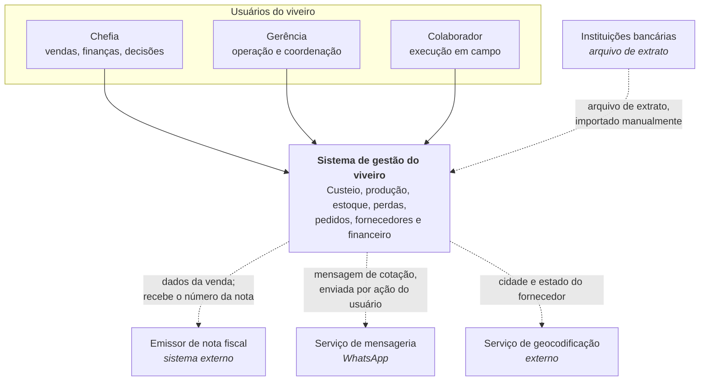
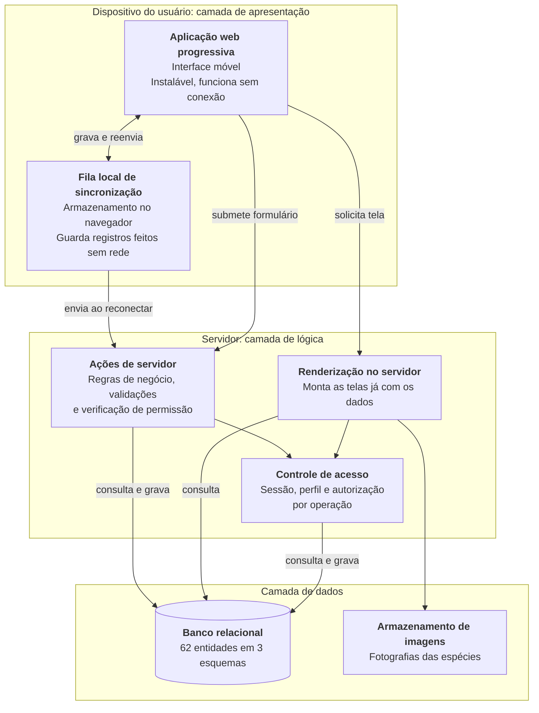
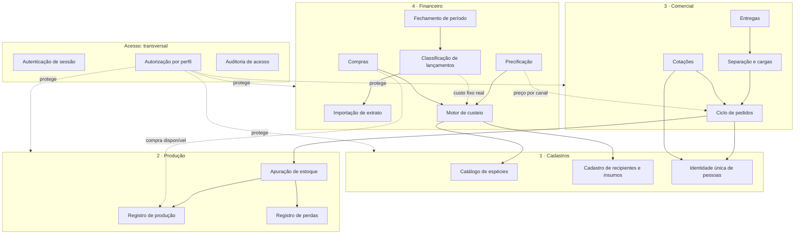

# D1: Documento de arquitetura

> **Artefato:** Documento de arquitetura (modelo C4) · **Bloco:** D, Arquitetura
> **Destino no TCC:** Capítulo 4, seção 4.6, Arquitetura da solução
> **Fundamentação:** Sommerville (2011) descreve a arquitetura cliente-servidor como conjunto de
> serviços e servidores acessados por clientes, e apresenta o sistema de informação genérico
> estruturado em **três camadas**: comunicação com o usuário, lógica da aplicação, e gerenciamento do
> banco de dados. Este documento organiza a arquitetura em níveis progressivos de detalhe e mapeia
> cada nível a essas três camadas.

---

## 1. As três camadas antes dos diagramas

A arquitetura adotada é **cliente-servidor em três camadas**, conforme o sistema de informação
genérico de Sommerville (2011). Antes de detalhar, convém fixar o que cada camada é neste sistema:

| Camada de Sommerville | Neste sistema | Onde executa |
|---|---|---|
| **Comunicação com o usuário** | Interface acessada pelo navegador do celular, concebida para uso móvel e instalável como aplicativo web progressivo | Dispositivo do usuário |
| **Lógica da aplicação** | Regras de negócio, validações e controle de acesso, executados exclusivamente no servidor | Servidor de aplicação |
| **Gerenciamento do banco de dados** | Sistema gerenciador relacional, responsável pela persistência e pela integridade | Servidor de banco |

**A decisão arquitetural mais determinante é a fronteira entre a primeira e a segunda camada.** As
regras de acesso a dados são executadas no servidor e nunca no navegador (RNF-12). O navegador
recebe apenas o resultado já filtrado pelo perfil do usuário, nunca a credencial de banco, nunca a
regra que decide o que ele pode ver. Um usuário que inspecione o código entregue ao seu dispositivo
não encontra ali nada que lhe permita contornar a autorização.

---

## 2. Nível 1: Contexto

Quem usa o sistema e com que sistemas externos ele troca informação.

**Nenhuma das integrações externas é automática.** O envio da cotação é sempre clique do usuário; o
extrato é arquivo que a chefia baixa e importa; a nota fiscal é emitida no sistema externo e o número
é informado de volta. É decisão de projeto compatível com a restrição de orçamento e com a
inexistência de interface programática nos sistemas envolvidos, e, no caso da mensageria, também de
conformidade (ver [`E5`](../E-qualidade/E5-mapeamento-lgpd.md)).

---

## 3. Nível 2: Contêineres

As unidades executáveis e de armazenamento, e a correspondência com as três camadas.

### Justificativa dos contêineres

| Contêiner | Por que existe |
|---|---|
| **Aplicação web progressiva** | Atende ao uso móvel (RE-2) sem exigir instalação por loja de aplicativos (RNF-26), o que elimina custo e fricção de distribuição para nove usuários |
| **Fila local de sincronização** | A conexão no viveiro é instável (RE-3). Sem ela, o registro em campo falharia justamente onde mais ocorre, e seria substituído por papel |
| **Renderização no servidor** | Permite que a tela chegue ao celular já com os dados, reduzindo o número de idas e voltas sob rede lenta (RNF-07) |
| **Ações de servidor** | Concentram regra de negócio e verificação de permissão do lado do servidor, atendendo ao RNF-12 |
| **Controle de acesso** | Verificação por operação, e não apenas ocultação de elementos na interface (RF-06) |
| **Banco relacional** | Integridade referencial e restrições declarativas, indispensáveis a um modelo com 62 entidades interligadas |

---

## 4. Nível 3: Componentes da camada de lógica

Decomposição interna do servidor, organizada pelos **quatro módulos** do sistema 
(`docs/rotinas/00-mapa-de-rotinas.md`), com Acesso transversal.

### O que o grafo de dependências revela

**O motor de custeio é a raiz, e ele mora no Financeiro.** Precificação depende dele, e ele
depende apenas do catálogo de Cadastros e das compras. É a tradução arquitetural da ordem de
implementação declarada no §3.5 da metodologia: o custeio é o primeiro projeto porque nada mais
funciona sem ele. Custo e preço são dinheiro, ficam no módulo do dinheiro, não num "núcleo"
à parte.

**A apuração de estoque depende de produção e perdas, e o ciclo de pedidos depende dela.** A cadeia
explica por que a verificação de disponibilidade não pode ser confiável antes de os registros de
campo estarem em uso: o estoque é derivado, não digitado.

**O Financeiro alimenta a Produção de volta**, por dois caminhos: a compra de insumo, que nasce
lá e fica disponível para uso no campo, e o custo fixo efetivamente saído da conta, em lugar de
um valor estimado. São as dependências que atravessam a fronteira do módulo restrito, e por
isso são de leitura agregada: o custeio recebe o total do período, nunca o lançamento
individual. É esse retorno que fecha o ciclo; sem ele, o preço volta a ser estimativa.

---

## 5. Decisões arquiteturais e suas consequências

| Decisão | Consequência aceita |
|---|---|
| Lógica e autorização exclusivamente no servidor | Toda operação exige ida ao servidor; mitigado pela fila local nas operações de campo |
| Aplicação web progressiva em vez de aplicativo nativo | Sem acesso a recursos nativos avançados; em troca, distribuição imediata e sem loja |
| Banco relacional com integridade declarativa | Alterações de esquema exigem migração versionada (RNF-19); em troca, o dado inconsistente é impedido pelo banco e não apenas pela aplicação |
| Esquema separado para o financeiro | Consultas precisam qualificar o esquema; em troca, a fronteira de acesso é estrutural |
| Sincronização por fila local, e não banco replicado no dispositivo | Consultas agregadas exigem conexão; em troca, não há conflito de escrita a resolver |

> O registro formal de cada decisão, com alternativas descartadas, corresponderia ao item **D2** do
> catálogo de artefatos, não selecionado para produção.

---

## 6. Atendimento aos requisitos não funcionais

| Requisito | Como a arquitetura o atende |
|---|---|
| RNF-05: registro sem conexão | Fila local no dispositivo, com reenvio automático |
| RNF-06: concepção móvel | Camada de apresentação projetada para o celular, não adaptada de tela maior, nas rotinas de campo |
| RNF-27: tela larga na coordenação | Agenda do dia e mapa de produção projetados para o computador, com redução em lista no celular |
| RNF-07: conexão lenta | Renderização no servidor reduz idas e voltas |
| RNF-09, RNF-10: senha e sessão | Armazenadas apenas como resumo criptográfico |
| RNF-11: cookies de sessão | Marcações que restringem uso a canal cifrado e impedem leitura por código de página |
| RNF-12: regras no servidor | Componente de autorização na camada de lógica, verificando a cada operação |
| RNF-13: cifra em trânsito | Comunicação cifrada obrigatória entre as três camadas |
| RNF-19: esquema versionado | Migrações aplicadas de forma controlada na publicação (ver [`D3`](D3-diagrama-implantacao.md)) |
