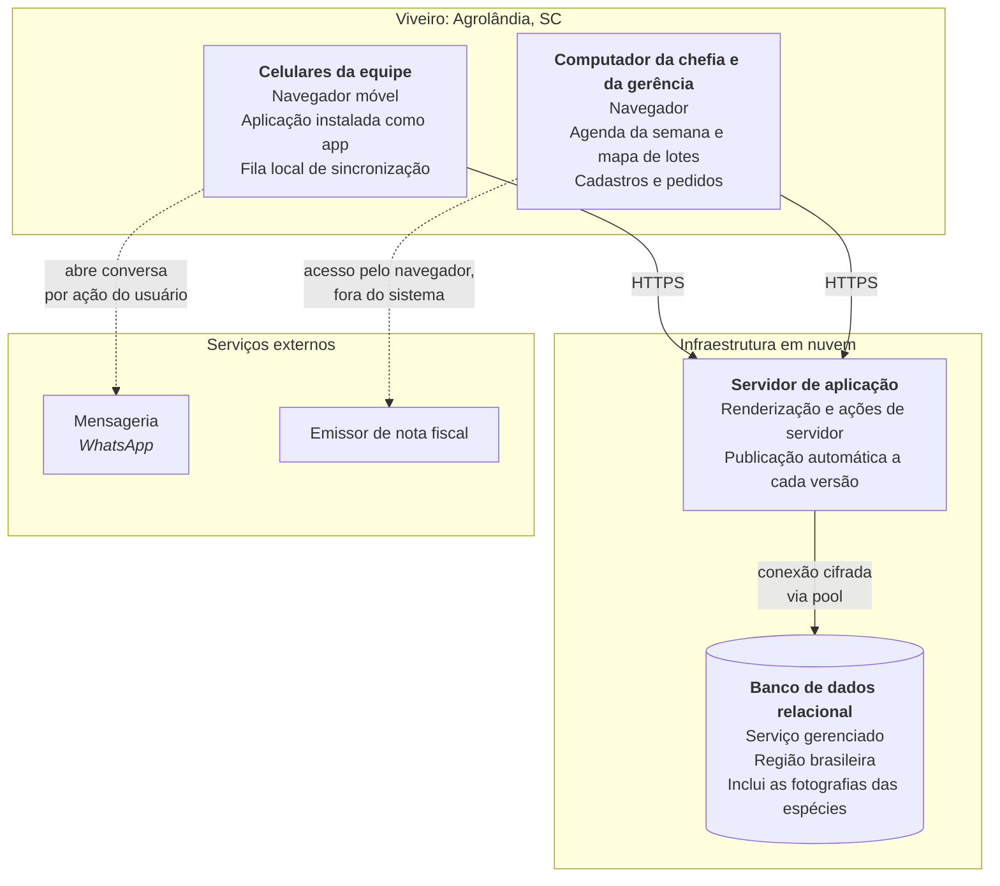
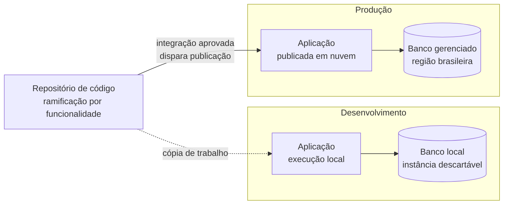
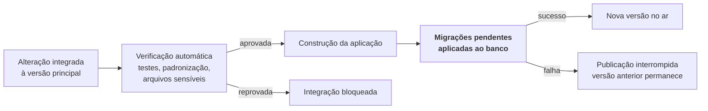

# D3: Diagrama de implantação

> **Artefato:** Diagrama de implantação · **Bloco:** D, Arquitetura
> **Destino no TCC:** Capítulo 4, seção 4.6, Arquitetura da solução
> **Fundamentação:** Sommerville (2011) descreve a arquitetura cliente-servidor como sistema
> distribuído cuja principal vantagem está em permitir acrescentar servidores sem afetar as demais
> partes. Este documento registra como os componentes lógicos de [`D1`](D1-arquitetura-c4.md) se
> distribuem em nós físicos.

---

## 1. Topologia de produção

**A rede do viveiro não hospeda nada.** Não há servidor local a manter, atualizar ou proteger: o que
é decisão de custo e de risco: uma microempresa de nove pessoas não tem quem administre servidor, e um
equipamento no viveiro seria o ponto único de falha e o alvo mais exposto.

---

## 2. Nós e responsabilidades

| Nó | Papel | Justificativa |
|---|---|---|
| **Celulares da equipe** | Camada de apresentação em campo; guarda a fila local de registros feitos sem rede | É o dispositivo que a equipe já possui e usa. Restrição RE-2 |
| **Computador da chefia e da gerência** | Mesma aplicação, em tela maior, para as duas telas de coordenação da produção, os cadastros e os pedidos | Comparar nove faixas de uma semana ou trinta canteiros de uma vez pede tela larga, e montar catálogo é tarefa de mesa. Restrição RE-2 com a exceção de RNF-14 |
| **Servidor de aplicação** | Camadas de apresentação e de lógica; publicação automática a cada versão | Elimina administração de servidor. Restrição RE-5 |
| **Banco de dados** | Camada de persistência, em serviço gerenciado com região brasileira. Guarda também as fotografias das espécies | Latência menor para usuários no Brasil, e backup gerenciado sem operação manual |

---

## 3. Dois ambientes

A publicação em nuvem é o ambiente de produção. O desenvolvimento ocorre em ambiente local
equivalente, e a diferença entre os dois se resume ao endereço do banco.

**O ambiente é determinado pelo endereço do banco, não por variável de modo.** A aplicação escolhe a
estratégia de conexão a partir do próprio endereço configurado: banco gerenciado em nuvem exige
conexão adequada a ambiente sem servidor persistente, sob pena de esgotar o limite de conexões; banco
local usa um conjunto de conexões convencional. A consequência prática é que apontar o sistema para
outro banco basta para trocar de ambiente, sem alterar código nem configuração adicional.

---

## 4. Publicação e migração de esquema

Três propriedades desse fluxo importam para a confiabilidade do ambiente:

1. **A migração precede a entrada no ar.** O esquema nunca fica atrás do código que o consome.
2. **Falha na migração interrompe a publicação.** A versão anterior continua operando, degradação
   preferível a uma versão nova sobre esquema incompatível.
3. **Somente o pendente é aplicado.** Cada ambiente recebe apenas as migrações que ainda não
   executou, o que torna a publicação idempotente.

**Migração não tem guarda condicional.** Uma migração que verifica uma condição e retorna sem fazer
nada é registrada como aplicada mesmo sem ter criado coisa alguma, e o ambiente passa a divergir
silenciosamente. A regra adotada é que migração falha ruidosamente ou não existe.

---

## 5. Distribuição, proteção e o compromisso entre as duas

Sommerville (2011) apresenta proteção e distribuição como fatores conflitantes: quanto mais
distribuído o sistema, mais oportunidades de invasão; quanto mais concentrado, mais crítica uma
invasão bem-sucedida, por não haver reserva. A configuração adotada e o ponto de equilíbrio escolhido:

| Aspecto | Escolha | Consequência |
|---|---|---|
| **Concentração** | Aplicação e banco em provedores gerenciados distintos | Comprometer a aplicação não entrega o banco, e vice-versa |
| **Superfície exposta** | Somente a aplicação é publicamente acessível; o banco só aceita conexão dela | Reduz a superfície ao mínimo compatível com o funcionamento |
| **Ponto único de falha** | Existe: a aplicação em nuvem | Aceito. Uma microempresa de nove pessoas não sustenta redundância, e a indisponibilidade de algumas horas não interrompe a produção de mudas |
| **Recuperação** | Backup gerenciado do banco, com procedimento de restauração declarado | Ver [`E6`](../E-qualidade/E6-plano-backup-recuperacao.md) |

O ponto único de falha é registrado como decisão consciente, e não como omissão. O sistema é
ferramenta de gestão, não de controle de processo em tempo real: sua indisponibilidade temporária
adia registros, e o registro adiado é recuperado pela fila local do dispositivo.

---

## 6. Segurança na fronteira entre nós

| Fronteira | Proteção |
|---|---|
| Dispositivo → aplicação | Canal cifrado obrigatório (RNF-12); sessão identificada por resumo criptográfico, com marcações que impedem leitura por código de página (RNF-09, RNF-10) |
| Aplicação → banco | Conexão cifrada; credencial mantida exclusivamente no servidor, nunca entregue ao navegador (RNF-11) |
| Aplicação → serviços externos | Sem credencial de terceiro embarcada no cliente; a mensageria é acionada por ação do usuário, não pelo servidor |
| Repositório | Credenciais e dados sensíveis jamais versionados, com verificação automática que bloqueia o envio (RNF-19) |
