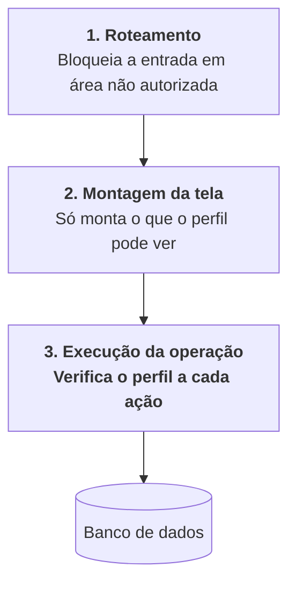

# D4: Matriz de controle de acesso baseado em papéis

> **Artefato:** Matriz RBAC · **Bloco:** D, Arquitetura
> **Destino no TCC:** Capítulo 4, seção 4.7, Segurança e controle de acesso
> **Fundamentação:** Sommerville (2011) trata autenticação e controle de acesso como controles de
> **prevenção de vulnerabilidade**, e observa que a proteção tem como contrapartida a perda de
> produtividade do usuário, cabendo ao projetista encontrar o equilíbrio em cada cenário. Este
> documento registra onde esse equilíbrio foi fixado.

---

## 1. Os papéis

Três perfis de negócio, correspondentes às funções reais da empresa, mais um papel técnico.

| Papel | Corresponde a | Pessoas | Natureza |
|---|---|---|---|
| **Chefia** | Direção: vendas, finanças, decisões, entregas | 1 | Negócio |
| **Gerência** | Coordenação: operação, estoque, produção, tarefas | 2 | Negócio |
| **Colaborador** | Execução em campo | 6 | Negócio |
| **Administrador** | Manutenção do sistema e gestão de usuários | 1, acumulado | **Técnico** |

**O administrador não é uma função da empresa.** Não participa de nenhuma rotina de negócio: seu
escopo limita-se a criar usuários, atribuir perfis e manter o sistema. É representado à parte para
que a matriz de negócio reflita a operação real do viveiro, e não a estrutura interna do sistema.

**Princípio adotado:** o menor privilégio que permita à pessoa fazer o seu trabalho. Onde houve
dúvida, a decisão pendeu para conceder: um perfil restrito demais produz pedido de exceção
constante, e a exceção concedida caso a caso é pior que a permissão declarada.

### 1.1 Nota sobre o administrador na implementação (11/08/2026)

A coluna *Administrador* da matriz é, em algumas linhas, mais restrita que a da chefia, coerente
com o parágrafo acima, já que o administrador não é função de negócio. **Na implementação, porém,
o perfil `admin` recebe acesso irrestrito**, por um `if` explícito em
[`src/lib/permissions.ts`](../../../src/lib/permissions.ts) anterior à consulta da matriz.

A razão é operacional e não conceitual: há **uma pessoa** com esse perfil, ela é quem mantém o
sistema, e precisa conseguir destravar qualquer situação em produção. A alternativa real não é um
administrador mais restrito: é um administrador que troca o próprio perfil para resolver
incidente, o que destrói o registro de auditoria justamente no momento em que ele mais importa.

A matriz permanece como está: ela descreve o **projeto** do controle de acesso, e é a fonte do
teste que compara documento e código (`src/lib/__tests__/permissions.test.ts`). O override é uma
decisão de implantação, declarada aqui e em um único ponto do código.

---

## 2. Matriz por recurso e operação

Legenda: **C** criar · **L** ler · **A** atualizar · **E** excluir · **-** sem acesso

Os recursos estão agrupados pelos **quatro módulos** do sistema, com Acesso à frente por ser
transversal: o mesmo agrupamento de [`B2 §2`](../B-requisitos/B2-especificacao-requisitos.md)
e de [`src/lib/permissions.ts`](../../../src/lib/permissions.ts), onde esta matriz vira código.

**A permissão é do recurso, não do módulo.** Nenhuma linha abaixo é concedida por a tela ficar
sob `/financeiro` ou `/producao`: a guarda é por recurso, em toda operação (§4). O agrupamento
serve para ler a matriz, não para decidir acesso, é o que permite que o módulo restrito
contenha, sem contradição, recursos que a gerência lê (§3.2).

| Recurso | Chefia | Gerência | Colaborador | Administrador |
|---|:--:|:--:|:--:|:--:|
| **1 · Cadastros** | | | | |
| **Espécies** | C L A E | L | L | C L A E |
| **Recipientes** | C L A E | L | L | C L A E |
| **Tipos de embalagem** ⁶ | C L A | C L A | L | C L A E |
| **Protocolo de atividades** ⁶ | C L A | C L A | L | L |
| **Insumos** | C L A E | L | L | C L A E |
| **Clientes** | C L A E | L | - | C L A E |
| **Dados fiscais de cliente** | C L A | L | - | C L A |
| **Fornecedores** | C L A E | - | - | C L A E |
| **Funcionários** ² | C L A E | L | - | C L A E |
| **Tarefas** ² | C L | C L A E | L A ³ | L |
| **Áreas e canteiros** ⁵ | C L | C L A E | L | L |
| **Período de trabalho** ⁵ | C L A | C L A | L | C L A |
| **Centros de custo** ⁴ | C L A | - | - | C L A |
| **2 · Produção** | | | | |
| **Consumo de insumo** | L ¹ | L | **C L** | L |
| **Coleta de sementes** | C L A E | L | - | C L A E |
| **Lotes** ⁵ | L | C L A | **C L** | L |
| **Divisão de lote** ⁶ | L | **C** | - | L |
| **Apontamento** ⁵ | L | C L A E | L A ³ | L |
| **Atividades de produção** | L ¹ | C L A | **C L** | L |
| **Estoque** | L | C L A | L | L |
| **Estoque de insumo** ⁵ | C L A | C L A | L | L |
| **Gastos de tarefa** ⁵ | C L A E | C L | - | L |
| **Perdas** | L ¹ | L A | **C L** | L |
| **Análise de perdas** | L | L | - | L |
| **3 · Comercial** | | | | |
| **Pedidos** | C L A E | L A | L | C L A E |
| **Aprovação de pedido** | **A** | - | - | A |
| **Verificação de disponibilidade** | L | **C L A** | - | L |
| **Cargas** | L | C L A | L | L |
| **Separação de carga** | L | L A | **A** | L |
| **Entregas** | C L A | L | - | C L A |
| **Cotações** | C L A | - | - | C L A |
| **Escolha de proposta** | **A** | - | - | A |
| **4 · Financeiro: módulo restrito** | | | | |
| **Custos fixos** | C L A E | - | - | C L A E |
| **Financeiro: todos os recursos** | **C L A E** | **-** | **-** | C L A E |
| **Custo unitário** | L | L | **-** | L |
| **Margem por canal** | C L A | L | **-** | L |
| **Preço de venda** | C L A | L | **-** | L |
| **Indicadores** | L | L (parcial) | - | L |
| **Acesso: transversal aos quatro módulos** | | | | |
| **Usuários e perfis** | - | - | - | **C L A E** |
| **Configurações do sistema** ⁵ | L A | - | - | L A |
| **Sessões próprias** | L E | L E | L E | L E |
| **Auditoria de acesso** | - | - | - | L |

¹ **Emenda de 11/08/2026: a chefia também cria.** Ver [§3.10](#310-emenda-a-chefia-registra-em-campo-enquanto-o-colaborador-não-usa-o-sistema).

² **Recursos do [P13](../../../plans/P13-producao-agenda-cadastros.md), declarados antes da tela.**
`funcionario` e `tarefa` já existem em `src/lib/permissions.ts`: o primeiro porque a lista de
pessoas precisa saber quem pode ver o papel, o segundo porque a agenda de pessoal traz a
primeira regra que depende do registro e não só do perfil. Os requisitos que os justificam foram
escritos em 19/08/2026: **RF-69/RF-70** para funcionário e tipo de tarefa, **RF-71 a RF-75** para
a agenda; as tabelas e as telas vêm nas Fases 2 e 3 do P13.

³ **O colaborador atualiza apenas a tarefa atribuída a ele**, é a única regra da matriz que
depende do registro, e não do perfil. Ver §3.11.

⁴ **Recurso especificado, ainda sem tabela e sem tela.** `financeiro.cost_centers` e
`/cadastros/centros-de-custo` vêm nas tarefas T13.24 a T13.26 do
[P13](../../../plans/P13-producao-agenda-cadastros.md). Os requisitos que o justificam são
**RF-77 a RF-79**, escritos em 24/08/2026, e a regra de acesso está no §3.12.

⁵ **Recursos da rotina de produção, escritos em 24/08/2026**, todos ainda sem tabela e sem tela.
Requisitos: **RF-80/RF-81** para áreas e canteiros, **RF-83** para o período de trabalho,
**RF-84 a RF-91** para lotes, **RF-94 a RF-100** para o apontamento, **RF-101 a RF-103** para o
estoque de insumo e **RF-104** para gastos de tarefa. As regras de acesso que não se leem direto
da matriz estão em §3.13 e §3.14.

⁶ **Recursos do protocolo de atividades por lote, escritos em 26/08/2026**, todos ainda sem tabela
e sem tela. Requisitos: **RF-121** para tipos de embalagem, **RF-122 a RF-125 e RF-133** para o
protocolo, **RF-135** para a divisão de lote. As regras de acesso que não se leem direto da matriz
estão em §3.16.

---

## 3. As regras de exceção

A matriz não se explica sozinha. Onze decisões merecem justificativa: em oito delas a permissão
restringe alguém que aparentemente deveria ter acesso; as três últimas (§3.10, §3.11 e §3.12) são
emendas posteriores, datadas, feitas quando a transcrição para código, ou uma rotina nova, revelou
o que a especificação não tinha previsto.

### 3.1 O colaborador não vê custo nem preço

É a restrição mais ampla da matriz. O colaborador registra consumo de insumo, dado que **compõe** o
custo: e não pode consultar o custo resultante.

A razão não é desconfiança, é escopo: o colaborador não toma decisão de preço, e a informação de
margem não o ajuda em nenhuma de suas cinco tarefas. Expô-la aumentaria a superfície de dado sensível
em seis dispositivos que circulam em campo, sem contrapartida operacional.

### 3.2 O núcleo bancário do financeiro é exclusivo da chefia

Restrição total, e não parcial, sobre **a base bancária**: extrato, lançamento, compra, custo fixo
e fechamento não são acessíveis à gerência nem em modo de leitura. É a linha
**Financeiro: todos os recursos** da matriz, somada a **Custos fixos**.

A base mistura gasto do viveiro com gasto pessoal da família e da clínica. Separá-los por centro de
custo é justamente o objetivo do subsistema, mas, até que a separação exista e mesmo depois, o
acesso permanece restrito, porque a natureza pessoal do dado não desaparece com a classificação. É a
única restrição da matriz cuja motivação é de privacidade e não de escopo funcional.

**Por que a regra não diz "o módulo 4 é exclusivo da chefia".** Com o reagrupamento de
19/08/2026, o módulo Financeiro passou a abrigar também custo unitário, margem por canal, preço
de venda e indicadores: que a matriz sempre deu à gerência em leitura, e que a gerência precisa
para verificar pedido, cotar com fornecedor e acompanhar a produção. Enunciar a restrição pela
porta do módulo produziria uma de duas coisas ruins: ou fecharia para a gerência informação que
ela sempre teve, ou obrigaria a espalhar essas telas por módulos onde não pertencem, só para
escapar da regra.

A restrição, portanto, **é do recurso**, e o critério é preciso: fica restrito o que **expõe a
base bancária**; fica em leitura o que é **derivado dela**. Custo unitário é uma soma que não
revela para quem se pagou; o extrato revela. Essa é toda a diferença, e é o mesmo critério que o
§4 aplica: a verificação acontece na operação, e nenhuma tela é liberada por estar sob
determinado caminho de URL.

| No módulo 4, é… | Recursos | Quem |
|---|---|---|
| **base bancária**: restrito | Financeiro (extratos, lançamentos, compras, fechamento), Custos fixos | chefia, admin |
| **derivado**: leitura para a gerência | Custo unitário, Margem por canal, Preço de venda, Indicadores | chefia, gerência, admin |

O colaborador não vê nenhum dos dois grupos (§3.1).

### 3.3 Aprovar pedido é privativo da chefia

A gerência pode ler o pedido, editar quantidades e verificar disponibilidade, mas não aprová-lo. A
aprovação é o ato que fixa o preço, e preço é decisão de quem responde pela margem.

### 3.4 A gerência não registra custo fixo

Custo fixo é folha, energia, água e depreciação, dado financeiro, ainda que consumido pelo custeio.
Fica com a chefia pela mesma razão de 3.2.

### 3.5 O colaborador atualiza a separação, mas não a cria

A carga é gerada pelo sistema no fechamento do pedido. O colaborador **marca** itens como separados,
sem poder criar ou remover carga. A distinção evita que um erro de operação em campo altere o que foi
comercialmente acordado.

### 3.6 Verificar disponibilidade é privativo da gerência

Nem a chefia executa a verificação. É quem está no viveiro que sabe o que existe, e a verificação
feita à distância seria adivinhação registrada como fato, exatamente o problema que o sistema
existe para eliminar.

### 3.7 Ninguém administra os próprios usuários

Nenhum perfil de negócio cria usuário ou altera perfil, inclusive a chefia. A separação entre
autoridade de negócio e autoridade de sistema impede que a escalada de privilégio seja um caminho de
uso normal.

### 3.8 Os cadastros pertencem à chefia, não à gerência

Catálogo de espécies, recipientes, insumos, clientes e fornecedores são criados e alterados pela
chefia. À gerência resta a leitura.

A razão é que todos esses cadastros **alimentam o custeio ou o comercial**, e não a operação diária:
o preço de um insumo altera o custo de todas as espécies que o utilizam; um cliente cadastrado com
documento errado impede a emissão da nota. São dados de baixa frequência de alteração e alto custo de
erro, e quem responde pela consequência é quem os mantém.

A gerência lê tudo o que precisa para operar, para verificar disponibilidade é necessário conhecer
espécies e recipientes, e para acompanhar um pedido é necessário saber de quem ele é.

### 3.10 Emenda: a chefia registra em campo enquanto o colaborador não usa o sistema

*Acrescentada em 11/08/2026, ao transcrever a matriz para código.*

As três linhas marcadas com ¹ (**Consumo de insumo**, **Atividades de produção** e **Perdas**)
davam `C` exclusivamente ao colaborador. Combinada com o §3.9, que declara que o uso em campo pelo
colaborador é iteração posterior e que hoje os usuários efetivos são chefia e gerência, a
especificação literal produz um resultado que ninguém pretendeu: **o registro de consumo em campo
(`/producao/consumo-insumos`, à época `/insumos/registrar`) fica sem nenhum usuário capaz de
usá-lo**, e o consumo (dependência-raiz do custeio) não acontece.

A emenda concede `C` à chefia nessas três linhas. É restrição temporal, não permanente: vale
enquanto os colaboradores não estiverem em campo com o sistema. Quando estiverem, a permissão da
chefia pode ser reavaliada, mas não precisa ser removida: quem responde pelo custo pode registrar
o que o compõe.

A alternativa considerada e descartada foi abrir exceção apenas no código. Seria reproduzir
exatamente o problema que a matriz única existe para eliminar: uma regra que vale, mas que não
está escrita onde as regras se leem.

### 3.11 A tarefa é a primeira regra que depende do registro, e não do perfil

*Acrescentada em 19/08/2026, junto do reagrupamento em quatro módulos.*

Todas as demais linhas da matriz respondem a uma pergunta só: *que perfil é este usuário?* A
linha **Tarefas** acrescenta uma segunda: *esta tarefa é dele?* O colaborador atualiza a tarefa
que lhe foi atribuída na agenda da semana e nenhuma outra, pode concluir a sua, não a do
colega.

**A linha Apontamento herda a mesma regra**, e por isso repete a nota ³. O colaborador vê e
encerra o apontamento aberto em nome dele, não o do colega. Quem opera o apontamento de toda a
equipe é a gerência, de um aparelho só (UC-50 a UC-52): é ela que tem `C` e `E` na linha.

A distinção importa porque muda o mecanismo, não só o valor: a verificação deixa de ser uma
consulta à tabela de perfis e passa a precisar do registro em mãos. Por isso o recurso foi
declarado em `src/lib/permissions.ts` **antes** de existirem a tabela e a tela (P13 Fase 3).
para que o mecanismo nasça exercitado por teste, em vez de ser improvisado na primeira tela que
precisar dele.

---

### 3.12 Um cadastro do módulo 1 com acesso do módulo 4

*Acrescentada em 24/08/2026, com o cadastro de centros de custo.*

**Centros de custo** é a primeira linha do módulo 1 fechada para a gerência. As demais seguem o
§3.8: a criação é da chefia, e a gerência lê. Esta não deixa nem ler.

O motivo é o do §3.2, e não o do módulo: o nome do centro **é** a informação sensível. Casa e
clínica dizem, só de aparecer numa lista, como a família divide a vida entre negócio e pessoal, que
é exatamente o que a base bancária expõe e o RE-7 protege. A tela mora em `/cadastros` por ser
manutenção de cadastro (RF-77 a RF-79), a permissão acompanha o recurso e não a porta (§2), e o
atalho some do hub para quem não pode entrar.

**Exclusão não aparece em coluna alguma**, nem para o administrador: centro de custo não se exclui,
inativa-se (RN-72), porque o lançamento já classificado guarda o seu centro para sempre. O verbo
ausente aqui é decisão de domínio, não esquecimento.

---

### 3.13 O colaborador cria lote sem poder editá-lo

*Acrescentada em 24/08/2026, com a rotina de produção.*

A linha **Lotes** dá `C L` ao colaborador e nega `A`, o que parece contraditório: quem cria
deveria poder corrigir. Não é contradição, é o desenho da repicagem.

**O colaborador nunca cria lote de propósito.** O lote nasce como consequência de ele encerrar
uma tarefa de repicagem e dizer para onde as mudas foram (UC-48): o gesto é "repiquei tanto para o
canteiro tal", e o lote filho é o que o sistema deriva disso. Dar-lhe `A` seria permitir editar
espécie, recipiente e canteiro de qualquer lote do viveiro a partir de uma tela de campo, que é
justamente o tipo de operação que a matriz mantém na gerência.

**Corrigir um lote errado é da gerência**, e o mecanismo de correção não é editar o lote: é uma
contagem física (UC-16), que gera o movimento de ajuste. O saldo do lote **nunca** é editado à
mão, nem pela gerência: ele é a soma dos movimentos (RN-78).

### 3.14 O gasto de tarefa é dinheiro, e a matriz trata como tal

*Acrescentada em 24/08/2026, com a rotina de produção.*

**Gastos de tarefa** é a única linha do módulo 2 fechada para o colaborador. As demais o incluem,
porque o módulo 2 é o módulo dele.

O motivo é o do §3.1: valor em reais não aparece para quem executa. O colaborador registra o que
**consumiu** (insumo, quantidade), e a conversão disso em dinheiro acontece do outro lado, com o
custo unitário que ele não vê. Um campo de valor na tela de campo exporia, tarefa a tarefa, a
estrutura de custo do viveiro.

A gerência tem `C L` e não `A`: lança o gasto quando ele ocorre, e corrigir valor lançado é da
chefia, que é quem concilia com o extrato.

---

### 3.15 Configurações: ninguém cria e ninguém exclui

*Acrescentada em 24/08/2026, com a rotina de produção.*

A linha **Configurações do sistema** tem só `L` e `A`, em coluna alguma aparece `C` ou `E`. Não é
esquecimento: **a chave nasce por migration, junto do código que a lê**; o que o usuário altera é
o **valor**.

Dar `C` produziria chaves que nada consulta, e dar `E` permitiria remover uma chave de que o
sistema depende, com o efeito aparecendo longe dali, na tela que a lê. É a mesma decisão de
domínio do §3.12 sobre centro de custo, e pelo mesmo motivo: **o verbo ausente é a regra**, não a
omissão dela.

A chefia altera porque os parâmetros são regra de negócio (o limiar de mortalidade, a margem
mínima), não infraestrutura. A gerência não lê: um deles é a margem, que o §3.1 já fecha.

### 3.16 O protocolo é da gerência tanto quanto da chefia, e a divisão é só da gerência

*Acrescentada em 26/08/2026, com o protocolo de atividades por lote.*

**A gerência monta protocolo, e é a exceção ao §3.8.** A regra geral é que cadastro pertence à
chefia e a gerência apenas lê; aqui as duas têm `C L A`. O protocolo não é dado comercial nem
financeiro: é a **receita de manejo**, e quem sabe em quantos dias o ipê germina no tubete é quem
está no viveiro todo dia. Deixá-lo só com a chefia produziria protocolo desatualizado, e protocolo
desatualizado gera ordem na data errada, que é pior do que não gerar ordem nenhuma.

**Nenhum dos dois tem `E`, e a razão é a mesma do §3.15.** Excluir um protocolo em uso deixaria os
lotes que o seguem sem receita, com o efeito aparecendo longe dali: eles simplesmente parariam de
receber ordens, em silêncio. Encerrar um protocolo é desativá-lo (`A`), e os lotes em curso
continuam apontando para ele. O administrador tem `E` sobre tipos de embalagem apenas para o caso
de um tipo criado por engano que nada referencia.

**A divisão de lote tem só `C`, e só para a gerência.** Não é cadastro: é um **evento**, como a
repicagem, e por isso não admite alterar nem excluir. Dividir encerra o lote de origem e cria dois
novos, e desfazer isso não é apagar uma linha, é reconstruir três estados de protocolo. O
colaborador não divide porque a decisão é de condução da produção, e não de execução de tarefa: é
a mesma fronteira do §3.13, onde ele cria lote mas não o edita.

---

## 3.9 Nota sobre o alcance atual do perfil colaborador

A matriz especifica as permissões do colaborador em sua forma completa, mas o **uso do sistema em
campo pelos colaboradores está previsto para iteração posterior**. Na primeira etapa de implantação,
os usuários efetivos são a chefia e a gerência, três pessoas.

A decisão tem consequência direta sobre a avaliação de usabilidade: os sujeitos do instrumento
descrito em [`F3`](../F-ux/F3-plano-avaliacao-usabilidade.md) são chefia e gerência. A condição do
§3.6 da metodologia (usuários reconhecidamente sem formação técnica) permanece atendida, já que
nenhum dos três a possui.

Os requisitos e casos de uso do colaborador permanecem especificados, e não removidos: são projeto,
e o projeto antecede a implantação.

---

## 4. Onde a verificação ocorre

Três níveis, complementares e não substituíveis entre si.

**O terceiro nível é o que de fato protege.** Os dois primeiros são conveniência de interface:
impedem que o usuário chegue a uma tela inútil e evitam apresentar botões que não funcionariam.
Podem ser contornados por quem acione a operação diretamente.

A verificação na execução da operação é a que não se contorna, e é por isso que o requisito RF-06
determina que a permissão seja verificada **a cada operação, e não apenas ocultando elementos da
interface**. Ocultar um botão não é controle de acesso, é o inverso: dá a impressão de proteção
onde não há.

### 4.1 Por que não há um quarto nível no banco

A pergunta reaparece a cada rodada, e a resposta é sempre a mesma: **Row Level Security não se
aplica a este sistema**, nem no Postgres local nem no Neon. Quatro razões, todas verificáveis:

1. **Não há identidade de usuário dentro do banco.** A aplicação abre a conexão com um papel só,
   o da `DATABASE_URL` (`src/lib/db.ts`), a partir de Server Components e Server Actions. Não
   existe token do usuário mapeado para papel de banco, nem API de dados exposta ao navegador: a
   sessão vive em `sessions` e só o servidor a lê. Uma política de linha não teria sobre o que
   discriminar.
2. **Fazê-la funcionar significaria duplicar esta matriz em SQL.** Seria preciso declarar o usuário
   corrente a cada requisição e reescrever os recursos da seção 2 como política de tabela: duas
   fontes da verdade para a mesma regra, que é exatamente o que produz divergência.
3. **O risco que ela mitigaria, ela não mitigaria aqui.** O papel de conexão é o **dono** das
   tabelas, e dono ignora RLS enquanto não houver `FORCE ROW LEVEL SECURITY`. Vazada a
   `DATABASE_URL`, vaza tudo, com política ou sem.
4. **O controle real existe e é conferido por teste.** `src/lib/permissions.ts` é a fonte única, e
   `src/lib/__tests__/permissions.test.ts` e `authz-cobertura.test.ts` comparam o código com a
   seção 2 deste documento.

É a mesma conclusão que `migrations/20260413000002_p1_rls.sql` registrou em 13/04/2026, quando o
conceito saiu do projeto, e que a conferência de 26/08/2026 confirmou no banco: nenhuma tabela com
RLS ligado, nenhuma política.

---

## 5. O compromisso entre proteção e produtividade

Sommerville (2011) observa que um sistema que exige múltiplas senhas frequentemente deixa o usuário
sem acesso, por não conseguir memorizá-las, e ilustra com isso que a proteção adicional cobra seu
preço em produtividade. Três decisões deste sistema explicitam onde o preço foi pago e onde não foi.

| Decisão | Proteção | Produtividade | Escolha |
|---|---|---|---|
| **Duração da sessão no dispositivo do colaborador** | Sessão longa amplia a janela de uso indevido de um aparelho perdido | Sessão curta exigiria autenticação a cada registro de perda, em campo, com as mãos sujas | **Sessão longa**, compensada pela possibilidade de encerrar sessões à distância (RF-07) e pelo registro de acesso (RF-04) |
| **Troca de senha no primeiro acesso** | Impede que a senha temporária, comunicada verbalmente, permaneça em uso | Acrescenta uma etapa ao primeiro acesso de cada usuário | **Exigida.** Custo pago uma única vez por pessoa |
| **Troca periódica obrigatória de senha** | Reduz a janela de uma credencial vazada | Senha trocada com frequência é senha anotada em papel: o próprio Sommerville usa este caso como exemplo de falha originada em decisão de projeto | **Não adotada** |

A capacidade de encerrar sessões à distância é o que torna a sessão longa defensável: o risco que ela
cria (aparelho perdido com sessão ativa) tem tratamento direto e ao alcance do usuário, sem
depender de administrador.

---

## 6. Rastreabilidade

| Requisito | Onde a matriz o realiza |
|---|---|
| RF-05 | Linha *Usuários e perfis*, exclusiva do administrador |
| RF-06 | Seção 4: verificação na execução da operação |
| RF-07 | Linha *Sessões próprias*, com leitura e exclusão para todos os perfis |
| RF-44 | Linha *Aprovação de pedido*, exclusiva da chefia (regra 3.3) |
| RF-62 | Linhas *Financeiro: todos os recursos* e *Custos fixos*, exclusivas da chefia (regra 3.2) |
| RF-77, RF-78, RF-79 | Linha *Centros de custo*, de chefia e administrador, sem exclusão (regra 3.12) |
| RNF-12 | Seção 4: verificação no servidor, nunca no navegador |

A matriz é insumo direto da modelagem de ameaças
([`E4`](../E-qualidade/E4-modelagem-de-ameacas.md)): cada permissão concedida é uma superfície a
avaliar, e cada restrição é um controle já aplicado.
