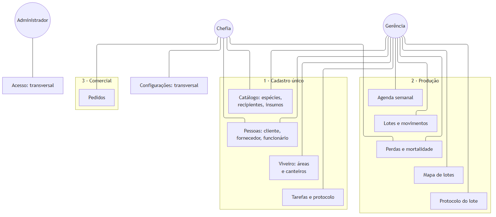
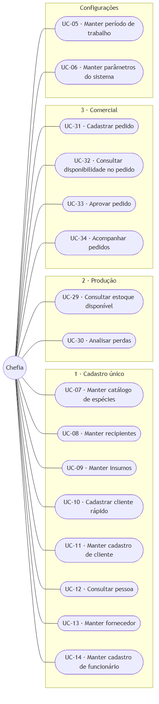
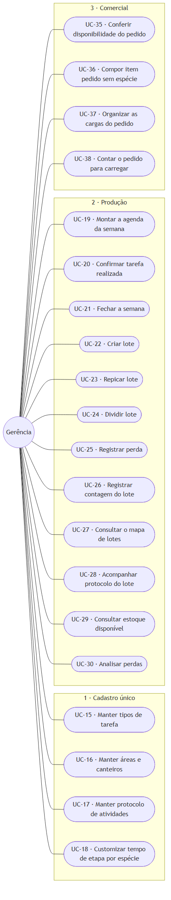
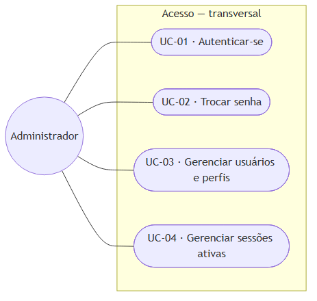

# 4.4 Modelagem do sistema

> Gerado a partir de `C-modelagem/C1-diagrama-casos-de-uso.md`, `C-modelagem/C2-especificacao-casos-de-uso.md`.
> **Não edite este arquivo**: edite o artefato de origem e rode `node scripts/build-word.mjs`.

## 4.4.1 Atores

Os atores derivam diretamente da estrutura organizacional da empresa. A correspondência entre função
real e papel no sistema é a mesma registrada em
[`A1`](../A-fundacao/A1-documento-de-visao.md) e detalhada em
[`D4`](../D-arquitetura/D4-matriz-rbac.md).

| Ator | Meta ao utilizar o sistema | Nº de pessoas |
|---|---|---|
| **Chefia** | Vender e registrar o pedido, decidir com base em dado e não em memória | 1 |
| **Gerência** | Coordenar a operação e saber o que existe, o que falta e o que está por vir | 2 |
| **Administrador** | Manter o sistema operante e o acesso correto | 1 (acumulado pela gerência) |

**Sobre o administrador:** trata-se de **papel técnico**, não de função da empresa. Ele não participa
de nenhuma rotina de negócio e seus casos de uso limitam-se à gestão de usuários e permissões. É
representado à parte para que os casos de uso de negócio reflitam exclusivamente a operação real do
viveiro.

**Os colaboradores de campo não são atores do sistema.** São seis pessoas, e o trabalho delas é o
que a agenda organiza: aparecem como **funcionário**, o dado que a gerência atribui e confirma, e
não como quem opera uma tela. É a decisão de escopo registrada em
[`A1` §5](../A-fundacao/A1-documento-de-visao.md), e é o que explica por que nenhum caso de uso
abaixo tem o campo como origem: quem digita é sempre quem coordena.

**Atores externos ao sistema**: sistemas com os quais há troca de informação, sem serem operados por
usuário do viveiro: o **emissor de nota fiscal** (sistema fiscal externo, que recebe os dados
cadastrais do cliente) e o **serviço de mensageria** (WhatsApp, por onde a negociação ocorre antes
de o pedido ser registrado).

---

## 4.4.2 Visão geral: atores e subsistemas

**Figura 1**: Visão geral: atores e subsistemas. Fonte: elaborado pelo autor (2026).

Os subsistemas estão agrupados nas **três áreas de negócio** do sistema
(`docs/rotinas/00-mapa-de-rotinas.md`). Acesso e Configurações ficam de fora porque atravessam as
três.

Três leituras que o diagrama torna imediatas:

- **A gerência toca quase tudo, e é o traço central do sistema reduzido.** Com o campo fora do
  sistema, quem planeja é quem registra: a mesma pessoa monta a semana, confirma o que foi feito,
  cria o lote e olha o mapa. É o que justifica o rigor dos requisitos não funcionais de
  usabilidade, porque para esse ator o sistema **é** a rotina de coordenação.
- **O Cadastro único é o que as duas outras áreas consomem.** Nenhuma seta sai dele para a Produção
  ou para o Comercial no diagrama, e é justamente esse o ponto: ele não executa, ele alimenta. A
  espécie cadastrada uma vez vira tarefa, vira lote e vira item de pedido.
- **O Comercial conecta-se a um único ator.** Não é omissão do diagrama: quem vende é a chefia, e o
  pedido é o único ponto em que o sistema registra dinheiro. A gerência não precisa dele para
  operar, e o que ela produz chega ao pedido pelo saldo de muda pronta, e não por uma tela
  compartilhada.

---

## 4.4.3 Casos de uso por ator

> **Esta seção é por ator, e é de propósito.** A seção 2 agrupa por área, e o catálogo da seção 4
> traz a coluna **Área**: são três cortes do mesmo conjunto. Quem quer saber *o que este perfil
> faz* lê aqui; quem quer saber *o que esta área contém* lê a seção 2.

### 4.4.3.1 Chefia

**Figura 2**: Chefia. Fonte: elaborado pelo autor (2026).

### 4.4.3.2 Gerência

**Figura 3**: Gerência. Fonte: elaborado pelo autor (2026).

### 4.4.3.3 Administrador

**Figura 4**: Administrador. Fonte: elaborado pelo autor (2026).

**UC-01, UC-02 e UC-04 são de todos os perfis**, e aparecem no diagrama do administrador apenas
porque é ele quem responde pelo subsistema. Autenticar-se e trocar a senha são de quem tem login,
e ver as próprias sessões também.

---

## 4.4.4 Catálogo completo de casos de uso

A coluna **requisitos** faz a ligação com [`B2`](../B-requisitos/B2-especificacao-requisitos.md) e
alimenta a matriz de rastreabilidade [`B5`](../B-requisitos/B5-matriz-rastreabilidade.md). A coluna
**área** situa cada caso de uso na taxonomia descrita em
[`00-mapa-de-rotinas`](../../rotinas/00-mapa-de-rotinas.md).

| Código | Caso de uso | Área | Ator principal | Requisitos | Detalhado em C2 |
|---|---|---|---|---|---|
| **UC-01** | Autenticar-se | Acesso | Todos | RF-01 | - |
| **UC-02** | Trocar senha | Acesso | Todos | RF-02 | - |
| **UC-03** | Gerenciar usuários e perfis | Acesso | Administrador | RF-05, RF-06 | - |
| **UC-04** | Gerenciar sessões ativas | Acesso | Todos | RF-03, RF-04, RF-07 | - |
| **UC-05** | Manter período de trabalho | Config. | Chefia | RF-08 | - |
| **UC-06** | Manter parâmetros do sistema | Config. | Chefia | RF-09 | - |
| **UC-07** | Manter catálogo de espécies | 1 · Cad. | Chefia | RF-10 | - |
| **UC-08** | Manter recipientes | 1 · Cad. | Chefia | RF-11 | - |
| **UC-09** | Manter insumos | 1 · Cad. | Chefia | RF-12 | - |
| **UC-10** | Cadastrar cliente rápido | 1 · Cad. | Chefia | RF-15 | - |
| **UC-11** | Manter cadastro completo de cliente | 1 · Cad. | Chefia | RF-16, RF-17 | - |
| **UC-12** | Consultar pessoa | 1 · Cad. | Chefia | RF-18, RF-14 | - |
| **UC-13** | Manter fornecedor | 1 · Cad. | Chefia | RF-19 | - |
| **UC-14** | Manter cadastro de funcionário | 1 · Cad. | Chefia | RF-20 | - |
| **UC-15** | Manter catálogo de tipos de tarefa | 1 · Cad. | Gerência | RF-21 | - |
| **UC-16** | Manter áreas e canteiros | 1 · Cad. | Gerência | RF-13 | - |
| **UC-17** | Manter protocolo de atividades | 1 · Cad. | Gerência | RF-22, RF-23, RF-24 | **✔ sim** |
| **UC-18** | Customizar tempo de etapa por espécie | 1 · Cad. | Gerência | RF-25 | **✔ sim** |
| **UC-19** | Montar a agenda da semana | 2 · Prod. | Gerência | RF-26, RF-27, RF-28 | - |
| **UC-20** | Confirmar tarefa realizada | 2 · Prod. | Gerência | RF-29, RF-30 | **✔ sim** |
| **UC-21** | Fechar a semana | 2 · Prod. | Gerência | RF-31 | - |
| **UC-22** | Criar lote | 2 · Prod. | Gerência | RF-32, RF-46 | **✔ sim** |
| **UC-23** | Repicar lote | 2 · Prod. | Gerência | RF-34, RF-35, RF-36 | **✔ sim** |
| **UC-24** | Dividir lote | 2 · Prod. | Gerência | RF-40 | **✔ sim** |
| **UC-25** | Registrar perda | 2 · Prod. | Gerência | RF-38, RF-37 | **✔ sim** |
| **UC-26** | Registrar contagem do lote | 2 · Prod. | Gerência | RF-39 | - |
| **UC-27** | Consultar o mapa de lotes | 2 · Prod. | Gerência, Chefia | RF-33, RF-44, RF-45 | - |
| **UC-28** | Acompanhar protocolo do lote | 2 · Prod. | Gerência | RF-51, RF-52, RF-53 | - |
| **UC-29** | Consultar estoque disponível | 2 · Prod. | Chefia, Gerência | RF-43 | - |
| **UC-30** | Analisar perdas | 2 · Prod. | Gerência, Chefia | RF-41, RF-42 | - |
| **UC-31** | Cadastrar pedido | 3 · Com. | Chefia | RF-54, RF-55 | **✔ sim** |
| **UC-32** | Consultar disponibilidade no pedido | 3 · Com. | Chefia | RF-56 | **✔ sim** |
| **UC-33** | Aprovar pedido | 3 · Com. | Chefia | RF-57 | **✔ sim** |
| **UC-34** | Acompanhar pedidos | 3 · Com. | Chefia | RF-58 | - |
| **UC-35** | Conferir disponibilidade do pedido | 3 · Com. | Gerência | RF-59, RF-57 | **✔ sim** |
| **UC-36** | Compor item pedido sem espécie | 3 · Com. | Gerência | RF-60 | **✔ sim** |
| **UC-37** | Organizar as cargas do pedido | 3 · Com. | Gerência | RF-61 | **✔ sim** |
| **UC-38** | Contar o pedido para carregar | 3 · Com. | Gerência | RF-61, RF-62 | **✔ sim** |

**38 casos de uso.** Os quatorze marcados são especificados em detalhe em
[`C2`](C2-especificacao-casos-de-uso.md): são os que concentram fluxos alternativos e exceções, e
aqueles cujo erro tem maior custo operacional.

**UC-17 e UC-18 são de cadastro e, pela regra de seleção, não seriam especificados**; estão
marcados assim mesmo porque o erro neles é **silencioso e diferido**: âncora escolhida errada só
aparece semanas depois, no lote que foi classificado cedo demais.

### 4.4.4.1 Os cinco requisitos que não têm ator

Cinco requisitos funcionais descrevem o que o sistema faz **sozinho**, sem ninguém acionar. Não têm
ator, e inventar um seria registrar uma interação que não existe.

| RF | O que o sistema faz sem ator | Caso de uso | Onde o resultado aparece |
|---|---|---|---|
| RF-45 | Classifica o lote em saudável, atenção e crítico | UC-27 | no próprio UC-27 |
| RF-47 | Sugere, ao lado da agenda, as etapas de protocolo vencidas | *nenhum* | UC-19 |
| RF-48 | Avança a fase do lote ao concluir etapa sequencial | *nenhum* | UC-28 |
| RF-49 | Conta a ocorrência seguinte a partir da execução real | *nenhum* | UC-28 |
| RF-50 | Mantém no máximo uma ordem em aberto por etapa | *nenhum* | UC-28 |

O padrão é o mesmo nos cinco: **o valor é derivado, e derivar é o que dispensa a digitação**. É a
razão de o protocolo existir, e por isso a ausência de ator aqui é resultado, e não lacuna.

**Sem ator e sem caso de uso não são a mesma coisa, e a distinção decide um número do trabalho.**
RF-45 pertence a um caso de uso, porque há alguém consultando a tela em que o valor
aparece, ainda que não seja essa pessoa quem dispara a conta. Os outros quatro não pertencem a
nenhum: rodam sem que ninguém abra tela alguma, e o resultado só se vê depois, no caso de uso de
outra pessoa. Por isso o contador de [`B5` §6](../B-requisitos/B5-matriz-rastreabilidade.md) diz
**54 de 58 requisitos com caso de uso**, e não 53.

---

## 4.4.5 Nota sobre a notação

O Mermaid, empregado para versionar os diagramas em texto junto ao código, não implementa a notação
UML de caso de uso (ator como figura de palito, caso como elipse, sistema como retângulo delimitador).
Os diagramas acima representam **atores como círculos** e **casos de uso como formas arredondadas**,
preservando a semântica (ator, caso, associação e fronteira de subsistema) ainda que não a
representação gráfica canônica.

As figuras publicadas no trabalho são geradas em notação UML padrão a partir do mesmo conteúdo, e
ficam em [`../word/img/`](../word/img/).

---

## Como ler

Dez casos de uso, dos trinta e quatro catalogados em [`C1`](C1-diagrama-casos-de-uso.md), estão
especificados aqui. O critério de seleção foi duplo: **concentração de fluxos alternativos** e
**custo operacional do erro**. Cadastrar um insumo errado corrige-se em segundos; repicar para o
canteiro errado põe a leva num lugar em que ninguém vai procurá-la.

**UC-17 e UC-18 esticam o critério.** Os dois são manutenção de cadastro, e pela regra acima
ficariam de fora. Entram porque o **custo do erro é diferido**: âncora escolhida errada no
protocolo não produz sintoma nenhum na hora, e aparece semanas depois no lote que foi classificado
cedo demais. Erro que não se manifesta quando é cometido precisa de fluxo de exceção escrito, e
não de tela de cadastro genérica.

Todos têm como pré-condição comum uma **sessão autenticada** cujo perfil autoriza a operação, a
verificação ocorre a cada ação, e não apenas na entrada da tela (RF-06).

**O campo Requisitos lista o que o fluxo exercita, e não só o que o caso realiza.** Quatro fluxos
atravessam requisito que [`C1`](C1-diagrama-casos-de-uso.md) §4 atribui a outro caso de uso, e o
requisito aparece aqui marcado com *(de UC-nn)*: cadastrar pedido oferece o cadastro rápido de
cliente sem sair da tela, consultar disponibilidade lê o mesmo saldo que UC-29 apresenta, registrar
perda atualiza a mortalidade que UC-30 analisa, e dividir lote encerra o protocolo do lote de
origem. **A atribuição canônica é a do `C1`**, e é dela que a matriz
[`B5`](../B-requisitos/B5-matriz-rastreabilidade.md) §2 é gerada: sem a marca, ler os dois
documentos lado a lado daria a impressão de que o mesmo requisito tem dois donos.

Notação dos fluxos: **FP** fluxo principal, **FA** fluxo alternativo, **FE** fluxo de exceção.

---

## UC-31 · Cadastrar pedido

| | |
|---|---|
| **Ator principal** | Chefia |
| **Objetivo** | Registrar no sistema um pedido já negociado por WhatsApp, antes que o detalhe se perca |
| **Requisitos** | RF-54, RF-55, RF-15 *(de UC-10)* |
| **Frequência** | Diária |
| **Pré-condições** | Existe ao menos uma espécie e um recipiente cadastrados |
| **Pós-condições** | Pedido criado no estado *cadastrado*, com ao menos um item e o preço unitário de cada um |

### FP: Fluxo principal

1. A chefia inicia o cadastro de um novo pedido.
2. O sistema solicita o cliente.
3. A chefia seleciona um cliente existente.
4. O sistema solicita o canal de venda e apresenta *atacado* como opção padrão.
5. A chefia confirma ou altera o canal.
6. A chefia adiciona um item informando espécie, recipiente, quantidade e **preço unitário**.
7. O sistema valida que a quantidade e o preço são positivos, apresenta ao lado do item o saldo de muda pronta daquela espécie e recipiente (UC-32) e acrescenta o item ao pedido.
8. A chefia repete os passos 6 e 7 para os demais itens.
9. A chefia informa, opcionalmente, a data prevista de entrega e observações.
10. A chefia conclui o cadastro.
11. O sistema registra o pedido no estado *cadastrado*, atribui-lhe número sequencial e apresenta o total do pedido.

### FA-1: Cliente ainda não cadastrado

No passo 3, a chefia não localiza o cliente.

1. A chefia aciona o cadastro rápido sem sair da tela de pedido.
2. O sistema solicita apenas **nome e telefone**.
3. O sistema cria o cliente e o seleciona no pedido, retornando ao passo 4.

> O cadastro fiscal completo não é exigido aqui. Exigi-lo interromperia a única
> etapa do processo que compete com uma conversa de WhatsApp em andamento: a complementação ocorre
> depois, pelo cadastro de cliente (UC-11), e só quando houver nota a emitir no sistema externo.

### FA-2: Saldo menor que a quantidade pedida

No passo 7, o saldo de muda pronta é menor do que a quantidade que o cliente pediu.

1. O sistema **sinaliza** a diferença ao lado do item, sem recusá-lo.
2. A chefia decide manter o item como está e prossegue para o passo 8.

> O sistema informa, e não impede. O pedido registra o que foi negociado, e o viveiro vende com
> frequência muda que ainda vai ficar pronta: bloquear o item pelo saldo de hoje transformaria uma
> venda normal em erro de sistema. O saldo existe para que a chefia decida sabendo, e é essa a
> diferença entre informar e barrar.

### FE-1: Quantidade ou preço inválido

No passo 7, a quantidade ou o preço informado é zero ou negativo. O sistema recusa o item, informa o
motivo e mantém o pedido em edição, sem perder os itens já lançados.

---

## UC-32 · Consultar disponibilidade no pedido

| | |
|---|---|
| **Ator principal** | Chefia |
| **Objetivo** | Saber, no momento em que o item é lançado, quanta muda pronta a produção tem daquela espécie e recipiente |
| **Requisitos** | RF-56, RF-43 *(de UC-29)* |
| **Frequência** | Diária, dentro de UC-31 |
| **Pré-condições** | Existe ao menos um lote aberto |
| **Pós-condições** | Nenhuma: o caso de uso é de leitura e não altera dado nenhum |

### FP: Fluxo principal

1. A chefia informa espécie e recipiente num item de pedido.
2. O sistema soma o saldo dos lotes abertos daquela espécie e recipiente que estão na fase de **muda pronta**.
3. O sistema apresenta o saldo ao lado do item, com a data da consulta.

### FA-1: Nenhum lote pronto

No passo 2, não há lote na fase de muda pronta. O sistema apresenta saldo zero e indica, quando
houver, a quantidade em produção daquela espécie e recipiente, que **não compõe** o saldo
disponível (RN-06).

> Distinguir "não tenho" de "tenho, mas ainda não está pronto" é o que permite à chefia responder
> ao cliente com uma data em vez de uma recusa. Somar as duas quantidades num número só faria o
> sistema prometer muda que não existe.

### FE-1: Espécie sem recipiente correspondente

No passo 1, a combinação de espécie e recipiente nunca foi produzida. O sistema apresenta saldo
zero, sem tratar o caso como erro: é pedido de algo que o viveiro ainda não faz, e essa é uma
informação comercial legítima.

> **Este caso de uso é a interconexão que o trabalho existe para demonstrar.** Ele não tem tela
> própria, não grava nada e não tem pós-condição: é uma leitura da Produção dentro de uma tela do
> Comercial. Especificá-lo em separado registra que o número exibido é **derivado**, e não
> digitado, que é exatamente o que distingue este sistema da planilha que ele substitui.

---

## UC-33 · Aprovar pedido

| | |
|---|---|
| **Ator principal** | Chefia |
| **Objetivo** | Decidir sobre o pedido já conferido, fixando o que vai ser vendido |
| **Requisitos** | RF-57 |
| **Frequência** | Diária |
| **Pré-condições** | Pedido no estado *verificado*, com ao menos um item |
| **Pós-condições** | Pedido *aprovado*; itens não admitem mais alteração |

### FP: Fluxo principal

1. A chefia abre um pedido verificado.
2. O sistema apresenta os itens com espécie, recipiente, quantidade, preço unitário e total, indicando o que a gerência encontrou em cada um.
3. O sistema apresenta o total do pedido.
4. A chefia responde se o pedido sai com nota fiscal e aprova o pedido.
5. O sistema retira os itens que a conferência deu por indisponíveis.
6. O sistema ajusta os itens encontrados em parte para a quantidade e o recipiente que existem.
7. O sistema registra o pedido como *aprovado*, guarda no histórico quantos itens saíram e quantos foram ajustados, e passa a recusar inclusão e alteração de item.

### FA-1: Pedido devolvido para alteração

No passo 4, a chefia não aceita o que foi conferido e devolve o pedido. O sistema registra o pedido
como *pendente de alteração* e o devolve à chefia, que altera os itens e reenvia para conferência.

### FA-2: Pedido cancelado

No passo 4, a chefia cancela em vez de aprovar. O sistema pede confirmação uma segunda vez, aceita
um motivo, registra o pedido como *cancelado* e preserva os itens para consulta.

### FE-1: Pedido sem itens

No passo 4, o pedido não tem nenhum item. O sistema recusa a aprovação e informa o motivo.

### FE-2: Alteração depois de aprovado

A chefia tenta alterar um item de pedido já aprovado. O sistema recusa a operação. A alteração
existe por outro caminho, que devolve o pedido ao começo da conferência, porque o que a gerência
apurou valia para os itens de antes.

### FE-3: Nada sobrou disponível

No passo 5, a retirada dos indisponíveis esvazia o pedido. O sistema recusa a aprovação e informa
que não sobrou item, para que a chefia cancele o pedido ou peça nova conferência.

> **A aprovação consome o que a conferência apurou, e é isso que torna a etapa seguinte simples.**
> Quem separa a carga nunca lê "tem trezentas das quinhentas", lê trezentas, que é o que vai no
> caminhão. A alternativa seria arrastar a apuração até o galpão e pedir que quem está contando
> refaça a conta, no pior lugar possível para errar.

---

## UC-35 · Conferir disponibilidade do pedido

| | |
|---|---|
| **Ator principal** | Gerência |
| **Objetivo** | Responder, item a item e no pátio, se o viveiro tem a muda que o pedido pede |
| **Requisitos** | RF-59, RF-57 |
| **Frequência** | Diária |
| **Pré-condições** | Pedido no estado *cadastrado*, com ao menos um item |
| **Pós-condições** | Pedido *verificado*, com todos os itens de topo respondidos |

### FP: Fluxo principal

1. A gerência abre a conferência de um pedido cadastrado.
2. O sistema registra o pedido como *verificando* e apresenta os itens com o progresso da conferência.
3. A gerência responde um item, informando que ele está disponível por inteiro.
4. O sistema grava a resposta e atualiza o progresso.
5. A gerência repete o passo 3 para os demais itens.
6. A gerência envia o pedido para a chefia.
7. O sistema registra o pedido como *verificado* e guarda no histórico quantos itens ficaram disponíveis.

### FA-1: Item disponível em parte

No passo 3, o viveiro tem menos mudas do que o item pede.

1. A gerência informa a quantidade encontrada e o recipiente em que ela está.
2. O sistema recusa quantidade igual ou maior que a pedida, porque esse caso é o disponível por inteiro.
3. O sistema grava a resposta, que fica visível à chefia na aprovação.

> O recipiente encontrado **pode ser outro** que o pedido, e isso não é erro. Achar as trezentas em
> saco de dezessete por vinte e dois quando o pedido dizia dez por dezoito é o caso comum, e o que
> o sistema faz é mostrar a troca a quem vai aprovar.

### FA-2: Conferência interrompida

No passo 5, a gerência precisa parar antes de responder tudo. O sistema guarda as observações de
quem ficou pendente, mantém o pedido em *verificando* e permite retomar depois, do ponto em que
parou.

### FE-1: Envio com item sem resposta

No passo 6, algum item de topo continua sem resposta. O sistema recusa o envio, informa quantos
faltam e mantém o pedido em *verificando*.

> **Não se envia pela metade, e a recusa é o ponto do caso de uso.** Item sem resposta é item que
> ninguém foi olhar, e deixá-lo passar faria a chefia aprovar sobre uma apuração incompleta, que é
> exatamente o que esta etapa existe para evitar.

---

## UC-36 · Compor item pedido sem espécie

| | |
|---|---|
| **Ator principal** | Gerência |
| **Objetivo** | Escolher quais espécies atendem o item que o cliente pediu sem nomear espécie |
| **Requisitos** | RF-60 |
| **Frequência** | Semanal, dentro de UC-35 |
| **Pré-condições** | Pedido em *verificando*, com item sem espécie |
| **Pós-condições** | Item composto por espécies cuja soma é a quantidade dele, e dado por respondido |

### FP: Fluxo principal

1. O sistema apresenta o item com a quantidade pedida, o recipiente mínimo e o que o cliente escreveu.
2. A gerência acrescenta uma espécie, com recipiente e quantidade.
3. O sistema apresenta quanto ainda falta para fechar a quantidade do item.
4. A gerência repete o passo 2 até a soma fechar.
5. A gerência confirma a composição.
6. O sistema grava uma linha por espécie escolhida e dá o item por respondido.

### FA-1: Composição refeita

No passo 5, a gerência muda de ideia sobre uma espécie já gravada. O sistema apaga as espécies
anteriores e grava as novas, porque recompor é decidir de novo, e somar as duas listas passaria da
quantidade pedida.

### FE-1: Soma que não fecha

No passo 5, a soma das espécies é menor ou maior que a quantidade do item. O sistema recusa,
informando quanto falta ou quanto passou.

### FE-2: Espécie fora do que o cliente aceita

No passo 2, o cliente restringiu as espécies e a gerência escolhe uma de fora da lista. O sistema
recusa a escolha.

> **A restrição do cliente é bloqueio, e não sugestão.** A venda para compensação ambiental costuma
> nomear as espécies que o laudo exige, e entregar outra no lugar invalida a compensação inteira,
> por mais que o viveiro tenha a muda. Quando o cliente não restringe nada, e é o caso mais comum,
> qualquer espécie serve.

---

## UC-37 · Organizar as cargas do pedido

| | |
|---|---|
| **Ator principal** | Gerência |
| **Objetivo** | Dizer em quantas viagens o pedido sai, e o que vai em cada uma |
| **Requisitos** | RF-61 |
| **Frequência** | Semanal |
| **Pré-condições** | Pedido no estado *aprovado*, sem carga organizada |
| **Pós-condições** | Pedido *separando*, com ao menos uma carga e a soma de cada item reproduzida nelas |

### FP: Fluxo principal

1. A gerência abre a separação de um pedido aprovado.
2. O sistema apresenta os itens que vão no caminhão.
3. A gerência informa que o pedido cabe em uma viagem.
4. O sistema cria uma carga com todos os itens, na quantidade cheia, e registra o pedido como *separando*.

### FA-1: Pedido dividido em mais de uma viagem

No passo 3, o pedido não cabe de uma vez.

1. A gerência distribui a quantidade de cada item entre as cargas.
2. O sistema apresenta, para cada item, quanto já foi distribuído e quanto falta.
3. A gerência confirma a divisão quando todo item fecha.
4. O sistema descarta a carga que ficou sem item nenhum, renumera as demais em sequência e registra o pedido como *separando*.

### FE-1: Item que não fecha

No passo 3 da FA-1, a soma de um item nas cargas não reproduz a quantidade dele. O sistema recusa a
divisão e informa qual item está aberto e por quanto.

> **Muda que não entrou em carga nenhuma é muda que ninguém vai separar**, e o caminhão sairia sem
> ela sem que nada no sistema avisasse. É por isso que a soma é conferida na confirmação da divisão,
> e não no fim da contagem.

---

## UC-38 · Contar o pedido para carregar

| | |
|---|---|
| **Ator principal** | Gerência |
| **Objetivo** | Conferir fisicamente cada item de cada carga antes de o caminhão sair |
| **Requisitos** | RF-61, RF-62 |
| **Frequência** | Semanal |
| **Pré-condições** | Pedido no estado *separando*, com ao menos uma carga |
| **Pós-condições** | Pedido *pronto para envio*, com todas as cargas prontas |

### FP: Fluxo principal

1. A gerência abre a carga a separar.
2. O sistema apresenta os itens da carga, a quantidade de cada um e quanto já foi separado.
3. A gerência conta o item, põe as mudas no lugar de carregamento e o marca como separado.
4. O sistema grava a confirmação e atualiza o progresso da carga.
5. A gerência repete o passo 3 para os demais itens.
6. A gerência dá a carga por pronta.
7. O sistema registra a carga como pronta e, quando ela é a última, registra o pedido como *pronto para envio*.

### FA-1: Marcação desfeita

No passo 3, a gerência marca um item por engano. O sistema aceita desfazer a marcação enquanto a
carga não estiver pronta.

### FE-1: Carga com item por separar

No passo 6, algum item da carga continua sem marcação. O sistema recusa o fechamento e informa
quantos faltam.

### FE-2: Carga já pronta

A gerência tenta fechar de novo uma carga que já está pronta, ou alterar um item dela. O sistema
recusa as duas operações.

> **O que se grava é a confirmação, e não o número contado.** Quantas mudas contar já está escrito
> na linha da carga, e guardar um segundo número abriria a pergunta do que fazer quando os dois
> divergem. Hoje a falta descoberta no galpão volta para a chefia editar o pedido, e registrar a
> divergência é a evolução natural desta etapa, não o seu estado atual.

---

## UC-25 · Registrar perda

| | |
|---|---|
| **Ator principal** | Gerência |
| **Objetivo** | Registrar mudas perdidas no momento e no local em que a perda é constatada |
| **Requisitos** | RF-38, RF-37 e RF-42 *(de UC-30)* |
| **Frequência** | Diária |
| **Pré-condições** | Existe lote aberto com saldo |
| **Pós-condições** | Movimento de perda gravado no lote; mortalidade do lote recalculada; alerta emitido se ultrapassar o limite |

### FP: Fluxo principal

1. A gerência aciona o registro de perda.
2. O sistema apresenta um formulário de **quatro campos**: lote, quantidade, causa e observação.
3. A gerência seleciona o lote, de uma lista dos canteiros ocupados.
4. O sistema exibe a espécie, o recipiente e o canteiro do lote escolhido, sem pedi-los.
5. A gerência informa a quantidade perdida.
6. A gerência seleciona a causa em lista fechada, seca, praga, geada, manuseio ou outro.
7. A gerência confirma.
8. O sistema grava o movimento de perda, exibe confirmação visual e retorna ao formulário vazio, pronto para o próximo registro.
9. O sistema baixa a quantidade do saldo do lote e recalcula a taxa de mortalidade do lote.

### FA-1: Mortalidade acima do limite

No passo 9, a taxa recalculada ultrapassa o limite mantido em Configurações, que vale 20% na
instalação e é alterável a qualquer momento. O
sistema destaca o lote no mapa (UC-27), identificando taxa e causa predominante. **O registro não é
interrompido**: o alerta é uma leitura da tela seguinte, e não uma caixa a fechar.

### FA-2: Sem conexão

Nos passos 7 e 8, não há rede. O sistema grava localmente, confirma e envia ao restabelecer a
conexão. O recálculo do passo 9 ocorre na sincronização.

### FE-1: Quantidade inválida

No passo 5, a quantidade é zero, negativa ou não numérica. O sistema recusa, indica o campo e
preserva os demais já preenchidos.

### FE-2: Quantidade maior que o saldo do lote

No passo 7, a perda informada excede o que o lote ainda tem. O sistema recusa e apresenta o saldo
(RN-21): perda maior que o saldo significa que a contagem está errada, e gravar o negativo
propagaria o erro para o estoque. A correção é uma contagem física (UC-26), não uma perda maior.

> **Nota de projeto: como o quinto campo entrou sem virar campo.** Até 24/08/2026 este caso
> registrava que localizar a perda dentro do viveiro melhoraria a análise e **foi descartado**, por
> ser o campo que faria quem registra desistir de registrar. Com o lote, a decisão **não foi
> revertida, foi resolvida**: o formulário continua com quatro campos, e um deles deixou de ser
> "espécie" e "recipiente" para ser "lote", que carrega os dois **e mais o canteiro**. Passou-se a
> informar **menos**, e o sistema a saber mais. Ver
> [`B2`, seção 5](../B-requisitos/B2-especificacao-requisitos.md) e o achado L de
> [`auditoria-divergencias.md`](../../auditoria-divergencias.md).

---

## UC-22 · Criar lote

| | |
|---|---|
| **Ator principal** | Gerência |
| **Objetivo** | Registrar uma leva de mudas plantada junta e o canteiro que ela passa a ocupar |
| **Requisitos** | RF-32, RF-46 |
| **Frequência** | Semanal |
| **Pré-condições** | Existem espécie, recipiente e ao menos um canteiro livre cadastrados |
| **Pós-condições** | Lote aberto ocupando o canteiro, com saldo igual à quantidade inicial, um movimento de entrada e o protocolo do recipiente atribuído |

### FP: Fluxo principal

1. A gerência inicia a criação de um lote.
2. A gerência seleciona a espécie e o recipiente.
3. A gerência informa a quantidade de mudas.
4. O sistema apresenta as áreas e, dentro da escolhida, apenas os canteiros **livres**.
5. A gerência seleciona a área e o canteiro.
6. A gerência informa a data de plantio, que assume o dia corrente.
7. A gerência confirma.
8. O sistema cria o lote, gera o código, grava o movimento de entrada e atribui a ele o protocolo vigente do recipiente escolhido (RF-46).

### FA-1: A leva não cabe em um canteiro

No passo 3, a quantidade excede o que o canteiro ainda comporta, contando os lotes já abertos nele.
O sistema **avisa e não recusa** (RN-28), e a gerência escolhe: apertar mais, ou criar **dois
lotes**, um por canteiro, em vez de um lote em dois lugares (RN-19).

> **Por que não um lote em dois canteiros.** Seria uma entidade a mais e um campo a mais em toda
> tela que pede lote, para representar o que dois lotes já representam. E a pergunta que a
> operação faz é "o que tem neste canteiro", que o lote inteiro num canteiro só responde direto.
> **O canteiro comporta vários lotes** desde 26/08/2026: o que não existe é o lote espalhado.

### FA-2: Recipiente sem protocolo cadastrado

No passo 8, o recipiente escolhido ainda não tem protocolo. O lote é criado normalmente e **sem
etapas**: ele aparece no mapa como saudável e nunca cobra tarefa nenhuma. É estado válido e
visível, e não erro, porque o protocolo é cadastro que se monta uma vez por safra e o lote não pode
esperar por ele.

### FE-1: Canteiro já ocupado

No passo 7, o canteiro escolhido recebeu outro lote enquanto a tela estava aberta. O sistema recusa
e recarrega a lista de canteiros livres.

---

## UC-23 · Repicar lote

| | |
|---|---|
| **Ator principal** | Gerência |
| **Objetivo** | Passar mudas de um lote para recipiente maior, preservando a ligação com a leva de origem |
| **Requisitos** | RF-34, RF-35, RF-36 |
| **Frequência** | Semanal |
| **Pré-condições** | Existe lote aberto com saldo, e há canteiro livre para o lote de destino |
| **Pós-condições** | Lote novo aberto apontando para o de origem; saldo do de origem reduzido; dois movimentos gravados |

### FP: Fluxo principal

1. A gerência confirma a tarefa de repicagem (UC-20) e o sistema pede o destino das mudas.
2. O sistema exibe o lote de origem, com espécie, recipiente e saldo.
3. A gerência informa a quantidade repicada e o recipiente de destino.
4. A gerência seleciona a área e o canteiro de destino, entre os livres.
5. A gerência confirma.
6. O sistema grava um movimento de saída no lote de origem e cria o lote de destino com o movimento de entrada correspondente, apontando para a origem.
7. O sistema encerra o lote de origem se o saldo dele chegar a zero, liberando o canteiro.

### FA-1: Repicagem parcial

No passo 3, a quantidade é menor que o saldo. O lote de origem **permanece aberto** com o saldo
restante, e passa a ter um lote filho. É o caso normal: repica-se o que está no ponto.

### FA-2: Parte das mudas morreu na repicagem

No passo 3, entram menos mudas do que saíram. O sistema apresenta a diferença e pede a causa, em
lista fechada, gravando-a como **perda do lote de origem** no mesmo gesto (RN-27). A soma
"repicadas mais perdidas" tem de igualar a quantidade que saiu.

> Sem esta alternativa, a diferença viraria evaporação silenciosa: o saldo do lote de origem
> cairia sem que nada explicasse para onde a muda foi, e a mortalidade da espécie ficaria
> subestimada exatamente na etapa que mais mata.

### FA-3: Repica para o mesmo canteiro

No passo 4, o destino é o próprio canteiro do lote de origem, que se esvaziou por inteiro. O
sistema aceita, porque o passo 7 o liberou antes.

### FE-1: Quantidade maior que o saldo

No passo 5, a quantidade repicada somada à perdida excede o saldo do lote de origem. O sistema
recusa e apresenta o saldo disponível (RN-21).

---

## UC-20 · Confirmar tarefa realizada

| | |
|---|---|
| **Ator principal** | Gerência |
| **Objetivo** | Registrar que a tarefa planejada foi feita, e o que ela produziu |
| **Requisitos** | RF-29, RF-30 |
| **Frequência** | Várias vezes ao dia |
| **Pré-condições** | Existe atribuição planejada na semana corrente, e a semana não está fechada |
| **Pós-condições** | Atribuição marcada como *confirmada*, com a quantidade de cada participante; movimento gravado no lote quando a tarefa moveu mudas |

### FP: Fluxo principal

1. A gerência aciona "confirmar" na célula da agenda.
2. Se o tipo de tarefa declarar **lote específico**, o sistema pede o lote, uma vez para a tarefa, e não pede canteiro, que vem do lote (RF-29).
3. Se o tipo de tarefa declarar **área**, o sistema oferece registrar a área ou o canteiro em que a tarefa foi feita (RF-30). Tipo com lote nunca declara área.
4. Se o tipo de tarefa for **quantitativo por unidade**, o sistema pede **um número por participante**, na unidade que o tipo declara: quanto cada um fez (RF-29).
5. Se o tipo de tarefa não for quantitativo, o passo 4 não ocorre e o sistema não pede número algum.
6. A gerência confirma.
7. O sistema marca a atribuição como *confirmada* para todos os participantes.
8. Se a tarefa movimentou mudas, o sistema grava o movimento no lote correspondente.

### FA-1: Tarefa de repicagem

No passo 8, a tarefa é repicagem. O sistema encaminha para UC-23, porque o destino das mudas
precisa ser informado antes que o movimento possa ser gravado.

### FA-2: Tarefa de classificação

No passo 8, a tarefa é classificação. O sistema pede, no mesmo formulário, quantas mudas foram
descartadas, e grava a perda como movimento do lote (RN-27). Separar os dois gestos faria a perda
ser esquecida.

### FA-3: Sem conexão

Nos passos 7 e 8, não há rede. O sistema grava localmente com a chave gerada no aparelho, confirma
e envia ao restabelecer a conexão (RNF-05). O reenvio não duplica a confirmação nem o movimento.

### FA-4: Confirmação sem quantidade

No passo 4, a gerência não sabe quantos um dos participantes fez e deixa o campo dele em branco. O
sistema aceita e marca **aquele** participante como sem contagem, sem afetar os demais: a tarefa
fica registrada como feita de qualquer modo, e tarefa feita sem contagem vale mais do que nenhum
registro.

### FA-5: Ordem do protocolo

No passo 1, a célula é uma tarefa que nasceu de uma sugestão do protocolo aceita na agenda (RF-47),
e não de um lançamento digitado do zero. O lote, a etapa e o tipo **já vieram preenchidos** da
sugestão, e o passo 2 não pergunta nada sobre eles: campo já respondido pela origem da tarefa não é
campo a pedir. A conclusão realimenta o protocolo, que passa a contar a ocorrência seguinte a
partir desta data (RF-49).

### FE-1: Quantidade inválida

No passo 4, um dos números é negativo ou não numérico. O sistema recusa e mantém a atribuição
planejada, sem gravar os demais participantes: ou confirma a tarefa inteira, ou não confirma parte
alguma dela.

### FE-2: Lote não informado

No passo 2, o tipo de tarefa declara lote específico e o lote não foi informado. O sistema recusa a
confirmação e mantém a atribuição planejada (RF-29): sem lote a atividade não se liga à leva, e a
perda não encontra destino.

### FE-3: Semana já fechada

No passo 6, a semana da atribuição foi fechada enquanto a tela estava aberta. O sistema recusa a
confirmação e informa o motivo (RF-28, RN-13): semana fechada não se altera, e o que ficou por
confirmar já entrou no realizado com a marca de não confirmado (RF-31).

> **Confirmar não é apontar hora.** A tarefa registra que foi feita e quanto rendeu, e nada mais.
> Medir a hora de entrada e de saída de cada pessoa seria controle de ponto, que está fora do
> escopo declarado em [`A1` §7](../A-fundacao/A1-documento-de-visao.md). A hora que a atribuição
> pode carregar é a da **tarefa**, declarada no planejamento quando ela tem hora marcada (RN-12):
> ela diz quando a irrigação acontece, e não quando o irrigador chegou.

---

## UC-17 · Manter protocolo de atividades

| | |
|---|---|
| **Ator principal** | Gerência ou Chefia, com a mesma permissão (`D4` §3.8) |
| **Objetivo** | Definir, por recipiente, a sequência de etapas que todo lote daquele recipiente passa a seguir sozinho |
| **Requisitos** | RF-22, RF-23, RF-24 |
| **Frequência** | Raríssima: uma vez por recipiente, revista por safra |
| **Pré-condições** | Existem tipos de tarefa no catálogo e ao menos um recipiente |
| **Pós-condições** | Protocolo vigente para o recipiente; lotes criados a partir daí passam a segui-lo |

### FP: Fluxo principal

1. A gerência abre o cadastro de protocolos e escolhe o recipiente.
2. O sistema apresenta o protocolo vigente do recipiente, ou um protocolo vazio quando não há.
3. A gerência acrescenta uma etapa, escolhendo o tipo de tarefa no catálogo e dando-lhe um rótulo.
4. A gerência declara o agendamento: **sequencial**, que ocorre uma vez, ou **recorrente**, que repete (RF-22).
5. A gerência declara o **evento de referência**: a criação do lote, ou a conclusão de uma etapa já existente no protocolo, escolhida numa lista (RF-23).
6. A gerência informa o tempo em dias e, quando recorrente, o intervalo entre ocorrências.
7. A gerência informa o turno e decide se a etapa tem **alerta de atraso** ligado (RF-24).
8. Quando sequencial, a gerência escolhe, de forma opcional, a fase do lote que a conclusão da etapa passa a gravar.
9. O sistema valida a etapa e a acrescenta ao protocolo, na ordem escolhida.
10. A alteração passa a valer **apenas para o que ainda vai ser gerado** (RN-37).

### FA-1: Etapa que não altera a fase

No passo 8, a etapa é sequencial mas não corresponde a nenhuma mudança de fase do lote. A gerência
deixa o campo vazio e o sistema aceita: nem toda etapa sequencial promove o lote, e obrigar a
escolher uma fase faria inventar transições que o ciclo produtivo não tem.

### FA-2: Etapa com janela de aviso própria

No passo 7, a etapa precisa avisar antes ou depois do padrão. A gerência informa a janela própria,
em percentual do intervalo, e ela prevalece sobre o parâmetro geral (RN-35).

### FA-3: Alteração de protocolo com lotes em andamento

No passo 10, existem lotes seguindo o protocolo. O sistema **não** reescreve as ordens já emitidas
nem as datas já cumpridas: a alteração vale para as próximas sugestões de cada lote (RN-37). É a
mesma garantia que a tarefa já lançada tem em RF-47, e a razão é a mesma: regra que reescrevesse o
passado apagaria dia já trabalhado.

### FE-1: Âncora circular

No passo 5, a etapa é apontada como âncora de outra que já é âncora dela, direta ou indiretamente.
O sistema recusa e indica o ciclo. **É validação de aplicação, e não do banco**: a restrição não
cabe em verificação declarativa, e sem ela as duas etapas nunca ganhariam data de referência, e
nenhuma das duas venceria coisa alguma, em silêncio.

### FE-2: Etapa recorrente sem intervalo

No passo 6, o agendamento é recorrente e o intervalo está vazio. O sistema recusa: recorrente sem
intervalo não tem como produzir a ocorrência seguinte, e aceitá-la criaria uma etapa que ocorre uma
vez e se apresenta como se repetisse.

### FE-3: Segundo protocolo vigente para o mesmo tipo

No passo 2, já existe protocolo vigente e a gerência tenta criar outro para o mesmo recipiente. O
sistema recusa e oferece editar o existente: dois vigentes tornariam indeterminado qual deles o
lote novo segue.

---

## UC-24 · Dividir lote

| | |
|---|---|
| **Ator principal** | Gerência |
| **Objetivo** | Separar uma leva em dois lotes que passam a ser conduzidos de forma independente |
| **Requisitos** | RF-40, RF-53 *(de UC-28)* |
| **Frequência** | Ocasional |
| **Pré-condições** | Lote aberto, com saldo maior que um |
| **Pós-condições** | Dois lotes abertos, cada um com o seu saldo e o seu protocolo; lote original encerrado com motivo `dividido` |

### FP: Fluxo principal

1. A gerência aciona "dividir" na ficha do lote.
2. O sistema apresenta o saldo atual e pede a quantidade que vai para o segundo lote.
3. A gerência informa a quantidade e o canteiro de cada resultante, que podem ser o mesmo.
4. O sistema cria os dois lotes, ambos apontando para o original como lote de origem.
5. O sistema **copia para cada um o acompanhamento do protocolo do original**: a fase e a data da última execução de cada etapa (RN-39).
6. O sistema encerra o original com motivo `dividido`, e **cancela** as ordens dele ainda em aberto (RN-38).
7. O sistema grava os movimentos que explicam o saldo dos três lotes.
8. Daí em diante, os dois resultantes vencem e cumprem etapas de forma independente.

### FA-1: Divisão que mantém os dois no mesmo canteiro

No passo 3, os dois resultantes ficam onde estavam. O sistema aceita: um canteiro comporta vários
lotes (RN-19), e a divisão é frequentemente contábil, e não física.

### FA-2: Etapa já vencida no momento da divisão

No passo 5, o original tem etapa vencida e não executada. Os dois resultantes **herdam o
vencimento vencido**, e nascem os dois em atraso naquela etapa. É o correto: a limpeza que não foi
feita continua não tendo sido feita, em nenhuma das duas metades.

### FE-1: Quantidade igual ou maior que o saldo

No passo 3, a quantidade informada não deixa saldo para o primeiro lote. O sistema recusa: divisão
que esvazia um dos lados não é divisão, é transferência de canteiro, e existe caminho próprio para
ela.

### FE-2: Lote com apontamento em curso

No passo 1, há tarefa **confirmada hoje** sobre o lote. O sistema recusa e indica a tarefa: dividir
com apontamento em curso deixaria a execução apontando para um lote que passou a estar encerrado, e
a hora trabalhada perderia destino.

*Precisado em 19/09/2026, na implementação.* A redação anterior dizia "tarefa aberta", e tarefa
aberta é a **planejada**, que a RN-38 manda **cancelar** no encerramento, e não recusar: as duas
leituras não cabiam juntas. Quem perde destino é a execução já apontada, isto é, a confirmada do
dia; a planejada é cancelada como a de qualquer lote que encerra.

---

## UC-18 · Customizar tempo de etapa por espécie

| | |
|---|---|
| **Ator principal** | Gerência ou Chefia, com a mesma permissão (`D4` §3.8, nota 3) |
| **Objetivo** | Ajustar, para uma espécie, o tempo de uma etapa específica do protocolo |
| **Requisitos** | RF-25 |
| **Frequência** | Rara, e apenas para as espécies que fogem da média |
| **Pré-condições** | Espécie cadastrada e protocolo montado para o tipo de embalagem em questão |
| **Pós-condições** | A espécie passa a usar o tempo próprio; as demais seguem o do tipo de embalagem |

### FP: Fluxo principal

1. A gerência abre o cadastro da espécie e a seção de tempos do protocolo.
2. O sistema apresenta as etapas dos protocolos, com o tempo padrão de cada uma.
3. A gerência informa o tempo próprio da espécie na etapa que difere.
4. O sistema grava apenas o que foi preenchido, e o que ficou em branco continua vindo do protocolo (RN-36).
5. Lotes daquela espécie criados a partir daí passam a usar o tempo próprio.

### FA-1: Remover a customização

No passo 3, a gerência apaga o valor informado antes. O sistema remove a customização em vez de
gravar zero: zero seria uma etapa que vence no mesmo dia da âncora, e é o oposto do que apagar
significa.

### FE-1: Nenhum dos dois tempos preenchido

No passo 3, a gerência abre a customização de uma etapa e confirma sem informar nada. O sistema não
grava linha alguma: registro sem nenhum valor próprio faz a consulta de tempo efetivo percorrer um
caminho a mais para chegar ao mesmo número.

### FE-2: Alteração com lotes em andamento

No passo 5, existem lotes da espécie em curso. O novo tempo vale para os vencimentos **ainda não
gerados**, e não reescreve ordem já emitida (RN-37). O sistema informa quantos lotes serão
afetados na próxima geração, para que a gerência saiba o alcance antes de confirmar.

---

## Casos de uso não especificados

Os vinte e quatro casos restantes de [`C1`](C1-diagrama-casos-de-uso.md) são operações de manutenção
de cadastro e de consulta, cujo fluxo se resume a selecionar, preencher e confirmar, sem alternativas
relevantes. Especificá-los produziria repetição sem ganho analítico.

Três merecem registro por já estarem descritos em linguagem de negócio na documentação de domínio:
**UC-19 (montar a agenda da semana)** e **UC-21 (fechar a semana)**, em
[`docs/rotinas/2-producao/01-agenda-de-pessoal.md`](../../rotinas/2-producao/01-agenda-de-pessoal.md),
e **UC-27 (consultar mapa de lotes)**, em
[`docs/rotinas/2-producao/04-lotes-e-canteiros.md`](../../rotinas/2-producao/04-lotes-e-canteiros.md).
