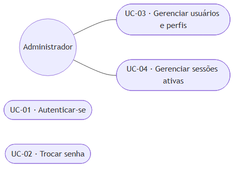

# 4.4 Modelagem do sistema

> Gerado a partir de `C-modelagem/C1-diagrama-casos-de-uso.md`, `C-modelagem/C2-especificacao-casos-de-uso.md`.
> **Não edite este arquivo**: edite o artefato de origem e rode `npm run docs:tcc`.

---

## 1. Atores

Os atores derivam diretamente da estrutura organizacional da empresa. A correspondência entre função
real e papel no sistema é a mesma registrada em
[`A1`](../A-fundacao/A1-documento-de-visao.md) e detalhada em
[`D4`](../D-arquitetura/D4-matriz-rbac.md).

| Ator | Meta ao utilizar o sistema | Nº de pessoas |
|---|---|---|
| **Chefia** | Vender com margem conhecida, decidir com base em dado e não em memória | 1 |
| **Gerência** | Coordenar a operação e saber o que existe, o que falta e o que está por vir | 2 |
| **Colaborador** | Registrar o que fez em campo, com o mínimo de interrupção do trabalho | 6 |
| **Administrador** | Manter o sistema operante e o acesso correto | 1 (acumulado pela gerência) |

**Sobre o administrador:** trata-se de **papel técnico**, não de função da empresa. Ele não participa
de nenhuma rotina de negócio e seus casos de uso limitam-se à gestão de usuários e permissões. É
representado à parte para que os casos de uso de negócio reflitam exclusivamente a operação real do
viveiro.

**Atores externos ao sistema**: sistemas com os quais há troca de informação, sem serem operados por
usuário do viveiro: o **emissor de nota fiscal** (sistema fiscal externo, que recebe os dados da
venda e devolve o número da nota), o **serviço de mensageria** (WhatsApp, por onde a negociação
ocorre) e o **serviço de geocodificação** (que converte cidade e estado do fornecedor em coordenadas).

---

## 2. Visão geral: atores e subsistemas

**Figura 1**: Visão geral: atores e subsistemas. Fonte: elaborado pelo autor (2026).

Os subsistemas estão agrupados nos **quatro módulos** do sistema
(`docs/rotinas/00-mapa-de-rotinas.md`). Acesso fica de fora porque atravessa os quatro.

Três leituras que o diagrama torna imediatas:

- **O colaborador toca cinco subsistemas, sempre pela ponta do registro.** Ele alimenta o sistema e
  não consulta resultado: não acessa preço, custo nem indicador. É o que justifica o rigor dos
  requisitos não funcionais de usabilidade: para esse ator, o sistema **é** o formulário. Lotes
  entrou nessa lista sem mudar a regra: ele **escolhe** o lote em que trabalhou, e o único lote que
  chega a **criar** é o que nasce da repicagem, dentro do gesto de encerrar a tarefa.
- **Custeio e precificação são do Financeiro, não da Produção.** A gerência toca o custeio para
  consultar, mas quem o alimenta é o extrato bancário, e é por isso que o preço do viveiro
  é estimativa enquanto o módulo 4 não rodar.
- **O subsistema Financeiro conecta-se a um único ator.** Não é omissão do diagrama, é regra de
  negócio: a base bancária mistura gasto do viveiro com gasto pessoal da família, e o acesso é
  restrito à chefia. Repare que **o módulo 4 não é restrito por inteiro**: a gerência toca
  Custeio, Precificação e Indicadores, que dele derivam sem o expor. A restrição é do recurso,
  não da porta do módulo ([`D4 §3.2`](../D-arquitetura/D4-matriz-rbac.md)).

---

## 3. Casos de uso por ator

> **Esta seção é por ator, e é de propósito.** A seção 2 agrupa por módulo, e o catálogo da seção 4
> traz a coluna **Módulo**: são três cortes do mesmo conjunto, e não resíduo da taxonomia anterior
> ao reagrupamento de 19/08/2026. Quem quer saber *o que este perfil faz* lê aqui; quem quer saber
> *o que este módulo contém* lê a seção 2. Registrado em 26/08/2026 para não ser "corrigido" numa
> próxima passada (achado K da [auditoria](../../auditoria-divergencias.md)).

### 3.1 Chefia

**Figura 2**: Chefia. Fonte: elaborado pelo autor (2026).

A concentração é acentuada: **vinte e sete dos cinquenta e nove casos de uso pertencem à chefia.** Não é
falha de distribuição: é o retrato de uma microempresa em que uma única pessoa responde por venda,
preço, compra, finanças e decisão. O sistema não redistribui responsabilidade; ele torna
verificável a que já existe.

### 3.2 Gerência

**Figura 3**: Gerência. Fonte: elaborado pelo autor (2026).

A gerência concentra-se no que **só é possível estando no viveiro**: contar estoque, planejar
produção e verificar disponibilidade. Nenhuma dessas tarefas pode ser executada à distância sem
virar adivinhação registrada como fato: que é precisamente o problema que o sistema existe para
eliminar.

### 3.3 Colaborador

**Figura 4**: Colaborador. Fonte: elaborado pelo autor (2026).

Oito casos de uso, todos de registro ou consulta operacional. É deliberado: cada caso adicional
atribuído a esse ator aumenta a chance de que nenhum seja executado.

**Os dois que entraram nesta revisão são gestos, não telas.** Repicar (UC-48) e lançar insumo e
gasto (UC-53) acontecem **dentro** do encerramento da tarefa, e não em menu próprio: aparecem
aqui porque têm regra e pós-condição próprias, não porque acrescentem um item de navegação à
vida do colaborador.

**Quem opera o apontamento é a gerência** (UC-50, UC-51 e UC-52), não o colaborador. Uma pessoa
coordena a equipe inteira de um aparelho só: é ela quem marca que Rogério saiu da repicagem e foi
para a irrigação. UC-44 continua existindo para o colaborador que confirma a própria tarefa.

### 3.4 Administrador

**Figura 5**: Administrador. Fonte: elaborado pelo autor (2026).

**UC-01** e **UC-02** são comuns a todos os atores e, por isso, não se repetem nos diagramas
anteriores: todo caso de uso do sistema tem como pré-condição uma sessão autenticada.

---

## 4. Catálogo completo de casos de uso

A coluna **requisitos** faz a ligação com [`B2`](../B-requisitos/B2-especificacao-requisitos.md) e
alimenta a matriz de rastreabilidade [`B5`](../B-requisitos/B5-matriz-rastreabilidade.md). A coluna
**módulo** situa cada caso de uso na taxonomia de quatro módulos descrita em
[`00-mapa-de-rotinas`](../../rotinas/00-mapa-de-rotinas.md).

| Código | Caso de uso | Módulo | Ator principal | Requisitos | Detalhado em C2 |
|---|---|---|---|---|---|
| **UC-01** | Autenticar-se | Acesso | Todos | RF-01 | - |
| **UC-02** | Trocar senha | Acesso | Todos | RF-02 | - |
| **UC-03** | Gerenciar usuários e perfis | Acesso | Administrador | RF-05, RF-06 | - |
| **UC-04** | Gerenciar sessões ativas | Acesso | Todos | RF-03, RF-04, RF-07 | - |
| **UC-05** | Manter catálogo de espécies | 1 · Cad. | Chefia | RF-08, RF-09 | - |
| **UC-06** | Manter recipientes | 1 · Cad. | Chefia | RF-10 | - |
| **UC-07** | Manter insumos | 1 · Cad. | Chefia | RF-11 | - |
| **UC-08** | Registrar custos fixos | 4 · Fin. | Chefia | RF-12 | - |
| **UC-09** | Registrar coleta de sementes | 2 · Prod. | Chefia | RF-13 | - |
| **UC-10** | Registrar consumo de insumo | 2 · Prod. | Colaborador | RF-14 | - |
| **UC-11** | Consultar custo unitário | 4 · Fin. | Chefia, Gerência | RF-15, RF-16, RF-17, RF-18 | - |
| **UC-12** | Registrar atividade de produção | 2 · Prod. | Colaborador | RF-19 | - |
| **UC-13** | Planejar e atribuir produção | 2 · Prod. | Gerência | RF-20 | - |
| **UC-14** | Acompanhar ciclo produtivo | 2 · Prod. | Gerência | RF-21 | - |
| **UC-15** | Consultar estoque | 2 · Prod. | Chefia, Gerência | RF-22, RF-24 | - |
| **UC-16** | Registrar contagem de estoque | 2 · Prod. | Gerência | RF-23, RF-25 | - |
| **UC-17** | Registrar perda | 2 · Prod. | Colaborador | RF-26 | **✔ sim** |
| **UC-18** | Analisar perdas | 2 · Prod. | Gerência, Chefia | RF-27, RF-28, RF-29, RF-30 | - |
| **UC-19** | Definir margem por canal | 4 · Fin. | Chefia | RF-31 | - |
| **UC-20** | Consultar preço por canal | 4 · Fin. | Chefia, Gerência | RF-32, RF-33, RF-34, RF-35 | - |
| **UC-21** | Cadastrar cliente rápido | 1 · Cad. | Chefia | RF-36 | - |
| **UC-22** | Manter cadastro completo de cliente | 1 · Cad. | Chefia | RF-37, RF-38, RF-40 | - |
| **UC-23** | Consultar cliente | 1 · Cad. | Chefia | RF-39 | - |
| **UC-24** | Cadastrar pedido | 3 · Com. | Chefia | RF-41, RF-66, RF-67 | **✔ sim** |
| **UC-25** | Verificar disponibilidade | 3 · Com. | Gerência | RF-42, RF-43, RF-68 | **✔ sim** |
| **UC-26** | Fechar pedido | 3 · Com. | Chefia | RF-44, RF-45, RF-46 | **✔ sim** |
| **UC-27** | Separar carga | 3 · Com. | Colaborador | RF-47 | **✔ sim** |
| **UC-28** | Acompanhar pedidos | 3 · Com. | Chefia, Gerência | RF-48, RF-49 | - |
| **UC-29** | Organizar agenda de entregas | 3 · Com. | Chefia | RF-50 | - |
| **UC-30** | Confirmar entrega | 3 · Com. | Chefia | RF-51 | - |
| **UC-31** | Manter fornecedor | 1 · Cad. | Chefia | RF-52 | - |
| **UC-32** | Emitir cotação | 3 · Com. | Chefia | RF-53 | **✔ sim** |
| **UC-33** | Escolher proposta | 3 · Com. | Chefia | RF-54 | **✔ sim** |
| **UC-34** | Consultar mapa de fornecedores | 3 · Com. | Chefia | RF-55 | - |
| **UC-35** | Importar extrato bancário | 4 · Fin. | Chefia | RF-56 | - |
| **UC-36** | Classificar lançamentos | 4 · Fin. | Chefia | RF-57, RF-58, RF-59 | **✔ sim** |
| **UC-37** | Fechar o mês | 4 · Fin. | Chefia | RF-60, RF-61 | - |
| **UC-38** | Consultar faturamento | 4 · Fin. | Chefia | RF-61, RF-62 | - |
| **UC-39** | Acompanhar indicadores | 4 · Fin. | Chefia, Gerência | RF-63, RF-64, RF-65 | - |
| **UC-40** | Consultar tarefas do dia | 2 · Prod. | Colaborador | RF-74 | - |
| **UC-41** | Manter cadastro de funcionário | 1 · Cad. | Chefia | RF-69 | - |
| **UC-42** | Manter catálogo de tipos de tarefa | 1 · Cad. | Gerência | RF-70, RF-82 | - |
| **UC-43** | Montar a agenda da semana | 2 · Prod. | Gerência | RF-71, RF-72, RF-73, RF-75 | - |
| **UC-44** | Concluir tarefa do dia | 2 · Prod. | Colaborador | RF-74 | - |
| **UC-45** | Manter centros de custo | 1 · Cad. | Chefia | RF-77, RF-78, RF-79 | - |
| **UC-46** | Manter áreas e canteiros | 1 · Cad. | Gerência | RF-80, RF-81 | - |
| **UC-47** | Criar lote | 2 · Prod. | Gerência | RF-84, RF-90 | **✔ sim** |
| **UC-48** | Repicar lote | 2 · Prod. | Colaborador | RF-86, RF-87, RF-88 | **✔ sim** |
| **UC-49** | Consultar ocupação do viveiro | 2 · Prod. | Gerência | RF-85, RF-87, RF-89 | - |
| **UC-50** | Apontar início de tarefa | 2 · Prod. | Gerência | RF-94, RF-95, RF-97 | **✔ sim** |
| **UC-51** | Encerrar tarefa | 2 · Prod. | Gerência | RF-98, RF-99, RF-100, RF-101, RF-107 | **✔ sim** |
| **UC-52** | Encerrar o dia do funcionário | 2 · Prod. | Gerência | RF-96, RF-100 | - |
| **UC-53** | Registrar insumos e gastos da tarefa | 2 · Prod. | Colaborador | RF-101, RF-104, RF-105 | - |
| **UC-54** | Manter período de trabalho | 1 · Cad. | Gerência | RF-83 | - |
| **UC-55** | Consultar saldo de insumos | 2 · Prod. | Gerência | RF-102, RF-103 | - |
| **UC-56** | Registrar entrada de insumo | 2 · Prod. | Gerência | RF-106 | - |
| **UC-57** | Manter protocolo de atividades | 1 · Cad. | Gerência | RF-121, RF-122, RF-123, RF-124, RF-125 | **✔ sim** |
| **UC-58** | Dividir lote | 2 · Prod. | Gerência | RF-135 | **✔ sim** |
| **UC-59** | Customizar tempo de etapa por espécie | 1 · Cad. | Gerência | RF-133 | **✔ sim** |

**59 casos de uso.** Os quinze marcados são especificados em detalhe em
[`C2`](C2-especificacao-casos-de-uso.md): são os que concentram fluxos alternativos e exceções, e
aqueles cujo erro tem maior custo operacional.

**Os três últimos entraram em 26/08/2026, com o protocolo de atividades por lote.** UC-57 e UC-59
são de cadastro e, pela regra de seleção, não seriam especificados; estão marcados assim mesmo
porque o erro neles é **silencioso e diferido**: âncora escolhida errada só aparece semanas depois,
no lote que foi classificado cedo demais.

---
## 5. Nota sobre a notação

O Mermaid, empregado para versionar os diagramas em texto junto ao código, não implementa a notação
UML de caso de uso (ator como figura de palito, caso como elipse, sistema como retângulo delimitador).
Os diagramas acima representam **atores como círculos** e **casos de uso como formas arredondadas**,
preservando a semântica (ator, caso, associação e fronteira de subsistema) ainda que não a
representação gráfica canônica.

As figuras publicadas no trabalho são geradas em notação UML padrão a partir do mesmo conteúdo, e
ficam em [`../word/img/`](../word/img/).

---

## Como ler

Quinze casos de uso, dos cinquenta e nove catalogados em [`C1`](C1-diagrama-casos-de-uso.md), estão
especificados aqui. O critério de seleção foi duplo: **concentração de fluxos alternativos** e
**custo operacional do erro**. Cadastrar um insumo errado corrige-se em segundos; separar a carga
errada põe um caminhão na estrada com a muda errada.

**Os três últimos, UC-57 a UC-59, entraram em 26/08/2026 e esticam o critério.** Dois deles são
manutenção de cadastro, e pela regra acima ficariam de fora. Entram porque o **custo do erro é
diferido**: âncora escolhida errada no protocolo não produz sintoma nenhum na hora, e aparece
semanas depois no lote que foi classificado cedo demais. Erro que não se manifesta quando é
cometido precisa de fluxo de exceção escrito, e não de tela de cadastro genérica.

Todos têm como pré-condição comum uma **sessão autenticada** cujo perfil autoriza a operação, a
verificação ocorre a cada ação, e não apenas na entrada da tela (RF-06).

Notação dos fluxos: **FP** fluxo principal, **FA** fluxo alternativo, **FE** fluxo de exceção.

---

## UC-24 · Cadastrar pedido

| | |
|---|---|
| **Ator principal** | Chefia |
| **Objetivo** | Registrar no sistema um pedido já negociado por WhatsApp, antes que o detalhe se perca |
| **Requisitos** | RF-41, RF-66, RF-67, RF-36 |
| **Frequência** | Diária |
| **Pré-condições** | Existe ao menos uma espécie e um recipiente cadastrados |
| **Pós-condições** | Pedido criado no estado *cadastrado*, com ao menos um item; gerência notificada |

### FP: Fluxo principal

1. A chefia inicia o cadastro de um novo pedido.
2. O sistema solicita o cliente.
3. A chefia seleciona um cliente existente.
4. O sistema solicita o canal de venda e apresenta *atacado* como opção padrão.
5. A chefia confirma ou altera o canal.
6. A chefia adiciona um item informando espécie, recipiente e quantidade.
7. O sistema valida que a quantidade é positiva e acrescenta o item ao pedido.
8. A chefia repete os passos 6 e 7 para os demais itens.
9. A chefia informa, opcionalmente, a data prevista de entrega e observações.
10. A chefia conclui o cadastro.
11. O sistema registra o pedido no estado *cadastrado*, atribui-lhe número sequencial e notifica a gerência de que há disponibilidade a verificar.

### FA-1: Cliente ainda não cadastrado

No passo 3, a chefia não localiza o cliente.

1. A chefia aciona o cadastro rápido sem sair da tela de pedido.
2. O sistema solicita apenas **nome e telefone**.
3. O sistema cria o cliente e o seleciona no pedido, retornando ao passo 4.

> O cadastro fiscal completo não é exigido aqui. Exigi-lo interromperia a única
> etapa do processo que compete com uma conversa de WhatsApp em andamento: a complementação ocorre
> no fechamento, e apenas se houver nota fiscal a emitir (UC-26, FA-1).

### FA-2: Item genérico

No passo 6, o cliente não especificou as espécies, pediu quantidade e porte.

1. A chefia marca o item como **genérico** e informa recipiente e quantidade, sem espécie.
2. O sistema, opcionalmente, aceita a lista de espécies que o cliente admite.
3. O sistema, opcionalmente, aceita a especificação de qualidade em texto livre.
4. O sistema registra o item genérico e retorna ao passo 8.

> Item genérico sem lista de espécies significa **aberto**: qualquer espécie o atende. É o caso
> corrente em compensação ambiental, onde a exigência é de quantidade e diversidade, não de espécies
> nomeadas.

### FE-1: Quantidade inválida

No passo 7, a quantidade informada é zero ou negativa. O sistema recusa o item, informa o motivo e
mantém o pedido em edição, sem perder os itens já lançados.

---

## UC-25 · Verificar disponibilidade

| | |
|---|---|
| **Ator principal** | Gerência |
| **Objetivo** | Conferir, contra o estoque físico, se o pedido pode ser atendido |
| **Requisitos** | RF-42, RF-43, RF-68 |
| **Frequência** | Diária |
| **Pré-condições** | Pedido no estado *cadastrado* |
| **Pós-condições** | Cada item classificado como disponível, parcial ou indisponível; pedido em *verificado*; chefia notificada |

### FP: Fluxo principal

1. A gerência abre um pedido pendente de verificação.
2. O sistema apresenta os itens em formato de lista de conferência, com espécie, recipiente e quantidade pedida.
3. O sistema registra o pedido como *verificando disponibilidade*.
4. Para cada item, a gerência confirma que há quantidade suficiente.
5. O sistema marca o item como **disponível**.
6. Concluídos todos os itens, a gerência encerra a verificação.
7. O sistema registra o pedido como *verificado* e notifica a chefia.

### FA-1: Disponibilidade parcial

No passo 4, existe menos do que o pedido.

1. A gerência informa a **quantidade efetivamente disponível**.
2. O sistema valida que o valor está entre 1 e a quantidade pedida.
3. O sistema marca o item como **parcial**, preservando as duas quantidades, e retorna ao passo 4.

### FA-2: Disponível em outro recipiente

No passo 4, a espécie existe, mas em recipiente diferente do pedido.

1. A gerência informa a quantidade disponível e **qual recipiente** de fato existe.
2. O sistema registra ambos e retorna ao passo 4.

> Trata-se de negociação, não de erro: um cliente que pediu saco 17x22 frequentemente aceita 20x26
> por outro preço. Reduzir esse caso a "indisponível" descartaria uma venda que ocorreria.

### FA-3: Item indisponível

No passo 4, não há nenhuma unidade. A gerência informa quantidade zero, o sistema marca o item como
**indisponível** e retorna ao passo 4. O pedido segue: a decisão de cancelar, substituir ou cotar com
fornecedor cabe à chefia (UC-26) ou origina uma cotação (UC-32).

### FA-4: Item genérico

No passo 4, o item não tem espécie definida. A gerência indica as espécies com que pretende atendê-lo,
respeitada a lista de espécies aceitas quando houver. O sistema valida a restrição e retorna ao passo 4.

### FE-1: Espécie fora da lista aceita

Em FA-4, a espécie escolhida não consta da lista definida pelo cliente. O sistema recusa a escolha e
informa quais espécies são aceitas.

---

## UC-26 · Fechar pedido

| | |
|---|---|
| **Ator principal** | Chefia |
| **Objetivo** | Decidir sobre o pedido verificado, aprovar preço e liberá-lo para separação |
| **Requisitos** | RF-44, RF-45, RF-46, RF-40, RF-33 |
| **Frequência** | Diária |
| **Pré-condições** | Pedido no estado *verificado* |
| **Pós-condições** | Pedido *aprovado*, carga de separação criada, colaboradores notificados |

### FP: Fluxo principal

1. A chefia abre um pedido verificado.
2. O sistema apresenta a análise: itens disponíveis, parciais e indisponíveis, com as quantidades de cada caso.
3. O sistema apresenta, por item, o preço sugerido do canal de venda do pedido.
4. A chefia confirma ou ajusta o preço de cada item.
5. O sistema valida que nenhum preço está abaixo do piso mínimo.
6. A chefia informa se o pedido exige nota fiscal.
7. A chefia aprova o pedido.
8. O sistema registra o pedido como *aprovado*, gera a carga de separação com os itens e quantidades aprovados, e notifica os colaboradores.

### FA-1: Nota fiscal exigida e cliente com cadastro incompleto

No passo 6, a chefia indica que há nota a emitir, mas o cliente possui apenas nome e telefone.

1. O sistema sinaliza a pendência e solicita os dados fiscais, tipo de pessoa, documento, razão social quando pessoa jurídica, endereço.
2. A chefia completa os dados **na própria tela de fechamento**.
3. O sistema valida o documento informado e retorna ao passo 7.

### FA-2: Atendimento parcial aceito

No passo 4, há itens parciais e a chefia decide faturar o que existe.

1. A chefia confirma as quantidades disponíveis como quantidades aprovadas.
2. O sistema registra a diferença e retorna ao passo 7.

### FA-3: Complementação por fornecedor

No passo 2, há itens indisponíveis que a chefia decide comprar de terceiro. O caso de uso é suspenso
e origina uma cotação (UC-32). O pedido permanece *verificado* até que a cotação se resolva.

### FE-1: Preço abaixo do piso mínimo

No passo 5, o preço informado é inferior ao piso. O sistema **recusa** a aprovação, indica o piso
aplicável e mantém o pedido em edição.

> O piso é bloqueio, não alerta. A regra existe justamente porque a venda com prejuízo hoje ocorre
> sem que ninguém perceba: um aviso que pode ser ignorado não altera esse quadro.

### FE-2: Documento fiscal inválido

Em FA-1, o CPF ou CNPJ informado não é válido. O sistema recusa o dado no momento da digitação e
indica o erro, sem descartar os demais campos já preenchidos.

---

## UC-27 · Separar carga

| | |
|---|---|
| **Ator principal** | Colaborador |
| **Objetivo** | Recolher fisicamente as mudas da carga e registrar o que foi separado |
| **Requisitos** | RF-47 |
| **Frequência** | Diária |
| **Pré-condições** | Existe carga no estado *pendente* |
| **Pós-condições** | Carga *pronta*; pedido em *pronto para envio*; chefia notificada |

### FP: Fluxo principal

1. O colaborador abre a lista de cargas a separar.
2. O sistema apresenta os itens da carga com espécie, recipiente e quantidade, em lista de conferência.
3. O sistema registra a carga como *separando*.
4. O colaborador separa fisicamente um item e o marca como separado.
5. O sistema registra a marcação e apresenta confirmação visual imediata.
6. O colaborador repete os passos 4 e 5 até o último item.
7. O sistema registra a carga como *pronta*, atualiza o pedido para *pronto para envio* e notifica a chefia.

### FA-1: Sem conexão

Nos passos 4 e 5, o dispositivo está sem rede.

1. O sistema registra a marcação localmente e confirma ao colaborador.
2. O sistema envia os registros pendentes assim que a conexão se restabelece.

> Este fluxo alternativo é o mais executado de todos os aqui descritos, e não a exceção: a área de
> separação é onde a conexão falha com mais frequência. Um sistema que exija rede nesse ponto será
> substituído por papel no primeiro dia.

### FA-2: Divergência entre carga e estoque físico

No passo 4, o item não existe na quantidade indicada. O colaborador registra a quantidade
efetivamente separada, e o sistema notifica a gerência da divergência para nova verificação.

---

## UC-17 · Registrar perda

| | |
|---|---|
| **Ator principal** | Colaborador |
| **Objetivo** | Registrar mudas perdidas no momento e no local em que a perda é constatada |
| **Requisitos** | RF-26, RF-28, RF-29, RF-91 |
| **Frequência** | Diária |
| **Pré-condições** | Nenhuma além da sessão autenticada |
| **Pós-condições** | Perda registrada; mortalidade da espécie recalculada; alerta emitido se ultrapassar o limite |

### FP: Fluxo principal

1. O colaborador aciona o registro de perda.
2. O sistema apresenta um formulário de **quatro campos**: lote, quantidade, causa e observação.
3. O colaborador seleciona o lote, de uma lista dos canteiros ocupados.
4. O sistema exibe a espécie, o recipiente e o canteiro do lote escolhido, sem pedi-los.
5. O colaborador informa a quantidade perdida.
6. O colaborador seleciona a causa em lista fechada, seca, praga, geada, manuseio ou outro.
7. O colaborador confirma.
8. O sistema grava a perda, exibe confirmação visual e retorna ao formulário vazio, pronto para o próximo registro.
9. O sistema baixa a quantidade do saldo do lote e recalcula a taxa de mortalidade da espécie no período.

### FA-1: Mortalidade acima do limite

No passo 9, a taxa recalculada ultrapassa 20%. O sistema emite alerta à gerência identificando
espécie, taxa e causa predominante. **O colaborador não é interrompido**: o alerta é dirigido a quem
pode agir sobre ele.

### FA-2: Sem conexão

Nos passos 7 e 8, não há rede. O sistema grava localmente, confirma ao colaborador e envia ao
restabelecer a conexão. O recálculo do passo 9 ocorre na sincronização.

### FE-1: Quantidade inválida

No passo 5, a quantidade é zero, negativa ou não numérica. O sistema recusa, indica o campo e
preserva os demais já preenchidos.

### FE-2: Quantidade maior que o saldo do lote

No passo 7, a perda informada excede o que o lote ainda tem. O sistema recusa e apresenta o saldo
(RN-78): perda maior que o saldo significa que a contagem está errada, e gravar o negativo
propagaria o erro para o estoque. A correção é uma contagem física (UC-16), não uma perda maior.

> **Nota de projeto: como o quinto campo entrou sem virar campo.** Até 24/08/2026 este caso
> registrava que localizar a perda dentro do viveiro melhoraria a análise e **foi descartado**, por
> ser o campo que faria o colaborador deixar de registrar. Com o lote, a decisão **não foi
> revertida, foi resolvida**: o formulário continua com quatro campos, e um deles deixou de ser
> "espécie" e "recipiente" para ser "lote", que carrega os dois **e mais o canteiro**. O
> colaborador passou a informar **menos**, e o sistema a saber mais. Ver
> [`B2`, seção 5](../B-requisitos/B2-especificacao-requisitos.md) e o achado L de
> [`auditoria-divergencias.md`](../../auditoria-divergencias.md).

---

## UC-47 · Criar lote

| | |
|---|---|
| **Ator principal** | Gerência |
| **Objetivo** | Registrar uma leva de mudas plantada junta e o canteiro que ela passa a ocupar |
| **Requisitos** | RF-84, RF-90 |
| **Frequência** | Semanal |
| **Pré-condições** | Existem espécie, recipiente e ao menos um canteiro livre cadastrados |
| **Pós-condições** | Lote aberto ocupando o canteiro, com saldo igual à quantidade inicial e um movimento de entrada |

### FP: Fluxo principal

1. A gerência inicia a criação de um lote.
2. A gerência seleciona a espécie e o recipiente.
3. A gerência informa a quantidade de mudas.
4. O sistema apresenta as áreas e, dentro da escolhida, apenas os canteiros **livres**.
5. A gerência seleciona a área e o canteiro.
6. A gerência informa a data de plantio, que assume o dia corrente.
7. A gerência confirma.
8. O sistema cria o lote, gera o código, grava o movimento de entrada e calcula a previsão de disponibilidade a partir do tempo de produção da espécie.

### FA-1: A leva não cabe em um canteiro

No passo 3, a quantidade excede o que o canteiro ainda comporta, contando os lotes já abertos nele.
O sistema **avisa e não recusa** (RN-92), e a gerência escolhe: apertar mais, ou criar **dois
lotes**, um por canteiro, em vez de um lote em dois lugares (RN-76).

> **Por que não um lote em dois canteiros.** Seria uma entidade a mais e um campo a mais em toda
> tela que pede lote, para representar o que dois lotes já representam. E a pergunta que a
> operação faz é "o que tem neste canteiro", que o lote inteiro num canteiro só responde direto.
> **O canteiro comporta vários lotes** desde 26/08/2026: o que não existe é o lote espalhado.

### FA-2: Espécie sem tempo de produção cadastrado

No passo 8, a espécie não tem tempo de produção. O lote é criado normalmente e a previsão fica
**em branco**, não em zero: previsão ausente é informação, previsão zerada é erro disfarçado de
dado.

### FE-1: Canteiro já ocupado

No passo 7, o canteiro escolhido recebeu outro lote enquanto a tela estava aberta. O sistema recusa
e recarrega a lista de canteiros livres.

---

## UC-48 · Repicar lote

| | |
|---|---|
| **Ator principal** | Colaborador |
| **Objetivo** | Passar mudas de um lote para recipiente maior, preservando a ligação com a leva de origem |
| **Requisitos** | RF-86, RF-87, RF-88 |
| **Frequência** | Semanal |
| **Pré-condições** | Existe lote aberto com saldo, e há canteiro livre para o lote de destino |
| **Pós-condições** | Lote novo aberto apontando para o de origem; saldo do de origem reduzido; dois movimentos gravados |

### FP: Fluxo principal

1. O colaborador encerra a tarefa de repicagem (UC-51) e o sistema pede o destino das mudas.
2. O sistema exibe o lote de origem, com espécie, recipiente e saldo.
3. O colaborador informa a quantidade repicada e o recipiente de destino.
4. O colaborador seleciona a área e o canteiro de destino, entre os livres.
5. O colaborador confirma.
6. O sistema grava um movimento de saída no lote de origem e cria o lote de destino com o movimento de entrada correspondente, apontando para a origem.
7. O sistema encerra o lote de origem se o saldo dele chegar a zero, liberando o canteiro.

### FA-1: Repicagem parcial

No passo 3, a quantidade é menor que o saldo. O lote de origem **permanece aberto** com o saldo
restante, e passa a ter um lote filho. É o caso normal: repica-se o que está no ponto.

### FA-2: Parte das mudas morreu na repicagem

No passo 3, entram menos mudas do que saíram. O sistema apresenta a diferença e pede a causa, em
lista fechada, gravando-a como **perda do lote de origem** no mesmo gesto (RN-90). A soma
"repicadas mais perdidas" tem de igualar a quantidade que saiu.

> Sem esta alternativa, a diferença viraria evaporação silenciosa: o saldo do lote de origem
> cairia sem que nada explicasse para onde a muda foi, e a mortalidade da espécie ficaria
> subestimada exatamente na etapa que mais mata.

### FA-3: Repica para o mesmo canteiro

No passo 4, o destino é o próprio canteiro do lote de origem, que se esvaziou por inteiro. O
sistema aceita, porque o passo 7 o liberou antes.

### FE-1: Quantidade maior que o saldo

No passo 5, a quantidade repicada somada à perdida excede o saldo do lote de origem. O sistema
recusa e apresenta o saldo disponível (RN-78).

---

## UC-50 · Apontar início de tarefa

| | |
|---|---|
| **Ator principal** | Gerência |
| **Objetivo** | Marcar que um funcionário começou uma tarefa, a partir da faixa dele na agenda do dia |
| **Requisitos** | RF-94, RF-95, RF-97, RF-99 |
| **Frequência** | Várias vezes ao dia |
| **Pré-condições** | O funcionário está ativo e o dia dele não foi encerrado |
| **Pós-condições** | Um apontamento aberto para o funcionário; o anterior, se havia, fechado no mesmo instante |

### FP: Fluxo principal

1. A gerência abre a agenda do dia e vê as tarefas planejadas e uma faixa por funcionário.
2. A gerência aciona "começar tarefa" na faixa de um funcionário.
3. O sistema apresenta os tipos de tarefa, com os planejados para aquele turno em primeiro lugar.
4. A gerência escolhe o tipo de tarefa.
5. O sistema pede **apenas** o que aquele tipo de tarefa declara exigir: espécie, recipiente, lote e canteiro (RF-82).
6. A gerência informa o que foi pedido.
7. A gerência confirma.
8. O sistema fecha o apontamento que estiver aberto para aquele funcionário, registrando o instante como fim, e abre o novo.
9. A faixa do funcionário passa a exibir a tarefa em curso e desde quando.

### FA-1: Tarefa fora do planejado

No passo 4, a tarefa escolhida não estava na agenda daquele turno. O sistema aceita e registra o
apontamento **sem atribuição vinculada**, marcando-o como avulso. O planejado não é alterado: a
comparação entre planejado e realizado é justamente o que se quer enxergar.

### FA-2: Vários funcionários na mesma tarefa

No passo 2, a gerência seleciona mais de uma faixa antes de acionar. O sistema abre **um
apontamento por pessoa**, todos ligados à mesma atribuição, porque cada um pode sair dela em
momento diferente (RN-83, RN-84).

### FA-3: O funcionário já estava em outra tarefa

No passo 8, havia apontamento aberto. É o **caso normal**, e não exceção: o gesto de começar
outra tarefa é o gesto de dizer que saiu da anterior. O sistema não pergunta nada e não pede
confirmação.

> **Por que sem confirmação.** Perguntar "deseja encerrar a tarefa atual?" a cada troca
> acrescentaria um toque a um gesto que se repete dezenas de vezes por dia, para confirmar o que o
> próprio gesto já declarou. A alternativa, exigir encerrar antes de começar, produziria tarefas
> eternamente abertas nos dias corridos, que são justamente os dias em que a troca ocorre.

### FE-1: Tipo de tarefa exige lote e nenhum foi informado

No passo 7, o tipo exige lote e o campo está vazio. O sistema recusa e indica o campo (RN-82).

### FE-2: Dia do funcionário já encerrado

No passo 2, o dia daquele funcionário foi encerrado (UC-52). O sistema informa e oferece
**reabrir o dia**, em vez de recusar em silêncio: encerramento por engano é comum, e recusar faria
a gerência deixar de registrar o resto do dia.

---

## UC-51 · Encerrar tarefa

| | |
|---|---|
| **Ator principal** | Gerência |
| **Objetivo** | Fechar o apontamento e registrar o que a tarefa produziu e consumiu |
| **Requisitos** | RF-98, RF-99, RF-100, RF-101, RF-107 |
| **Frequência** | Várias vezes ao dia |
| **Pré-condições** | Existe apontamento aberto para o funcionário |
| **Pós-condições** | Apontamento fechado com hora de fim; horas calculadas; consumo de insumo abatido do saldo |

### FP: Fluxo principal

1. A gerência aciona "encerrar" na tarefa, ou na faixa de um funcionário, ou inicia outra tarefa (UC-50 FA-3), ou encerra o dia (UC-52).
2. O sistema grava a hora de fim e calcula o intervalo trabalhado de cada participante.
3. Se o tipo de tarefa declarar **lote específico**, o sistema pede o lote, uma vez para a tarefa, e não pede canteiro, que vem do lote (RF-99).
4. Se o tipo de tarefa for **quantitativo por unidade**, o sistema pede **um número por participante**: quanto cada um fez (RF-98, RF-107).
5. Se o tipo de tarefa não for quantitativo, o passo 4 não ocorre e o sistema não pede número algum.
6. O sistema oferece, de forma opcional, registrar insumos consumidos e gasto extra (UC-53).
7. O sistema fecha o apontamento de todos os participantes e abate do saldo os insumos informados.
8. Se a tarefa movimentou mudas, o sistema grava o movimento no lote correspondente.

### FA-1: Tarefa de repicagem

No passo 8, a tarefa é repicagem. O sistema encaminha para UC-48, porque o destino das mudas
precisa ser informado antes que o movimento possa ser gravado.

### FA-2: Sem conexão

Nos passos 7 e 8, não há rede. O sistema grava localmente com a chave gerada no aparelho, confirma
e envia ao restabelecer a conexão (RNF-05). O reenvio não duplica o apontamento nem o consumo.

### FA-3: Encerramento sem quantidade

No passo 4, a gerência não sabe quantos um dos participantes fez e deixa o campo dele em branco. O
sistema aceita e marca **aquele** apontamento como sem contagem, sem afetar os demais: as horas
ficam registradas de qualquer modo, e hora sem contagem vale mais do que nenhum registro.

### FA-4: Encerramento de uma pessoa só

No passo 1, quem encerra é a faixa individual, e não a tarefa: alguém saiu do serviço no meio do
turno. O fluxo é o mesmo, com um único participante, e a tarefa continua aberta para os demais.

### FE-1: Quantidade inválida

No passo 4, um dos números é negativo ou não numérico. O sistema recusa e mantém o apontamento
aberto, sem gravar os demais participantes: ou encerra a tarefa inteira, ou não encerra nenhuma
parte dela.

### FE-2: Lote não informado

No passo 3, o tipo de tarefa declara lote específico e o lote não foi informado. O sistema recusa o
encerramento e mantém a tarefa aberta (RF-99): sem lote a atividade não se liga à leva, e nem a
perda nem o custo encontram destino.

### FE-3: Consumo maior que o saldo do insumo

No passo 7, o consumo deixaria o saldo do insumo negativo. O sistema **grava assim mesmo** e
sinaliza o saldo negativo (RF-105).

> **Por que aqui o sistema não recusa, e no lote recusa.** O saldo do lote é apurado pelo próprio
> sistema desde a entrada, e saldo negativo ali é contradição interna. O saldo de insumo depende
> de toda compra ter sido lançada, e o histórico do viveiro diz que nem toda foi: recusar o
> consumo real por causa de uma compra não lançada faria o campo parar de registrar consumo, que
> é o dado mais caro de obter. O negativo aqui **é o alerta** de que falta lançar compra.

---

## UC-32 · Emitir cotação

| | |
|---|---|
| **Ator principal** | Chefia |
| **Objetivo** | Consultar preço e disponibilidade junto a fornecedores para o que a produção própria não atende |
| **Requisitos** | RF-53 |
| **Frequência** | Semanal |
| **Pré-condições** | Existe ao menos um fornecedor cadastrado e apto a ser contatado |
| **Pós-condições** | Uma cotação por fornecedor, agrupadas sob a mesma consulta, no estado *na fila* |

### FP: Fluxo principal

1. A gerência inicia uma cotação, opcionalmente vinculada a um pedido de cliente.
2. A gerência informa os itens: espécie, quantidade e tamanho desejado.
3. O sistema sugere os fornecedores que declaram fornecer aquelas espécies.
4. A gerência seleciona os fornecedores a consultar.
5. O sistema compõe a mensagem de consulta e a apresenta para revisão.
6. A gerência revisa e ajusta o texto.
7. A gerência confirma.
8. O sistema cria uma cotação por fornecedor, todas vinculadas à mesma consulta, e registra o texto enviado.
9. A gerência aciona o envio a cada fornecedor pelo canal escolhido.

### FA-1: Cotação avulsa

No passo 1, a gerência não vincula a cotação a pedido algum, é sondagem de mercado ou reposição de
estoque. O fluxo segue idêntico, sem o vínculo.

### FE-1: Fornecedor que solicitou não ser contatado

No passo 4, um fornecedor selecionado está marcado como *não contatar*. O sistema **o exclui da
seleção** e informa o motivo.

> O envio é sempre ação manual do usuário, nunca disparo automático do sistema. Essa decisão é de
> conformidade, não de conveniência: aliada à marcação de *não contatar*, sustenta o direito de
> oposição previsto na legislação de proteção de dados, ver
> [`E5`](../E-qualidade/E5-mapeamento-lgpd.md).

---

## UC-33 · Escolher proposta

| | |
|---|---|
| **Ator principal** | Chefia |
| **Objetivo** | Comparar as respostas recebidas e definir de quem comprar cada espécie |
| **Requisitos** | RF-54, RF-33 |
| **Frequência** | Semanal |
| **Pré-condições** | Existe consulta com ao menos duas respostas registradas |
| **Pós-condições** | Uma proposta escolhida por espécie; preço de revenda definido |

### FP: Fluxo principal

1. A gerência registra as respostas recebidas, informando preço unitário e observações por item.
2. O sistema marca as cotações respondidas e apresenta o comparativo por espécie, com os fornecedores lado a lado.
3. A chefia escolhe, para cada espécie, a proposta vencedora.
4. O sistema registra a escolha, admitindo **uma única** por espécie dentro da consulta.
5. A chefia define o preço de revenda ao cliente.
6. O sistema valida o preço contra o piso mínimo.
7. O sistema registra o preço de revenda.

### FA-1: Fornecedor sem resposta

No passo 1, decorrido o prazo, um fornecedor não respondeu. A gerência marca a cotação como *sem
retorno*, e ela é excluída do comparativo sem ser apagada: o histórico de quem responde alimenta o
grau de confiabilidade do fornecedor.

### FE-1: Preço de revenda abaixo do piso

No passo 6, o preço informado não cobre o custo de aquisição acrescido da margem mínima. O sistema
recusa e apresenta o piso aplicável.

---

## UC-36 · Classificar lançamentos

| | |
|---|---|
| **Ator principal** | Chefia |
| **Objetivo** | Atribuir significado aos lançamentos importados do extrato, enquanto a memória do gasto ainda existe |
| **Requisitos** | RF-57, RF-58, RF-59 |
| **Frequência** | Semanal |
| **Pré-condições** | Existem lançamentos importados e não classificados |
| **Pós-condições** | Fila reduzida; classificações convertidas em regra para os meses seguintes |

### FP: Fluxo principal

1. A chefia abre a fila de lançamentos pendentes.
2. O sistema apresenta os lançamentos que **não** reconheceu, com data, valor e descrição do banco.
3. Para cada lançamento, a chefia informa centro de custo, categoria e contraparte, escolhendo de
   lista, sem digitação livre. A lista de centros oferece só os **ativos**, mantidos em UC-45.
4. O sistema registra a classificação e a converte em regra para lançamentos equivalentes futuros.
5. O sistema remove o lançamento da fila.
6. A chefia repete até esvaziar a fila.

### FA-1: Competência distinta da movimentação

No passo 3, o gasto pertence economicamente a outro mês, insumo comprado em fevereiro e pago em
abril.

1. A chefia informa a **data de competência**.
2. O sistema registra as duas datas, e o custeio passa a considerar a competência.

> Sem essa distinção, o mês de semeadura pesada aparece barato e o mês do pagamento aparece caro.
> e o custo por muda mente nos dois.

### FA-2: Gasto que serve a mais de um centro de custo

No passo 3, o lançamento é compartilhado: a energia de um imóvel que abriga casa e clínica. A chefia
divide o valor entre centros, e o sistema valida que a soma das partes iguala o total.

### FA-3: Lançamento já reconhecido

No passo 2, o sistema identifica lançamento equivalente a outro já classificado, aplica a
classificação automaticamente e o mantém fora da fila.

### FE-1: Mês já fechado

No passo 3, o lançamento pertence a mês travado. O sistema recusa a alteração e informa que é
necessário reabrir o período.

---

## UC-57 · Manter protocolo de atividades

| | |
|---|---|
| **Ator principal** | Gerência |
| **Objetivo** | Definir, por tipo de embalagem, a sequência de etapas que todo lote daquele tipo passa a seguir sozinho |
| **Requisitos** | RF-121, RF-122, RF-123, RF-124, RF-125 |
| **Frequência** | Raríssima: uma vez por tipo de embalagem, revista por safra |
| **Pré-condições** | Existem tipos de tarefa no catálogo e ao menos um tipo de embalagem |
| **Pós-condições** | Protocolo vigente para o tipo; lotes criados a partir daí passam a segui-lo |

### FP: Fluxo principal

1. A gerência abre Configurações e escolhe o tipo de embalagem, ou cria um novo (RF-121).
2. O sistema apresenta o protocolo vigente do tipo, ou um protocolo vazio quando não há.
3. A gerência acrescenta uma etapa, escolhendo o tipo de tarefa no catálogo e dando-lhe um rótulo.
4. A gerência declara o agendamento: **sequencial**, que ocorre uma vez, ou **recorrente**, que repete (RF-123).
5. A gerência declara o **evento de referência**: a criação do lote, ou a conclusão de uma etapa já existente no protocolo, escolhida numa lista (RF-124).
6. A gerência informa o tempo em dias e, quando recorrente, o intervalo entre ocorrências.
7. A gerência informa o turno e decide se a etapa tem **alerta de atraso** ligado (RF-125).
8. Quando sequencial, a gerência escolhe, de forma opcional, a fase do lote que a conclusão da etapa passa a gravar.
9. O sistema valida a etapa e a acrescenta ao protocolo, na ordem escolhida.
10. A alteração passa a valer **apenas para o que ainda vai ser gerado** (RN-107).

### FA-1: Etapa que não altera a fase

No passo 8, a etapa é sequencial mas não corresponde a nenhuma mudança de fase do lote. A gerência
deixa o campo vazio e o sistema aceita: nem toda etapa sequencial promove o lote, e obrigar a
escolher uma fase faria inventar transições que o ciclo produtivo não tem.

### FA-2: Etapa com janela de aviso própria

No passo 7, a etapa precisa avisar antes ou depois do padrão. A gerência informa a janela própria,
em percentual do intervalo, e ela prevalece sobre o parâmetro geral (RN-104).

### FA-3: Alteração de protocolo com lotes em andamento

No passo 10, existem lotes seguindo o protocolo. O sistema **não** reescreve as ordens já emitidas
nem as datas já cumpridas: a alteração vale para a próxima geração de cada lote (RN-107). É a
mesma garantia que a recorrência de calendário dá em RN-96, e a razão é a mesma: regra que
reescrevesse o passado apagaria dia já trabalhado.

### FE-1: Âncora circular

No passo 5, a etapa é apontada como âncora de outra que já é âncora dela, direta ou indiretamente.
O sistema recusa e indica o ciclo. **É validação de aplicação, e não do banco**: a restrição não
cabe em verificação declarativa, e sem ela as duas etapas nunca ganhariam data de referência, e
nenhuma das duas venceria coisa alguma, em silêncio.

### FE-2: Etapa recorrente sem intervalo

No passo 6, o agendamento é recorrente e o intervalo está vazio. O sistema recusa: recorrente sem
intervalo não tem como produzir a ocorrência seguinte, e aceitá-la criaria uma etapa que ocorre uma
vez e se apresenta como se repetisse.

### FE-3: Segundo protocolo vigente para o mesmo tipo

No passo 2, já existe protocolo vigente e a gerência tenta criar outro para o mesmo tipo de
embalagem. O sistema recusa e oferece editar o existente: dois vigentes tornariam indeterminado
qual deles o lote novo segue.

---

## UC-58 · Dividir lote

| | |
|---|---|
| **Ator principal** | Gerência |
| **Objetivo** | Separar uma leva em dois lotes que passam a ser conduzidos de forma independente |
| **Requisitos** | RF-135, RF-134 |
| **Frequência** | Ocasional |
| **Pré-condições** | Lote aberto, com saldo maior que um |
| **Pós-condições** | Dois lotes abertos, cada um com o seu saldo e o seu protocolo; lote original encerrado com motivo `dividido` |

### FP: Fluxo principal

1. A gerência aciona "dividir" na ficha do lote.
2. O sistema apresenta o saldo atual e pede a quantidade que vai para o segundo lote.
3. A gerência informa a quantidade e o canteiro de cada resultante, que podem ser o mesmo.
4. O sistema cria os dois lotes, ambos apontando para o original como lote de origem.
5. O sistema **copia para cada um o acompanhamento do protocolo do original**: a fase e a data da última execução de cada etapa (RN-109).
6. O sistema encerra o original com motivo `dividido`, e **cancela** as ordens dele ainda em aberto (RN-108).
7. O sistema grava os movimentos que explicam o saldo dos três lotes.
8. Daí em diante, os dois resultantes vencem e cumprem etapas de forma independente.

### FA-1: Divisão que mantém os dois no mesmo canteiro

No passo 3, os dois resultantes ficam onde estavam. O sistema aceita: um canteiro comporta vários
lotes (RN-76), e a divisão é frequentemente contábil, e não física.

### FA-2: Etapa já vencida no momento da divisão

No passo 5, o original tem etapa vencida e não executada. Os dois resultantes **herdam o
vencimento vencido**, e nascem os dois em atraso naquela etapa. É o correto: a limpeza que não foi
feita continua não tendo sido feita, em nenhuma das duas metades.

### FE-1: Quantidade igual ou maior que o saldo

No passo 3, a quantidade informada não deixa saldo para o primeiro lote. O sistema recusa: divisão
que esvazia um dos lados não é divisão, é transferência de canteiro, e existe caminho próprio para
ela.

### FE-2: Lote com apontamento em curso

No passo 1, há tarefa aberta sobre o lote. O sistema recusa e indica a tarefa: dividir com
apontamento em curso deixaria a execução apontando para um lote que passou a estar encerrado, e a
hora trabalhada perderia destino.

---

## UC-59 · Customizar tempo de etapa por espécie

| | |
|---|---|
| **Ator principal** | Gerência |
| **Objetivo** | Ajustar, para uma espécie, o tempo de uma etapa específica do protocolo |
| **Requisitos** | RF-133 |
| **Frequência** | Rara, e apenas para as espécies que fogem da média |
| **Pré-condições** | Espécie cadastrada e protocolo montado para o tipo de embalagem em questão |
| **Pós-condições** | A espécie passa a usar o tempo próprio; as demais seguem o do tipo de embalagem |

### FP: Fluxo principal

1. A gerência abre o cadastro da espécie e a seção de tempos do protocolo.
2. O sistema apresenta as etapas dos protocolos, com o tempo padrão de cada uma.
3. A gerência informa o tempo próprio da espécie na etapa que difere.
4. O sistema grava apenas o que foi preenchido, e o que ficou em branco continua vindo do protocolo (RN-106).
5. Lotes daquela espécie criados a partir daí passam a usar o tempo próprio.

### FA-1: Remover a customização

No passo 3, a gerência apaga o valor informado antes. O sistema remove a customização em vez de
gravar zero: zero seria uma etapa que vence no mesmo dia da âncora, e é o oposto do que apagar
significa.

### FE-1: Nenhum dos dois tempos preenchido

No passo 3, a gerência abre a customização de uma etapa e confirma sem informar nada. O sistema não
grava linha alguma: registro sem nenhum valor próprio faz a consulta de tempo efetivo percorrer um
caminho a mais para chegar ao mesmo número.

### FE-2: Alteração com lotes em andamento

No passo 5, existem lotes da espécie em curso. O novo tempo vale para os vencimentos **ainda não
gerados**, e não reescreve ordem já emitida (RN-107). O sistema informa quantos lotes serão
afetados na próxima geração, para que a gerência saiba o alcance antes de confirmar.

---

## Casos de uso não especificados

Os quarenta e quatro casos restantes de [`C1`](C1-diagrama-casos-de-uso.md) são operações de manutenção
de cadastro e de consulta, cujo fluxo se resume a selecionar, preencher e confirmar, sem alternativas
relevantes. Especificá-los produziria repetição sem ganho analítico.

Dois merecem registro por já estarem descritos em linguagem de negócio na documentação de domínio:
**UC-35 (importar extrato)** e **UC-37 (fechar o mês)**, ambos em
[`docs/rotinas/4-financeiro/`](../../rotinas/4-financeiro/).

