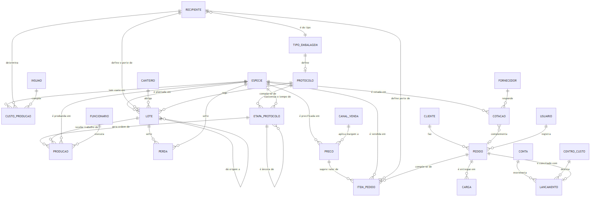
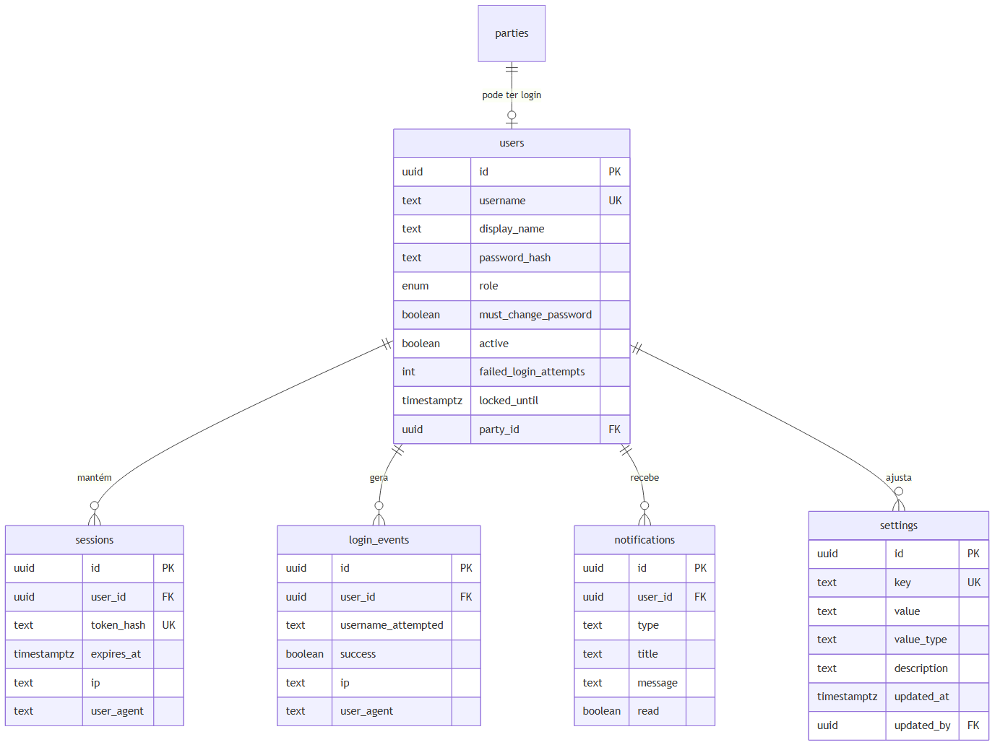
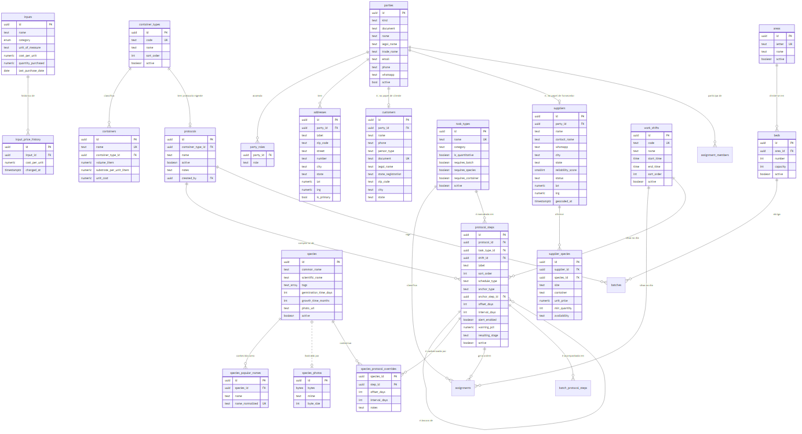
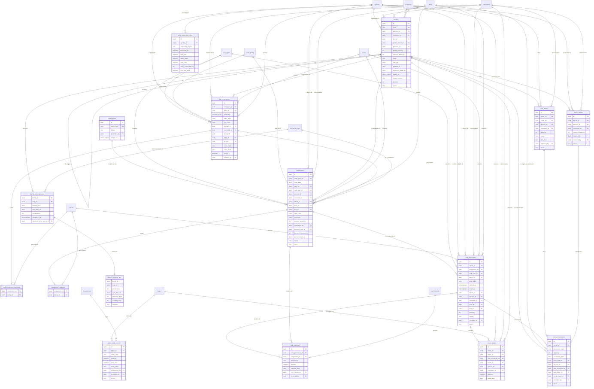
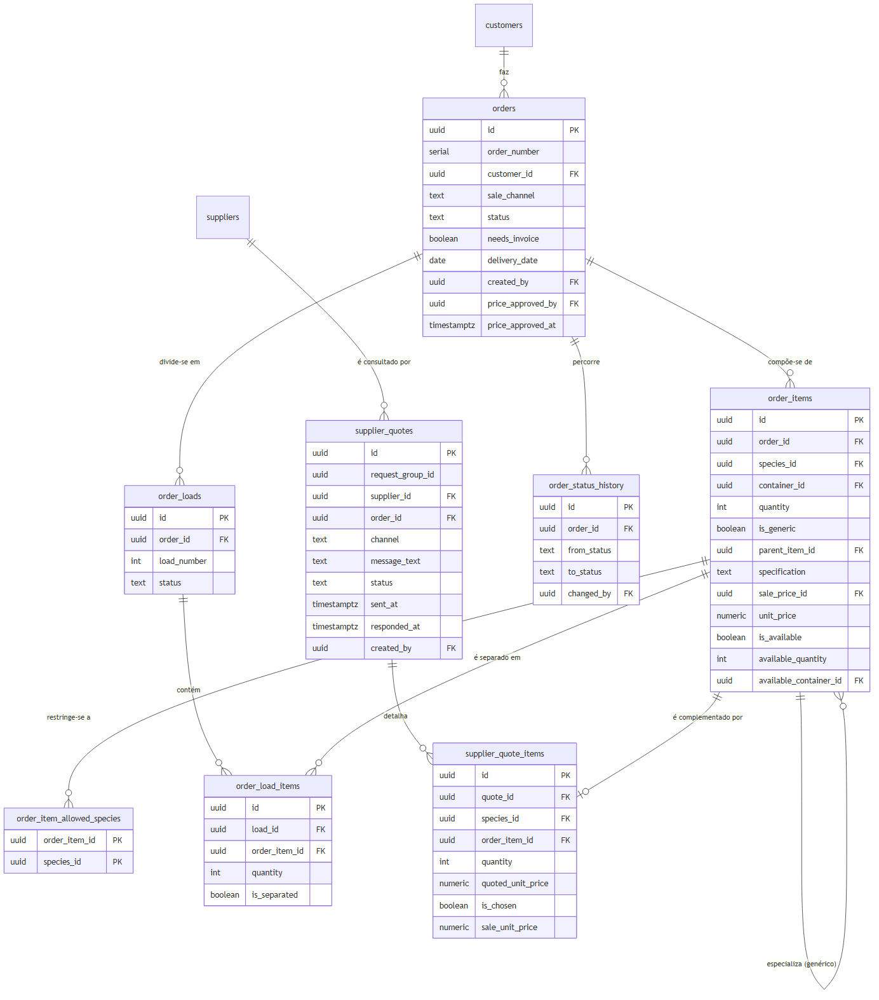
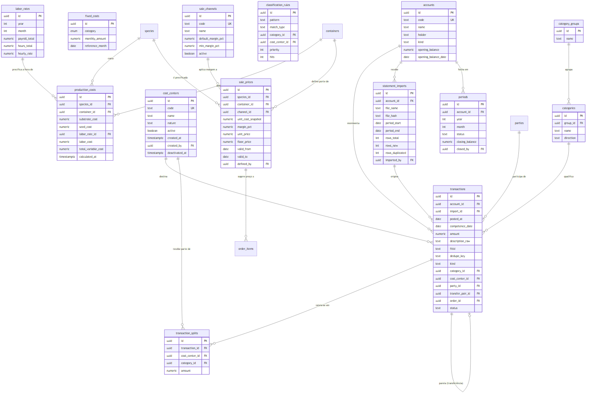

# 4.5 Modelagem de dados

> Gerado a partir de `C-modelagem/C6-modelo-entidade-relacionamento.md`.
> **Não edite este arquivo**: edite o artefato de origem e rode `npm run docs:tcc`.

---

## 1. Estratégia de modelagem

**A espécie é a entidade central.** Custo, preço, estoque, perda, item de pedido e oferta de
fornecedor referenciam-na por chave estrangeira. Essa centralidade não é preferência de projeto: é a
tradução direta da regra de negócio de que tudo no viveiro gira em torno da espécie.

O modelo é apresentado em **cinco agrupamentos**: os quatro módulos do sistema, mais o Acesso,
que atravessa todos. Um diagrama único com as 62 entidades seria ilegível em página impressa, e
usar aqui o mesmo agrupamento dos requisitos ([`B2 §2`](../B-requisitos/B2-especificacao-requisitos.md))
e da matriz de acesso ([`D4 §2`](../D-arquitetura/D4-matriz-rbac.md)) permite ler os três
documentos lado a lado sem traduzir de um para o outro.

| Agrupamento | Entidades | Papel |
|---|---|---|
| *(transversal)* **Acesso** | 5 | Autenticação, sessão, auditoria, notificação e parâmetros do sistema |
| **1 · Cadastros** | 16 | Catálogo de produção, endereço do viveiro e identidade das pessoas: não consome nada, alimenta tudo |
| **2 · Produção** | 12 | Lote, agenda, apontamento, consumo, coleta, perda e contagem de estoque |
| **3 · Comercial** | 8 | Pedido, item, carga e cotação com fornecedor |
| **4 · Financeiro** | 14 | Extrato como fonte da verdade, custeio e preço |
| **Total** | **55** | mais 2 visões derivadas (`species_unit_cost` e `input_stock_balance`), documentadas em [`C8`](C8-dicionario-de-dados.md) |

**O preço da escolha, declarado:** agrupar por propósito faz relacionamentos cruzarem a fronteira
do diagrama: `input_usages` é da Produção e aponta para `species`, `containers` e `inputs`, que
são de Cadastros. A convenção do §3 resolve isso sem duplicar conteúdo: a entidade estrangeira
aparece como **caixa vazia**, só para a aresta existir.

Duas realocações merecem nota, porque contrariam a intuição de onde a entidade nasceu:

- **O esquema `cadastro` (`parties`, `party_roles`, `addresses`) nasceu dentro do financeiro e
  serve o módulo 1.** Foi desenhado para dar contraparte a cada linha do extrato, mas o que ele
  resolve é anterior: cliente, fornecedor e funcionário são papéis de **uma identidade só**.
- **O custeio atravessa os três primeiros módulos e desemboca no quarto.** Consome catálogo
  (Cadastros) e consumo de campo (Produção), e o resultado (custo, margem, preço) é do
  Financeiro. É a razão de o custo do viveiro depender de rotina que ninguém associa a dinheiro.

Convenções adotadas, conforme Elmasri e Navathe (2011): tabelas nomeadas no **plural**, chaves
primárias e estrangeiras declaradas explicitamente, e identificadores universais como chave
primária: o que permite gerar a chave no cliente antes da gravação, requisito do funcionamento sem
conexão (RNF-05).

---

## 2. Modelo conceitual: visão geral

Apenas entidades e relacionamentos, sem atributos. É a visão que responde "de que o sistema trata".

**Figura 6**: Modelo conceitual: visão geral. Fonte: elaborado pelo autor (2026).

O diagrama conceitual apresenta **vinte e quatro entidades**, e não as sessenta e duas do modelo completo.
A redução é deliberada: Sommerville (2011) observa que a ausência de detalhe excessivo é
característica central do modelo, cujo objetivo é destacar o mais relevante e não especificar por
inteiro. Entidades associativas, de histórico e de auditoria aparecem apenas nos modelos lógicos por
módulo, na seção seguinte.

Sete leituras que o modelo conceitual já entrega:

- **A espécie participa de oito relacionamentos**, e está presente nos **quatro módulos**: custeio
  e preço no Financeiro, lote, atividade e perda na Produção, item de pedido e cotação no Comercial,
  e o próprio catálogo em Cadastros. É a confirmação estrutural da centralidade declarada no §3.4
  da metodologia. **O oitavo entrou em 26/08/2026 e é de outra natureza que os sete primeiros**:
  em `ESPECIE customiza o tempo de ETAPA_PROTOCOLO`, a espécie deixa de apenas participar do ciclo
  produtivo e passa a **parametrizá-lo**, decidindo em quantos dias cada etapa do manejo vence
  naquela espécie (RN-106).
- **Produção e perda são simétricas em torno da espécie.** Uma soma, a outra subtrai, e o estoque é
  a diferença: razão pela qual ele não aparece no modelo como entidade.
- **O modelo tem duas entidades reflexivas, e a segunda entrou em 26/08/2026.** `LOTE dá origem a LOTE` é a repicagem: a leva
  que muda de recipiente vira outra leva, ligada à primeira. Percorrer essa cadeia responde de
  quantas sementes semeadas saiu cada muda vendida, que é a pergunta que o viveiro nunca pôde
  responder. É também a entidade que dá **lugar** à muda: até 24/08/2026 o modelo dizia o que a
  muda era e não onde ela estava. A outra reflexiva é `ETAPA_PROTOCOLO é âncora de
  ETAPA_PROTOCOLO`, e ela diz **quando**: uma etapa do protocolo conta o prazo a partir da
  conclusão de outra, que não precisa ser a imediatamente anterior (RN-99).
- **O protocolo é o que liga a receita ao relógio.** `TIPO_EMBALAGEM define PROTOCOLO`, e não
  `RECIPIENTE define PROTOCOLO`: o manejo muda com ser saco ou tubete, não com a medida do saco
  (RN-98). É o que permite ao lote cobrar sozinho o que tem de receber, em vez de depender de
  alguém lembrar de lançar a tarefa.
- **O custo e o preço estão em cadeia, não em paralelo.** O custo de produção alimenta o preço, que
  sugere o valor do item de pedido. É a tradução no modelo de dados do objetivo central do trabalho:
  substituir a precificação intuitiva por uma derivada do custo apurado.
- **O pedido conecta-se ao lançamento financeiro.** É o vínculo que permite responder "esse pedido
  foi pago?": pergunta que hoje não tem resposta sem sentar e somar.
- **A cotação liga fornecedor e pedido.** Representa a decisão de complementar com muda de terceiro
  aquilo que a produção própria não atende, sem que o pedido do cliente precise ser recusado.

---

### 2.1 Recorte implementado

O modelo descrito aqui é o **especificado**, e é maior que o protótipo construído: das 62 entidades,
**46 existem no banco** (mais as três visões, `species_unit_cost`, `input_stock_balance` e
`batch_health`) e **16 permanecem só especificadas**. O recorte segue a priorização de
[`B2`](../B-requisitos/B2-especificacao-requisitos.md), e não uma limitação do modelo: o que se
modela é o sistema especificado, o que se constrói é o recorte que cabe no prazo do trabalho.

| Módulo | No banco | Só especificadas | Quais faltam |
|---|---:|---:|---|
| *(transversal)* Acesso | 5 | 0 | - |
| 1 · Cadastros | 16 | 4 | `container_types` e as três do protocolo de atividades |
| 2 · Produção | 14 | 1 | `batch_protocol_steps`, mais a visão `batch_protocol_due` |
| 3 · Comercial | 8 | 0 | - |
| 4 · Financeiro | 3 | 11 | as nove de `financeiro`, mais `sale_channels` e `sale_prices` |
| **Total** | **46** | **16** | |

O [`C8`](C8-dicionario-de-dados.md) marca a condição entidade por entidade. Três atributos de
entidade já existente estão na mesma situação: `users.party_id`, o par
`order_items.unit_price` / `order_items.sale_price_id` e `input_stock_entries.transaction_id`,
este último à espera do esquema `financeiro`.

**A Produção era o módulo mais especificado e o menos construído, e deixou de ser em 24/08/2026.**
As migrations `20260824000001` a `20260824000007` levaram ao banco as dezesseis entidades do lote,
da agenda, do apontamento e do estoque de insumo, com a carga inicial dos vinte e dois tipos de
tarefa e dos dois turnos. Em 26/08/2026 as migrations `20260826000001` a `20260826000004`
acrescentaram a tarefa recorrente e a visão de situação do lote, e emendaram `batches`,
`assignments` e `task_executions`: são as entidades que o protótipo da tela inicial do módulo
exigiu, e a alteração do lote por canteiro nasceu de o desenho contradizer o modelo. **O que falta
ali é tela, não tabela**: a construção da aplicação está planejada em
[`plans/P14`](../../../plans/P14-producao-lotes-apontamento.md).

**A Produção voltou a ter entidade no papel em 26/08/2026, e desta vez de propósito.** O protocolo
de atividades por lote (`container_types`, `protocols`, `protocol_steps`,
`species_protocol_overrides`, `batch_protocol_steps` e a visão `batch_protocol_due`) foi
especificado inteiro **antes de qualquer migration**, porque envolve um motor de geração automática
de ordens: modelar depois de construir, aqui, custaria reescrever a regra de contagem em três
lugares. A especificação está em
[`rotinas/2-producao/06`](../../rotinas/2-producao/06-protocolo-de-atividades.md), e a construção
em [`plans/P15`](../../../plans/P15-protocolo-de-atividades.md).

O Financeiro deixou de ser o único módulo com entidade no papel, e o motivo dele continua próprio:
depende de acesso a extrato bancário que o protótipo ainda não tem.

---

## 3. Modelo lógico por módulo

Um diagrama por módulo, na ordem em que o fluxo do sistema os percorre, mais o Acesso à frente
por atravessar os quatro. É o mesmo agrupamento de
[`B2 §2`](../B-requisitos/B2-especificacao-requisitos.md), do
[`D1 §4`](../D-arquitetura/D1-arquitetura-c4.md) e da
[`D4 §2`](../D-arquitetura/D4-matriz-rbac.md).

**As caixas trazem o conjunto que sustenta a leitura do diagrama**, chaves, atributos estruturais
e os que carregam decisão de modelagem. Campos de observação livre, de arquivamento e de detalhe
de contato ou endereço ficam de fora, porque encheriam a página sem mudar o que o diagrama diz. A
lista completa de cada entidade está no [`C8`](C8-dicionario-de-dados.md).

**Caixa sem atributos = entidade de outro módulo.** Quando um relacionamento cruza a fronteira.
e vários cruzam, porque a espécie é referenciada em quase todo lugar: a entidade estrangeira
aparece como caixa vazia, apenas para que a aresta exista. Os atributos dela estão no diagrama do
seu próprio módulo, uma vez só.

### 3.1 Acesso: transversal aos quatro módulos

**Figura 7**: Acesso: transversal aos quatro módulos. Fonte: elaborado pelo autor (2026).

**`users.party_id` é opcional, e a opcionalidade é a regra.** Usuário é *credencial*; funcionário é
*vínculo* (`cadastro.parties`). Há pessoa com login e sem vínculo (o administrador), e pessoa com
vínculo e sem login: o diarista, que aparece na agenda e no custo sem nunca abrir o aplicativo.
Fundir as duas numa tabela só obrigaria a inventar um dos dois lados.

O usuário não pertence a módulo de negócio: ele opera os quatro. `notifications` está aqui, e não
no Comercial que a origina, porque a notificação é do **destinatário**: quem a lê é uma pessoa,
não um pedido.

**`settings` é transversal pelo mesmo motivo, e não é cadastro.** Guarda parâmetro escalar do
sistema em chave e valor tipado: o limiar de mortalidade de 20%, as coordenadas do viveiro, a
margem mínima de revenda. Todos moram hoje em variável de ambiente ou constante de código, e
**são regra de negócio, não infraestrutura**: quem os decide é a chefia, e mudar qualquer um deles
hoje exige uma implantação.

> **Onde está a fronteira entre `settings` e cadastro.** Parâmetro que é **um valor** vai para
> `settings`. Parâmetro que é **uma lista de coisas com atributos** vira entidade: foi o caso dos
> centros de custo, e é o caso do período de trabalho, que virou `work_shifts` no módulo 1 em vez
> de duas chaves aqui. A regra de corte é a mesma dos Cadastros: se apagar deixa um movimento
> passado sem sentido, é entidade.

### 3.2 Módulo 1 · Cadastros

O que é estável e se repete. Não consome nada e alimenta os outros três: as únicas arestas que
saem daqui apontam para entidades da Produção, e é por isso que `assignments`, `assignment_members`,
`batches` e `batch_protocol_steps` aparecem como caixa vazia no fim do diagrama.

**O protocolo de atividades entrou aqui em 26/08/2026, e não na Produção**, junto com
`container_types`. É a mesma regra que já colocava `task_types` e `work_shifts` neste módulo: o que
é **mantido uma vez e consultado sempre** é cadastro, ainda que só a Produção o consuma. O que a
Produção guarda é o percurso de **cada lote** pelo protocolo (`batch_protocol_steps`), que é dado de
movimento e fica na §3.3.

**Figura 8**: Módulo 1 · Cadastros. Fonte: elaborado pelo autor (2026).

**Por que `species_popular_names` é entidade separada.** O nome popular é atributo **multivalorado**
a mesma espécie tem vários nomes regionais, e a busca precisa encontrá-la por qualquer um (RF-09).
Elmasri e Navathe tratam esse caso explicitamente: atributo multivalorado não cabe em coluna única, e
repetir a espécie por nome violaria a primeira forma normal. A restrição de unicidade sobre o nome
normalizado garante o outro lado da regra: **um nome popular aponta para uma única espécie**.

**Por que `species_photos` não tem `species_id`.** A aresta aparece tracejada porque não é
chave estrangeira, e a ausência é deliberada: a tela envia a foto **antes** de inserir a espécie, de
modo que no momento da gravação da imagem a espécie ainda não existe. A referência fica do outro
lado, em `species.photo_url`, no formato `/api/fotos/<uuid>`. A imagem vive no banco, e não em
disco, porque o sistema de arquivos da plataforma de publicação é somente leitura e descartado a
cada implantação: guardá-la em disco significaria perdê-la. O ganho colateral é que a foto entra no
mesmo backup do banco, previsto em [`E6`](../E-qualidade/E6-plano-backup-recuperacao.md).

**Por que `input_price_history` existe.** Sem ela, atualizar o preço de um insumo reescreveria o
custo de todas as espécies retroativamente: o custo apurado em março passaria a refletir o preço de
agosto. É a anomalia de atualização que a normalização busca evitar, e a solução é preservar o
histórico em vez de sobrescrever (RF-11).

**`task_types` é cadastro, e não configuração de tela.** Passa na regra de corte do módulo:
apagar um tipo de tarefa deixaria sem sentido toda atribuição passada que o usou, e por isso ele
se inativa (`active`) em vez de ser excluído.

**Um nome e quatro booleanos, e cada booleano tem efeito visível.** `is_quantitative` faz o
encerramento pedir quanto **cada participante** fez (RN-81, RN-91); `requires_batch` é o "lote
específico" da tela, e faz aparecer o campo de lote, que traz consigo canteiro, espécie e
recipiente (RN-82); `requires_species` e `requires_container` valem para as tarefas que os pedem
sem haver lote, como colher semente e encher saquinho. `category` é a única coisa ali que **não**
comanda formulário: é lista fechada de seis (semente, terra, plantio, manutenção, pós-morte,
expedição), e serve para agrupar a lista e somar horas por tipo de trabalho (RN-80).

> **`measurement_type` e `avg_minutes_per_unit` saíram, por motivos opostos.** O primeiro tinha
> três valores (`tempo`, `saco`, `tubete`), e os dois últimos existiam para dizer qual recipiente
> se contava; mas o recipiente já está no lote e no nome da tarefa, de modo que os três valores
> respondiam uma pergunta de dois estados. Guardar em três o que decide em dois garante que
> alguém, um dia, escreva a condição para `'saco'` e esqueça `'tubete'`. O segundo saiu porque
> nunca teve de onde vir: ninguém cronometrou tempo por unidade, e o custo de mão de obra sai das
> **horas apontadas** em `task_executions`, não de estimativa.

> **O `unit_of_measure` saiu antes, e pelo mesmo raciocínio.** Era texto livre ("muda", "bandeja",
> "metro") e não decidia nada. A entidade nunca chegou ao banco, então aquela troca não custou
> migração; esta custou, e está em `migrations/20260825000001_tipos_tarefa_simplificacao.sql`.

**`areas` e `beds` são o endereço do viveiro.** A área tem letra, o canteiro tem número dentro
dela, e a numeração recomeça em cada área: por isso a unicidade é do par (`area_id`, `number`), e
não do número sozinho (RN-74). É o vocabulário que a equipe já usa apontando com o dedo, e o
sistema não inventa nomenclatura nova para ele.

**`beds ||--o{ batches` é a cardinalidade que carrega a regra.** Um canteiro abriga **vários** lotes
abertos, e lote encerrado larga o canteiro (RN-79): canteiro livre é canteiro sem nenhum lote
aberto. `capacity` é opcional e serve de aviso ao criar lote, não de trava: o viveiro sabe apertar
mais do que a conta quando precisa, e a ocupação real é a soma dos saldos dos lotes abertos nele
(RN-92).

**A cardinalidade era `||--o|` até 26/08/2026.** O modelo declarava um lote por canteiro, e o
viveiro nunca operou assim: quem apontou a contradição foi o protótipo do mapa de produção, que
desenha vários lotes dentro do mesmo canteiro porque é o que se vê ao olhar para ele.

**`work_shifts` é o período de trabalho, e existe para tirar um número de dentro do código.** A
regra RN-48 dizia, no próprio enunciado, que um turno vale quatro horas. Isso é convenção que muda
com a estação e com a combinação da equipe, e convenção que muda é **dado**, não constante
(RN-85). O precedente do projeto é `financeiro.cost_centers`, que também nasceu carga fechada em
código e virou cadastro.

**Por que `parties` está aqui, e não no Financeiro onde nasceu.** As três entidades do esquema
`cadastro` (`parties`, `party_roles`, `addresses`) foram desenhadas para dar contraparte a cada
linha do extrato bancário. Mas o que elas resolvem é anterior ao dinheiro: **cliente, fornecedor e
funcionário são papéis da mesma pessoa**, e quem vende muda e às vezes compra tem de ser um
cadastro só. `customers` e `suppliers` sobrevivem como as tabelas **do papel**, é nelas que ficam
os campos que não são de identidade: dados fiscais de um lado, espécies ofertadas e geocodificação
do outro. O papel `funcionario` existe em `party_roles` sem tabela própria, porque um funcionário
não tem atributo que um `party` já não tenha.

**`container` do fornecedor é texto livre**, e não chave estrangeira para `containers`. A distinção é
deliberada e vale registrá-la: a tabela de recipientes modela a **produção interna**, com volume e
consumo de substrato usados no custeio. O fornecedor externo usa embalagem arbitrária, raiz nua,
lata, saco de um metro: que não tem custo de substrato a apurar. Forçá-lo na lista interna
corromperia a base do custeio para representar um dado que não a alimenta.

**`status` do fornecedor contempla "não contatar"**, que é registro de **oposição do titular** ao
tratamento de seus dados para contato comercial, e não um estado operacional. Ver
[`E5`](../E-qualidade/E5-mapeamento-lgpd.md).

#### O protocolo: o que o lote tem de receber, lembre alguém ou não

**As cinco entidades do protocolo respondem uma pergunta que o modelo não respondia: *quando*.**
`batches` diz o que a muda é e onde ela está; `assignments` diz o que alguém planejou fazer. Nada
dizia o que a leva **precisa** receber ao longo do ciclo, de modo que tarefa não lançada era tarefa
que o sistema não sabia que faltava. É a lacuna que [`rotinas/2-producao/06`](../../rotinas/2-producao/06-protocolo-de-atividades.md)
descreve, e ela tem efeito visível: `batch_health` deriva a cor do atraso das tarefas **lançadas**,
então o lote esquecido por completo aparecia como saudável.

**`protocols` pende de `container_types`, e não de `containers`.** É a cardinalidade que carrega a
RN-98: os quatro sacos (10x18, 17x22, 20x26, 28x32) são quatro linhas de `containers` e **um** tipo
de embalagem, porque o que muda o manejo é ser saco, não a medida do saco. Pendurar o protocolo no
recipiente obrigaria a manter quatro cópias da mesma receita e a mantê-las iguais para sempre.
`container_types` é tabela, e não lista fechada, porque "outros tipos a criar" é requisito
(RF-121): o dia em que o viveiro adotar bandeja, a gerência cria a bandeja.

**`protocol_steps` é reflexiva, e é a segunda reflexiva do modelo.** `anchor_step_id` aponta para a
etapa cuja conclusão inicia a contagem desta, e **não é a etapa anterior**: "Classificar
pós-germinação" ancora em "Plantar no tubete", que pode estar várias posições atrás. Derivar a
âncora de `sort_order` faria a classificação contar da criação do lote, e a semente pode ficar dias
esperando plantio antes de germinar (RN-99). A âncora é atributo justamente para não ser
consequência da posição na lista.

> **O ciclo na cadeia de âncoras não é impedido pelo modelo.** A etapa A ancorando em B e B em A é
> estruturalmente representável, e nenhuma restrição declarativa o barra: a validação é da
> aplicação. Está registrado aqui, e não omitido, porque limite conhecido documentado é limite; o
> mesmo não vale para o que se descobre em produção.

**`species_protocol_overrides` é associativa entre espécie e etapa, e existe para não duplicar
protocolo.** Espécie de germinação lenta precisa de setenta dias onde o padrão são quarenta, e a
alternativa seria um protocolo inteiro por espécie: cento e quarenta e duas cópias de quinze etapas
para variar um número. Colunas em `species` produziriam uma matriz quase toda nula, pela mesma
regra de corte que separa `settings` de entidade.

**`batch_protocol_steps` guarda fatos, e nunca o vencimento.** As colunas são a data da âncora já
resolvida, a data **real** da última execução e quantas ocorrências foram concluídas. O próximo
vencimento sai delas na visão `batch_protocol_due`, e não é coluna, pela mesma razão de
`batch_health` e `input_stock_balance` não serem tabelas (RN-110): número gravado que depende da
data de hoje envelhece sozinho.

**`anchor_date` nula é o estado que faz a etapa esperar.** Enquanto o plantio não é concluído, as
etapas ancoradas nele não têm âncora, e não vencem nada. É o que representa "ainda não germinou", e
é diferente de "germinou hoje": nulo, aqui, é informação, e não ausência de dado.

**A ordem gerada é `assignments`, e não entidade nova.** `protocol_step_id` marca de que etapa ela
nasceu, exatamente como `recurrence_id` marca de que recorrência de calendário (RN-111). A agenda,
o apontamento e a tela do colaborador continuam lendo uma tabela só, e quem executa não precisa
saber de onde a tarefa veio. Uma entidade paralela de ordens duplicaria a noção de pendência e
obrigaria a reescrever `batch_health`.

> **Não há entidade de eventos do protocolo, e é decisão declarada.** O razão que explica o estado
> é o par `assignments` + `task_executions`: a ordem sabe a etapa e a ocorrência, e a execução sabe
> a data real. Uma terceira tabela criaria duas verdades sobre o mesmo fato, que é o que
> `batch_movements` evita fazer com o saldo. **A consequência aceita:** marcar uma etapa como feita
> fora da agenda tem de gerar a ordem e a execução correspondentes, e não escrever direto no
> estado.

**`batches` ganhou quatro atributos, e um deles muda o sentido de outro.** `protocol_id` fotografa
o protocolo na criação, para que trocar o recipiente do lote não troque a receita dele no meio do
caminho. `closed_reason` distingue a divisão da repicagem, que também usa `parent_batch_id` mas
**não** encerra o lote de origem. E `filled_at` entra ao lado de `planted_at`, que passa a ser
**nulo até o plantio ocorrer**: são as duas datas da RN-103, e antes disso a segunda fazia o papel
das duas.

### 3.3 Módulo 2 · Produção

Registro do que acontece no campo. Consome o catálogo do módulo 1 (daí as caixas vazias) e
entrega estoque para o Comercial e medida de consumo e de horas para o custeio.

**É o maior módulo do modelo, e passou a ser em 24/08/2026**, quando o lote entrou no escopo
([`A1`](../A-fundacao/A1-documento-de-visao.md) §7). Quinze entidades e três visões derivadas: a
tarefa recorrente e a situação do lote entraram em 26/08/2026, com o protótipo da tela inicial do
módulo, e no mesmo dia entraram `batch_protocol_steps` e a visão `batch_protocol_due`, o percurso de
cada lote pelo protocolo, que ainda **não existem no banco** (§2.1). O protocolo em si é cadastro e
está na §3.2.

**Figura 9**: Módulo 2 · Produção. Fonte: elaborado pelo autor (2026).

#### O lote: onde a muda está e de que leva veio

**`batches` é o endereço da muda dentro do viveiro.** Espécie e recipiente dizem *o que* é a muda;
`bed_id` diz *onde* ela está, e a data de plantio diz *quando* começou. Até 24/08/2026 o modelo
não tinha resposta para a segunda pergunta, e a rotina de campo não consegue operar sem ela: a
tarefa de repicagem é dada apontando um canteiro, não uma espécie.

**Um lote ocupa um canteiro, e um canteiro abriga vários: a cardinalidade é `beds ||--o{ batches`.**
Leva que não cabe em um canteiro é **outro lote** (RN-76). A alternativa, uma entidade de ocupação
com quantidade por canteiro, custaria um nível de indireção em toda tela que pede lote, para
representar o que dois lotes já representam.

**A cardinalidade era `||--o|` até 26/08/2026, e a correção veio do protótipo da tela.** O modelo
declarava exclusividade, garantida pelo índice `batches_um_lote_aberto_por_canteiro`, e o viveiro
nunca a teve: o mapa de produção desenha seis, oito, nove lotes no mesmo canteiro, que é como a
operação usa o espaço. O índice proibia exatamente o gesto de todo dia, e ninguém tinha esbarrado
nele porque a tela ainda não existia. **`position` entrou junto**, para que o desenho do canteiro
seja estável entre um carregamento e outro: reconhece-se o lote pelo lugar antes de ler o rótulo, e
lote que troca de posição a cada abertura desfaz essa leitura.

**`parent_batch_id` é reflexivo, e é o que a repicagem produz.** Quando a muda passa do tubete
para o saco, ela muda de recipiente, e recipiente define produto, custo e preço: comercialmente,
virou outra coisa. Por isso a repicagem **não move** o lote, e sim baixa parte do lote de origem e
cria um lote novo que aponta para ele (RN-77). O que se ganha é a pergunta que o viveiro nunca
pôde responder: **de cada mil sementes semeadas, quantas mudas chegaram à venda?** A resposta é
percorrer a cadeia de `parent_batch_id` e comparar as pontas.

**`current_quantity` é redundante com `batch_movements`, e a redundância é deliberada.** O saldo
poderia ser somado dos movimentos a cada leitura, e é assim que o estoque de espécie funciona.
Aqui não: a tela de ocupação lê o saldo de todos os lotes abertos a cada abertura, no celular, em
rede instável. O saldo materializado é mantido **pela aplicação** na mesma transação que grava o
movimento, e não por gatilho: a migration cria a restrição de não negativo e deixa a atualização
com quem já está dentro da transação. `batch_movements` é a fonte que o audita. É a única quantidade materializada do modelo, e está
declarada como exceção justamente porque o resto do sistema segue a regra oposta.

#### Agenda e apontamento: o planejado e o realizado

**`assignments` é o planejado e `task_executions` é o realizado.** A separação já existia; o que
mudou nesta revisão é que ambos deixaram de ser uma linha por pessoa e por dia.

**`assignments` perdeu `party_id` para `assignment_members`.** Uma tarefa admite vários executores,
e o mesmo turno admite duas tarefas com grupos diferentes (RN-84): metade da equipe enchendo
saquinho enquanto a outra metade repica é a norma. Com `party_id` na própria atribuição, escalar
quatro pessoas na mesma tarefa criaria quatro atribuições idênticas, e a tarefa deixaria de ser
uma coisa só para virar quatro coisas parecidas.

**`assignments.shift` virou `shift_id`.** O turno deixou de ser o texto `manha`/`tarde` e passou a
apontar para `work_shifts`, no módulo 1, que carrega a hora de início e de fim. É de lá que sai a
duração do turno que a RN-48 usa: o valor de quatro horas saiu do enunciado da regra e virou
parâmetro (RN-85).

**`task_executions` tem `started_at` e `ended_at`, e `ended_at` nulo significa tarefa em curso.**
É o que sustenta a faixa do funcionário na linha do tempo do dia. Uma pessoa faz uma tarefa por vez
(RN-83), e o banco garante isso com **índice único parcial sobre `party_id` onde `ended_at` é
nulo**: não é validação de aplicação, porque duas telas abertas ao mesmo tempo a burlariam, e
duas tarefas abertas contariam a mesma hora duas vezes.

**A hora entrou em `assignments` sem derrubar o turno.** `start_time` e `end_time` são opcionais e
`shift_id` continua obrigatório: a atribuição sem hora vale o turno inteiro, que é o que RF-100 usa
nos dias sem apontamento, e a atribuição com hora vale a janela declarada. Quem traz hora para o
planejamento é a **tarefa recorrente**, e ela é a única (RN-95). Fazer o contrário, trocar o turno
pela hora em toda a agenda, exigiria montar a semana de hora em hora, e é a decisão que a RN-48
recusa desde o começo.

**A recorrência declara turno *e* hora, e o turno não é enfeite.** `assignments.shift_id` é
obrigatório: a ocorrência gerada precisa de um, e a hora sozinha não o determina. Os turnos são
`07:00-11:00` e `13:00-17:00`, com o almoço no meio, e a recorrência das 11:30 às 12:30 (a carga de
terra que chega no fim da manhã) não cai em nenhum dos dois. Derivar o turno da hora exigiria
escolher entre errar e recusar; quem responde é a gerência, e a pergunta é simples: esta rotina
conta como manhã ou como tarde? **`shift_id` entrou em `task_recurrences` por isso**, e é ele que a
ocorrência herda, enquanto `start_time`/`end_time` desenham a barra na linha do tempo.

**`task_recurrences` é a regra, e `assignments` continua sendo a ocorrência.** A recorrência não
tem linha do tempo própria: ela **gera atribuições**, e dali em diante cada dia vive por conta
própria (RN-96). Excluir a ocorrência de uma quarta não altera a regra; alterar a regra não
reescreve o dia já trabalhado. É a mesma separação entre planejado e realizado, um nível acima: a
regra explica de onde o dia veio, sem poder reescrevê-lo.

**A geração é sob demanda, ao abrir a agenda do dia, e não por tarefa agendada.** O sistema não tem
processo de fundo, e criar um só para isto seria infraestrutura nova para uma regra que a própria
tela resolve ao ser aberta. O que torna isso seguro é o índice único parcial sobre
`(recurrence_id, work_date)`: sem ele, abrir a tela duas vezes geraria a atribuição duas vezes, e
as horas assumidas por RF-100 dobrariam em silêncio.

**`assignments.is_recurring` saiu na mesma alteração.** O booleano dizia que a tarefa era fixa sem
dizer de que regra vinha, em que dias valia nem até quando: metade da resposta, guardada onde a
resposta inteira cabia. É o mesmo corte que tirou `measurement_type` de `task_types`.

**`task_executions` substituiu `production_activities`, e não é renomeação cosmética.** A entidade
antiga registrava um fato consumado (espécie, recipiente, quantidade, data) e classificava-o por
`activity_type`, uma segunda lista fechada que duplicava o catálogo de `task_types`. A nova
registra um **intervalo de trabalho** de uma pessoa, classificado pelo próprio catálogo. A
entidade antiga nunca chegou ao banco, então a troca não custou migração de dado.

**`quantity` é opcional, e é o catálogo que decide se ela é pedida.** Tarefa não quantitativa
encerra sem número algum; tarefa quantitativa por unidade pede a contagem (RN-81). Quem declara
isso é `task_types.is_quantitative`, no módulo 1: o formulário não sabe nada por conta própria.

**E `quantity` é da pessoa, não da tarefa** (RN-91). É a razão de a contagem morar aqui e não em
`assignments`: `task_executions` já tem **uma linha por participante**, e quatro pessoas enchendo
saquinho gravam quatro números. Um total único na atribuição obrigaria a dividir por quatro para
saber o rendimento de cada um, inventando um número que ninguém produziu. Por isso o encerramento
do grupo (RF-107) não precisa de entidade nova: ele escreve `ended_at` e `quantity` em cada uma
das linhas que já existiam.

**`client_id` repete em `task_executions` a solução já adotada em `input_usages`**: chave gerada no
aparelho antes do primeiro envio, que torna o reenvio idempotente (RNF-05). Apontamento duplicado
inflaciona horas, que é o número que o custeio existe para apurar.

**O horário informado abriu um buraco na garantia de RN-83, e a restrição de exclusão o fecha.** O
índice único parcial cobria dois apontamentos **abertos** para a mesma pessoa, e isso bastava
enquanto todo apontamento nascia do relógio. Com "escolher horário" (RF-110), quem coordena lança às
onze o que começou às sete, e nada impedia gravar 7h-11h e 9h-12h para a mesma pessoa: duas linhas
legítimas, cada uma com fim, somando quatro horas que ninguém trabalhou.
`task_executions_sem_sobreposicao` é `EXCLUDE USING gist` sobre `party_id` e o intervalo do
apontamento, com o aberto entrando como intervalo sem fim, de modo que a mesma restrição cobre os
dois casos (RN-97). É garantia de banco pelo mesmo motivo da anterior: duas telas abertas ao mesmo
tempo burlariam qualquer validação de aplicação.

**`area_id` e `bed_id` entraram nos dois lados porque o lugar não tinha onde ser gravado.**
`assignments` e `task_executions` tinham lote, espécie e recipiente; "Irrigação" tem
`requires_batch = FALSE`, e até 26/08/2026 não havia como registrar **onde** ela foi feita. Lugar e
lote são **alternativos, nunca redundantes**: a tela só apresenta área e canteiro quando o tipo de
tarefa não exige lote (RF-82, RF-113), e tarefa com lote herda o canteiro dele.

**A situação do lote é visão, e não coluna.** `batch_health` deriva de `assignments` e
`task_executions`: o lote fica em atenção ou crítico conforme o atraso da tarefa planejada para ele
que ninguém executou, com os limites vindos de `settings` (RN-93, RN-94). Guardar a situação em
`batches` criaria um valor que envelhece sozinho, e o lote marcado como saudável ontem continuaria
saudável hoje: é a mesma razão que mantém `input_stock_balance` e `species_unit_cost` fora das
tabelas.

#### Insumo: entrada, consumo e saldo

**`input_usages` ganhou `task_execution_id` e `batch_id`, e afrouxou `species_id` e
`container_id`.** O consumo passa a nascer dentro do encerramento da tarefa (RN-87), e quando há
lote, espécie e recipiente vêm dele: pedi-los de novo seria pedir duas vezes o mesmo dado. Os dois
campos continuam existindo para o registro avulso, que é como a tela de campo funciona hoje e
continua funcionando.

**`input_stock_entries` guarda só o que entra.** Compra, ajuste de inventário e perda de estoque.
A saída é o próprio `input_usages`, e o **saldo é a visão `input_stock_balance`**: entradas menos
consumo. Não há campo de saldo em `inputs`, pelo mesmo motivo que não há para muda: guardar o
número cria duas verdades sobre ele (RN-88).

> **Por que o insumo não segue a exceção do lote.** `batches.current_quantity` é materializado
> porque a tela de ocupação lê centenas de saldos de uma vez, em campo. O saldo de insumo é lido
> em dezenas, de escritório: não paga o custo de manter uma segunda verdade.

**`task_expenses` é o gasto extra da tarefa**, e liga a Produção ao Financeiro por
`cost_centers`. É custo **direto** do lote trabalhado, não custo fixo rateado (RN-89): quem pagou
por ele foi aquela leva.

#### O que não mudou

**O estoque continua não sendo entidade.** É quantidade derivada: produção registrada, menos
perdas, menos o que saiu em pedidos aprovados. Modelá-lo como entidade criaria duas verdades sobre
o mesmo número, a calculada e a armazenada, que divergiriam ao primeiro registro esquecido. A
decisão está declarada desde o [glossário](../A-fundacao/A2-glossario-dominio.md), na lista de
termos deliberadamente não adotados. O lote **não** contradiz isso: ele não é o estoque, é a leva,
e o estoque da espécie continua sendo a soma dos lotes abertos dela menos o que saiu.

**`stock_counts` continua armazenando o evento de contagem, não o estoque.** Ganhou `batch_id`
porque agora se conta um canteiro, que é como a contagem física de fato acontece. Quando diverge do
calculado, prevalece a contagem, e a divergência vira um movimento de ajuste no lote: ela própria é
informação, indica registro de produção ou de perda que não foi feito.

**A causa da perda continua sendo lista fechada**: seca, praga, geada, manuseio, outro. Causa
digitada à mão inviabiliza a análise por causa, que é o que o indicador de mortalidade precisa
produzir. `loss_events` ganhou `batch_id`, e com ele a perda passou a ter **lugar** sem ganhar
campo: o formulário de campo continua com quatro campos, e o lote carrega espécie, recipiente e
canteiro de uma vez ([`C2`](C2-especificacao-casos-de-uso.md), UC-17).

**`quantity` em `loss_events` continua sendo a unidade de mortalidade.** A taxa é a razão entre a
soma das perdas e a soma da produção do período, e é dela que decorre o alerta acima de 20%, que é
regra de negócio e não configuração de painel. Com lote, a mesma taxa passa a ser calculável **por
leva**, e não só por espécie: é onde a regra ganha poder de apontar qual plantio deu errado.

**`input_usages` continua sendo a entidade de maior volume de escrita do sistema**, e a que mais
depende do funcionamento sem conexão. Está no módulo do colaborador, não no do dinheiro, porque
quem a preenche é quem está com as mãos na terra.

#### O percurso do lote pelo protocolo

**`batch_protocol_steps` é o que a Produção guarda do protocolo, e só isso.** A receita em si é
cadastro e está na §3.2; aqui fica uma linha por par lote e etapa, com **fatos**: a data do evento
de referência já resolvido, a data **real** da última execução e quantas ocorrências foram
concluídas.

**`anchor_date` nula é o estado que faz a etapa esperar.** Enquanto o plantio não é concluído, as
etapas ancoradas nele não têm âncora, e não vencem nada. É o que representa "ainda não germinou", e
é diferente de "germinou hoje": nulo, aqui, é informação, e não ausência de dado.

**`last_done_on` é a data da execução, e não a da ordem.** É o que faz a ocorrência seguinte contar
de quando o serviço foi de fato feito (RN-100). Usar a data planejada devolveria o comportamento de
calendário fixo que o módulo existe para não ter.

**`next_due_on` não é coluna: é a visão `batch_protocol_due`.** O vencimento é função do que já está
na tabela, e gravá-lo criaria um número que depende da data de hoje e envelhece sozinho, pela mesma
razão de `batch_health`, `input_stock_balance` e `species_unit_cost` não serem tabelas (RN-110). É
dela que `batch_health` passa a tirar a cor do lote, e é a correção que motivou o módulo: o critério
anterior lia o atraso das tarefas **lançadas**, de modo que o lote esquecido por completo aparecia
como saudável.

**A ordem gerada é `assignments`, e não entidade nova.** `protocol_step_id` marca de que etapa ela
nasceu, exatamente como `recurrence_id` marca de que recorrência de calendário (RN-111). A agenda, o
apontamento e a tela do colaborador continuam lendo uma tabela só. Ela entra na semana do vencimento
(RN-112) e **nasce sem ninguém escalado** (RN-113): `assignment_members` só recebe linha quando a
gerência atribui as pessoas.

> **Não há entidade de eventos do protocolo, e é decisão declarada.** O razão que explica o estado é
> o par `assignments` + `task_executions`: a ordem sabe a etapa e a ocorrência, e a execução sabe a
> data real. Uma terceira tabela criaria duas verdades sobre o mesmo fato, que é o que
> `batch_movements` evita fazer com o saldo. **A consequência aceita:** marcar uma etapa como feita
> fora da agenda precisa gerar a ordem e a execução correspondentes, e não escrever direto no estado.

**`batches` ganhou quatro atributos, e um deles muda o sentido de outro.** `protocol_id` fotografa o
protocolo na criação, para que trocar o recipiente do lote não troque a receita dele no meio do
caminho. `closed_reason` distingue a divisão da repicagem, que também usa `parent_batch_id` mas
**não** encerra o lote de origem. E `filled_at` entra ao lado de `planted_at`, que passa a ser
**nulo até o plantio ocorrer**: são as duas datas da RN-103, e antes disso a segunda fazia o papel
das duas.

### 3.4 Módulo 3 · Comercial

O ciclo do pedido e a cotação que o complementa. `customers` e `suppliers` aparecem vazios: são
cadastro, e o Comercial só os referencia.

**Figura 10**: Módulo 3 · Comercial. Fonte: elaborado pelo autor (2026).

**O item genérico é o ponto mais sutil do modelo.** Um item de pedido pode não ter espécie:
`is_generic` verdadeiro e `species_id` nulo representam "500 mudas nativas", sem escolha das
espécies. Três consequências estruturais:

1. **`species_id` é opcional**, ao contrário do que a centralidade da espécie sugeriria. A restrição
   de integridade garante a coerência: item genérico **não pode** ter espécie, e item específico
   **precisa** ter: salvo quando é filho de um genérico.
2. **`parent_item_id` é auto-relacionamento.** Ao decidir com que espécies atender o item genérico, o
   sistema cria itens filhos que o especializam, preservando o item original tal como o cliente o
   pediu.
3. **`order_item_allowed_species` é tabela associativa** que materializa a lista fechada de espécies
   aceitas (RF-67). Ausência de linhas significa **aberto**, qualquer espécie atende.

**O preço acordado está no item, e não no pedido.** Cada espécie e recipiente negocia o seu, e um
pedido mistura vários. `unit_price` guarda o valor efetivamente combinado, que pode diferir do
sugerido desde que não desça abaixo do piso (RN-59, RF-33); `sale_price_id` aponta a linha de
`sale_prices` que serviu de base. Não se copia aqui o valor sugerido nem o piso: como `sale_prices`
guarda vigência fechada, a referência recupera os dois sem duplicar dado (RN-58), e é ela que
sustenta o relatório de custo contra preço praticado (RF-35). A aprovação da chefia (RF-44) fica no
pedido, porque é o pedido inteiro que avança ou não.

**Por que a carga é entidade e não atributo do pedido.** Um pedido grande sai em mais de uma viagem,
e cada viagem tem estado próprio de separação. Modelar como atributo obrigaria a repetir o pedido por
viagem, ou a perder o controle da separação parcial.

**A disponibilidade parcial ocupa três colunas**, `is_available`, `available_quantity` e
`available_container_id`: porque são quatro estados distintos, não dois: disponível, parcial,
indisponível e ainda não verificado. Um único campo booleano confundiria "não tem" com "ninguém
olhou ainda", que são operacionalmente opostos.

**`request_group_id` sem tabela-mãe.** Um disparo de cotação para cinco fornecedores gera cinco
registros que compartilham o mesmo identificador de grupo. Não há entidade "consulta" porque ela não
teria atributo próprio algum: seria uma tabela de uma coluna. O agrupamento é feito na leitura.

### 3.5 Módulo 4 · Financeiro

O módulo restrito, e o único com entidades em **esquema próprio** (`financeiro`). São nove, as do
extrato e da classificação: `accounts`, `cost_centers`, `category_groups`, `categories`,
`statement_imports`, `transactions`, `transaction_splits`, `classification_rules` e `periods`. As
demais entidades do módulo, custeio (`fixed_costs`, `production_costs`, `labor_rates`) e preço
(`sale_channels`, `sale_prices`), ficam em `public`, porque a Produção e o Comercial as consultam.
A separação é de segurança, não de organização: a base mistura gasto do viveiro com gasto pessoal da família e da
clínica, e a fronteira de esquema torna a restrição de acesso estrutural em vez de apenas
procedimental.

**`cost_centers` é a exceção de dono, não de lugar.** Ela fica neste schema porque é aqui que é
consumida (classificação, rateio, regra automática), mas quem a **mantém** é o módulo 1, pela tela
`/cadastros/centros-de-custo` (RF-77 a RF-79). A fronteira de schema é de acesso, não de posse: a
manutenção segue restrita a chefia e administrador ([`D4 §3.12`](../D-arquitetura/D4-matriz-rbac.md)),
que é o que torna a exceção inofensiva. `created_by` e `deactivated_at` existem por isso: a lista
deixou de ser carga inicial imutável e passou a ter autor e história.

Custo e preço estão aqui, e não na Produção que os alimenta, pela mesma razão que a compra está:
são dinheiro. O que a Produção entrega é medida de campo (quanto se consumiu, quantas horas), e
o que sai daqui é custo por muda e preço por canal.

**Figura 11**: Módulo 4 · Financeiro. Fonte: elaborado pelo autor (2026).

#### O extrato como fonte da verdade

Quatro decisões de modelagem com justificativa:

- **Nenhum lançamento sem conta.** Não há lançamento órfão: o gasto em dinheiro entra por uma conta
  chamada *caixa*, que também é conta. É essa obrigatoriedade que faz o saldo calculado ter de bater
  com o saldo do banco.
- **Duas datas, não uma.** `posted_at` é quando o banco moveu e nunca é editado; `competence_date` é
  o mês a que o gasto pertence economicamente. Saldo apura-se pela primeira, custo pela segunda.
  Registrar apenas uma tornaria irreversível a perda: reconstruir a competência anos depois é
  impossível.
- **`description_raw` nunca é editado.** É a prova de que a linha veio do banco e não da memória de
  alguém: a diferença exata entre este modelo e a planilha que ele substitui.
- **O rateio é entidade separada.** O caso comum usa o centro de custo direto no lançamento; o rateio
  existe para o caso real da energia de um imóvel que serve a dois fins. A invariante: a soma das
  partes iguala o total: é validada na camada de aplicação, onde a mensagem de erro é legível e o
  comportamento é testável.
- **Duas datas, não uma.** `posted_at` é quando o banco moveu e nunca é editado; `competence_date` é
  o mês a que o gasto pertence economicamente. Saldo apura-se pela primeira, custo pela segunda.
  Registrar apenas uma tornaria irreversível a perda: reconstruir a competência anos depois é
  impossível.
- **`description_raw` nunca é editado.** É a prova de que a linha veio do banco e não da memória de
  alguém: a diferença exata entre este modelo e a planilha que ele substitui.
- **O rateio é entidade separada.** O caso comum usa o centro de custo direto no lançamento; o rateio
  existe para o caso real da energia de um imóvel que serve a dois fins. A invariante: a soma das
  partes iguala o total: é validada na camada de aplicação, onde a mensagem de erro é legível e o
  comportamento é testável.
- **`description_raw` nunca é editado.** É a prova de que a linha veio do banco e não da memória de
  alguém: a diferença exata entre este modelo e a planilha que ele substitui.
- **O rateio é entidade separada.** O caso comum usa o centro de custo direto no lançamento; o rateio
  existe para o caso real da energia de um imóvel que serve a dois fins. A invariante: a soma das
  partes iguala o total: é validada na camada de aplicação, onde a mensagem de erro é legível e o
  comportamento é testável.
- **O rateio é entidade separada.** O caso comum usa o centro de custo direto no lançamento; o rateio
  existe para o caso real da energia de um imóvel que serve a dois fins. A invariante: a soma das
  partes iguala o total: é validada na camada de aplicação, onde a mensagem de erro é legível e o
  comportamento é testável.

**`labor_rates` guarda o valor-hora do período, e não o salário de ninguém.** É a folha do mês
dividida pelas horas do mês (RN-53): um número por período, que multiplica as horas da agenda para
produzir o custo de mão de obra por espécie. A escolha é deliberada: o custo fica real, e o
sistema nunca precisa saber quanto cada pessoa ganha.

#### Do custo ao preço

A precificação é a ponte entre o custeio e o comercial: consome o custo unitário apurado e entrega
o preço praticado no pedido.

**`production_costs.labor_rate_id` guarda a taxa que gerou o número.** O custo de mão de obra sai
dos minutos gastos multiplicados pelo valor-hora do período, e apagar qual valor-hora foi usado
tornaria o custo apurado no passado impossível de reconferir. É o mesmo motivo de
`sale_prices.unit_cost_snapshot` (RN-58).

**Por que o canal é entidade e não texto.** A margem é atributo do canal, não do preço: alterar a
margem do atacado deve refletir-se em todos os preços daquele canal, e um canal escrito como texto
em cada linha tornaria essa alteração uma varredura sujeita a erro. É a mesma anomalia de atualização
que motiva a separação em qualquer normalização.

**Por que o preço tem vigência.** `valid_from` e `valid_to` delimitam o período em que o preço vale.
Sobrescrever o preço destruiria a informação de quanto se vendeu a quanto, e o relatório de margem
passaria a comparar a venda de março com o custo de agosto. É a razão que motiva
`input_price_history`, aplicada ao outro lado da equação.

**Por que o custo é fotografado no preço.** `unit_cost_snapshot` guarda o custo unitário vigente no
momento em que o preço foi definido. Sem ele, a margem registrada e a margem recalculada divergiriam
a cada alteração de custo, e não seria possível responder "qual era a margem quando eu vendi".

**Por que o piso é coluna e não constante.** O piso mínimo varia por canal e por espécie: uma espécie
de ciclo longo tem piso diferente de uma pioneira. Fixá-lo em configuração única obrigaria a escolher
entre um piso alto demais para umas e baixo demais para outras.

**`total_variable_cost` e `cost_per_seed` são atributos derivados**, calculados a partir dos demais
e mantidos pelo próprio banco: o primeiro em `production_costs`, aqui; o segundo em
`seed_collection_costs`, na Produção. Armazená-los é desnormalização deliberada: evita recalcular a
soma a cada leitura de relatório, sem risco de divergência, porque o banco não permite gravá-los
diretamente.

**O preço sugere, não impõe.** O item de pedido registra o valor **efetivamente acordado**, que
pode diferir do sugerido dentro do limite do piso. A entidade de preço é fonte de sugestão e de
validação: a negociação existe, e o modelo precisa acomodá-la sem perder o controle da margem.

---

## 4. Nota de normalização

O esquema está em **terceira forma normal**, com duas desnormalizações deliberadas e declaradas:
os atributos derivados de custo (§3.2) e a redundância entre `active` e `status` em fornecedores, que
distinguem arquivamento de registro (soft-delete) de estado comercial, informações diferentes que um
único campo não expressaria.

A demonstração formal da progressão 1FN → 2FN → 3FN, com as anomalias de inserção, exclusão e
atualização evitadas em cada passo, **não integra o conjunto de artefatos selecionados**
(corresponderia ao item C7 do catálogo). O que se registra aqui são as decisões, não a derivação.

---

## 5. Observação sobre a origem deste artefato

As duas entidades de precificação (`sale_channels` e `sale_prices`, hoje no §3.5) não constavam
da primeira versão deste modelo. Foram
acrescentadas ao se verificar que os requisitos **RF-31 a RF-35**, margem por canal, preço sugerido,
piso mínimo e relatório de margem: não tinham onde persistir: o único preço de venda modelado era o
de revenda de muda de terceiro, que atende ao fornecedor e não à produção própria.

Uma segunda passagem, agora confrontando o modelo com o banco construído, mostrou que a correção
tinha ficado pela metade: `sale_channels` e `sale_prices` guardam o preço **sugerido vigente**, mas
o **valor efetivamente acordado** continuava sem lugar, embora RN-59 o admita diferente do sugerido
e RF-33, RF-35 e RF-44 falem em preço praticado. **Correção:** `order_items` recebeu `unit_price` e
`sale_price_id`, e `orders` recebeu a aprovação de preço pela chefia (§3.4).

O registro fica aqui porque ilustra a função da matriz de rastreabilidade
([`B5`](../B-requisitos/B5-matriz-rastreabilidade.md)): cinco requisitos sem entidade correspondente
são um defeito de especificação que só aparece quando requisito e modelo são confrontados
sistematicamente.

