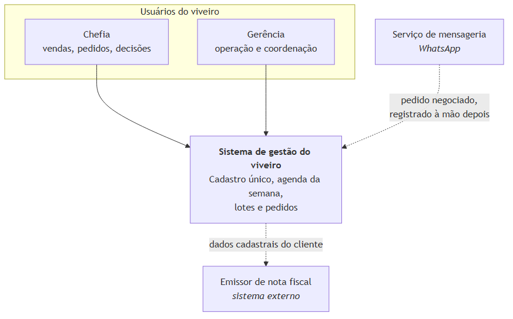
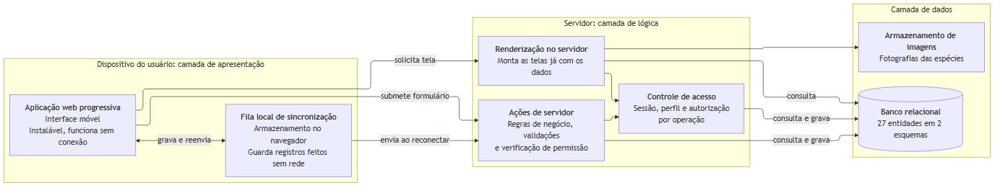
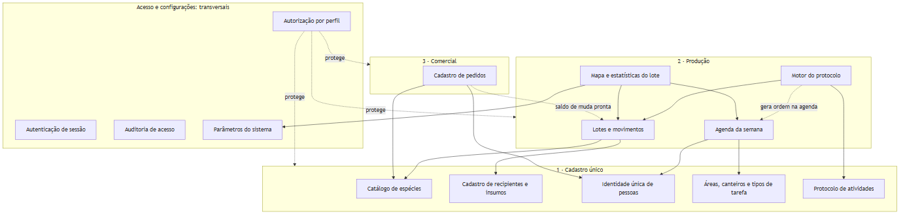
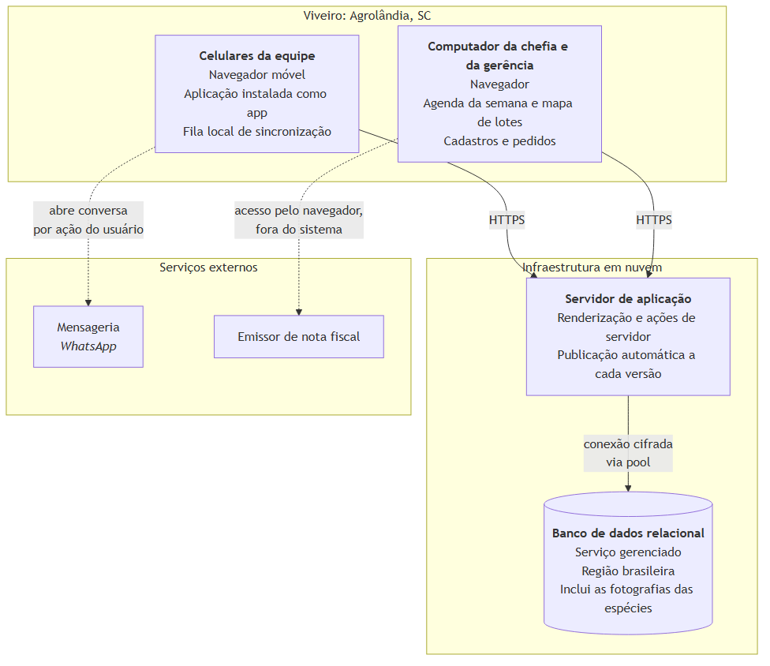
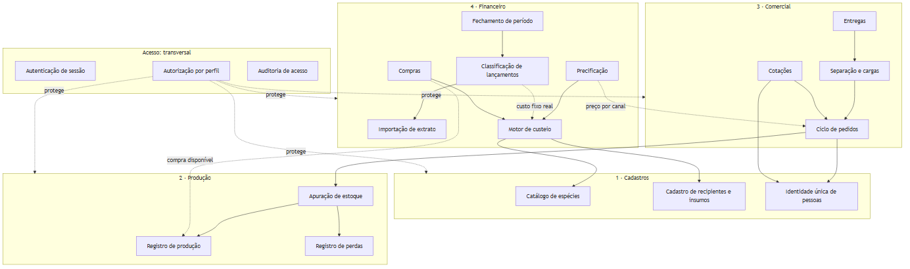
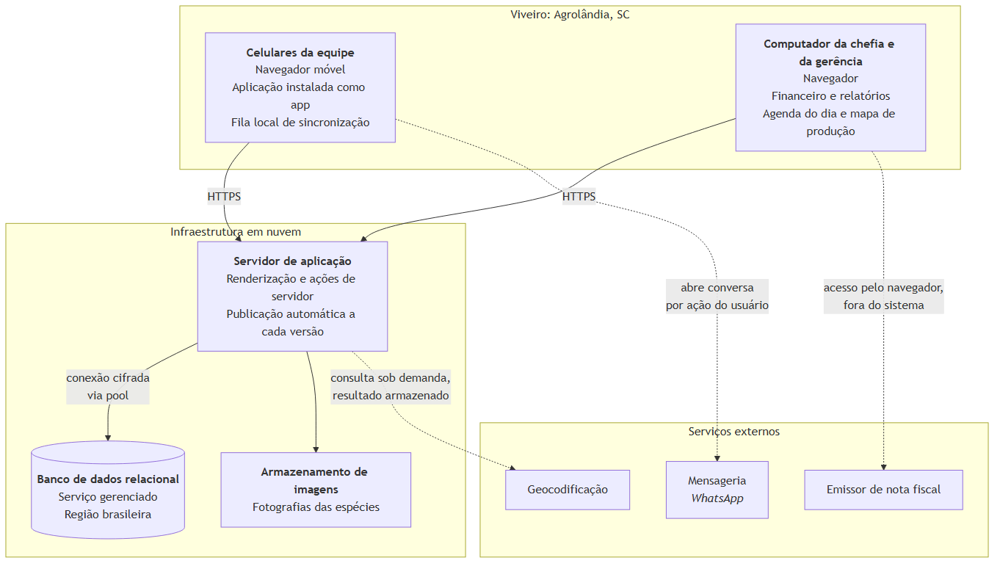

# 4.6 Arquitetura da solução

> Gerado a partir de `D-arquitetura/D1-arquitetura-c4.md`, `D-arquitetura/D3-diagrama-implantacao.md`.
> **Não edite este arquivo**: edite o artefato de origem e rode `node scripts/build-word.mjs`.

## 1. As três camadas antes dos diagramas

A arquitetura adotada é **cliente-servidor em três camadas**, conforme o sistema de informação
genérico de Sommerville (2011). Antes de detalhar, convém fixar o que cada camada é neste sistema:

| Camada de Sommerville | Neste sistema | Onde executa |
|---|---|---|
| **Comunicação com o usuário** | Interface acessada pelo navegador do celular, concebida para uso móvel e instalável como aplicativo web progressivo | Dispositivo do usuário |
| **Lógica da aplicação** | Regras de negócio, validações e controle de acesso, executados exclusivamente no servidor | Servidor de aplicação |
| **Gerenciamento do banco de dados** | Sistema gerenciador relacional, responsável pela persistência e pela integridade | Servidor de banco |

**A decisão arquitetural mais determinante é a fronteira entre a primeira e a segunda camada.** As
regras de acesso a dados são executadas no servidor e nunca no navegador (RNF-12). O navegador
recebe apenas o resultado já filtrado pelo perfil do usuário, nunca a credencial de banco, nunca a
regra que decide o que ele pode ver. Um usuário que inspecione o código entregue ao seu dispositivo
não encontra ali nada que lhe permita contornar a autorização.

---

## 2. Nível 1: Contexto

Quem usa o sistema e com que sistemas externos ele troca informação.

**Figura 10**: Nível 1: Contexto. Fonte: elaborado pelo autor (2026).

**Nenhuma das duas integrações é automática, e as setas pontilhadas dizem isso.** A nota fiscal é
emitida no sistema externo, que apenas consome o cadastro que este mantém; a negociação por
WhatsApp é conduzida por pessoa, e o pedido chega ao sistema digitado por quem vendeu. É decisão de
projeto compatível com a restrição de orçamento e com a inexistência de interface programática nos
sistemas envolvidos, e, no caso da mensageria, também de conformidade (ver
[`E5`](../E-qualidade/E5-mapeamento-lgpd.md)).

**Os colaboradores de campo não aparecem porque não são usuários do sistema.** O trabalho deles é
planejado e confirmado pela gerência ([`A1` §5](../A-fundacao/A1-documento-de-visao.md)), e um
diagrama de contexto que os desenhasse estaria descrevendo a empresa, e não o software.

---

## 3. Nível 2: Contêineres

As unidades executáveis e de armazenamento, e a correspondência com as três camadas.

**Figura 11**: Nível 2: Contêineres. Fonte: elaborado pelo autor (2026).

### Justificativa dos contêineres

| Contêiner | Por que existe |
|---|---|
| **Aplicação web progressiva** | Atende ao uso móvel (RE-2) sem exigir instalação por loja de aplicativos (RNF-27), o que elimina custo e fricção de distribuição para nove usuários |
| **Fila local de sincronização** | A conexão no viveiro é instável (RE-3). Sem ela, o registro em campo falharia justamente onde mais ocorre, e seria substituído por papel |
| **Renderização no servidor** | Permite que a tela chegue ao celular já com os dados, reduzindo o número de idas e voltas sob rede lenta (RNF-07) |
| **Ações de servidor** | Concentram regra de negócio e verificação de permissão do lado do servidor, atendendo ao RNF-12 |
| **Controle de acesso** | Verificação por operação, e não apenas ocultação de elementos na interface (RF-06) |
| **Banco relacional** | Integridade referencial e restrições declarativas, indispensáveis a um modelo com 27 entidades interligadas |

---

## 4. Nível 3: Componentes da camada de lógica

Decomposição interna do servidor, organizada pelas **três áreas de negócio** do sistema
(`docs/rotinas/00-mapa-de-rotinas.md`), com Acesso e Configurações transversais.

**Figura 12**: Nível 3: Componentes da camada de lógica. Fonte: elaborado pelo autor (2026).

### O que o grafo de dependências revela

**O Cadastro único é a raiz, e nada nele depende de nada.** Todas as setas apontam para ele, e
nenhuma sai. É a tradução arquitetural do que o sistema afirma: o catálogo é o que as outras duas
áreas consomem, e é por isso que ele é a primeira coisa a existir.

**O motor do protocolo é o único componente que escreve numa área que não é a sua.** Ele lê a
etapa em Cadastro único, lê o lote em Produção e **gera ordem na agenda**, que também é Produção.
A seta pontilhada marca que a escrita é automática: nenhum usuário a aciona, e é justamente essa
a razão de o componente existir (RF-51).

**O Comercial depende da Produção por uma única aresta, e ela é de leitura.** O cadastro de
pedidos consulta o saldo de muda pronta e não escreve nada lá: o pedido não reserva, não baixa e
não move lote. É a interconexão que o trabalho existe para demonstrar, e o diagrama mostra que ela
custa uma seta.

**O mapa depende de três coisas, e uma delas é parâmetro.** Ele lê lote, lê agenda e lê os limites
de atraso e de mortalidade. É o que torna a cor da tela ajustável sem implantação (RN-27), e é a
razão de Configurações ser transversal e não um canto do Cadastro único.

---

## 5. Decisões arquiteturais e suas consequências

| Decisão | Consequência aceita |
|---|---|
| Lógica e autorização exclusivamente no servidor | Toda operação exige ida ao servidor; mitigado pela fila local nas operações de campo |
| Aplicação web progressiva em vez de aplicativo nativo | Sem acesso a recursos nativos avançados; em troca, distribuição imediata e sem loja |
| Banco relacional com integridade declarativa | Alterações de esquema exigem migração versionada (RNF-20); em troca, o dado inconsistente é impedido pelo banco e não apenas pela aplicação |
| Esquema separado para o cadastro de pessoas | Consultas precisam qualificar o esquema; em troca, a identidade única fica visivelmente fora das três áreas de negócio, que é o que ela é |
| Sincronização por fila local, e não banco replicado no dispositivo | Consultas agregadas exigem conexão; em troca, não há conflito de escrita a resolver |

> O registro formal de cada decisão, com alternativas descartadas, corresponderia ao item **D2** do
> catálogo de artefatos, não selecionado para produção.

---

## 6. Atendimento aos requisitos não funcionais

| Requisito | Como a arquitetura o atende |
|---|---|
| RNF-05: registro sem conexão | Fila local no dispositivo, com reenvio automático |
| RNF-06: concepção móvel | Camada de apresentação projetada para o celular, não adaptada de tela maior, nas rotinas de campo |
| RNF-15: tela larga na coordenação | Agenda do dia e mapa de produção projetados para o computador, com redução em lista no celular |
| RNF-07: conexão lenta | Renderização no servidor reduz idas e voltas |
| RNF-09, RNF-10: senha e sessão | Armazenadas apenas como resumo criptográfico |
| RNF-11: cookies de sessão | Marcações que restringem uso a canal cifrado e impedem leitura por código de página |
| RNF-12: regras no servidor | Componente de autorização na camada de lógica, verificando a cada operação |
| RNF-13: cifra em trânsito | Comunicação cifrada obrigatória entre as três camadas |
| RNF-20: esquema versionado | Migrações aplicadas de forma controlada na publicação (ver [`D3`](D3-diagrama-implantacao.md)) |

---

## 1. Topologia de produção

**Figura 13**: Topologia de produção. Fonte: elaborado pelo autor (2026).

**A rede do viveiro não hospeda nada.** Não há servidor local a manter, atualizar ou proteger: o que
é decisão de custo e de risco: uma microempresa de nove pessoas não tem quem administre servidor, e um
equipamento no viveiro seria o ponto único de falha e o alvo mais exposto.

---

## 2. Nós e responsabilidades

| Nó | Papel | Justificativa |
|---|---|---|
| **Celulares da equipe** | Camada de apresentação em campo; guarda a fila local de registros feitos sem rede | É o dispositivo que a equipe já possui e usa. Restrição RE-2 |
| **Computador da chefia e da gerência** | Mesma aplicação, em tela maior, para as duas telas de coordenação da produção, os cadastros e os pedidos | Comparar nove faixas de uma semana ou trinta canteiros de uma vez pede tela larga, e montar catálogo é tarefa de mesa. Restrição RE-2 com a exceção de RNF-15 |
| **Servidor de aplicação** | Camadas de apresentação e de lógica; publicação automática a cada versão | Elimina administração de servidor. Restrição RE-5 |
| **Banco de dados** | Camada de persistência, em serviço gerenciado com região brasileira. Guarda também as fotografias das espécies | Latência menor para usuários no Brasil, e backup gerenciado sem operação manual |

---

## 3. Dois ambientes

A publicação em nuvem é o ambiente de produção. O desenvolvimento ocorre em ambiente local
equivalente, e a diferença entre os dois se resume ao endereço do banco.

**Figura 14**: Dois ambientes. Fonte: elaborado pelo autor (2026).

**O ambiente é determinado pelo endereço do banco, não por variável de modo.** A aplicação escolhe a
estratégia de conexão a partir do próprio endereço configurado: banco gerenciado em nuvem exige
conexão adequada a ambiente sem servidor persistente, sob pena de esgotar o limite de conexões; banco
local usa um conjunto de conexões convencional. A consequência prática é que apontar o sistema para
outro banco basta para trocar de ambiente, sem alterar código nem configuração adicional.

---

## 4. Publicação e migração de esquema

**Figura 15**: Publicação e migração de esquema. Fonte: elaborado pelo autor (2026).

Três propriedades desse fluxo importam para a confiabilidade do ambiente:

1. **A migração precede a entrada no ar.** O esquema nunca fica atrás do código que o consome.
2. **Falha na migração interrompe a publicação.** A versão anterior continua operando, degradação
   preferível a uma versão nova sobre esquema incompatível.
3. **Somente o pendente é aplicado.** Cada ambiente recebe apenas as migrações que ainda não
   executou, o que torna a publicação idempotente.

**Migração não tem guarda condicional.** Uma migração que verifica uma condição e retorna sem fazer
nada é registrada como aplicada mesmo sem ter criado coisa alguma, e o ambiente passa a divergir
silenciosamente. A regra adotada é que migração falha ruidosamente ou não existe.

---

## 5. Distribuição, proteção e o compromisso entre as duas

Sommerville (2011) apresenta proteção e distribuição como fatores conflitantes: quanto mais
distribuído o sistema, mais oportunidades de invasão; quanto mais concentrado, mais crítica uma
invasão bem-sucedida, por não haver reserva. A configuração adotada e o ponto de equilíbrio escolhido:

| Aspecto | Escolha | Consequência |
|---|---|---|
| **Concentração** | Aplicação e banco em provedores gerenciados distintos | Comprometer a aplicação não entrega o banco, e vice-versa |
| **Superfície exposta** | Somente a aplicação é publicamente acessível; o banco só aceita conexão dela | Reduz a superfície ao mínimo compatível com o funcionamento |
| **Ponto único de falha** | Existe: a aplicação em nuvem | Aceito. Uma microempresa de nove pessoas não sustenta redundância, e a indisponibilidade de algumas horas não interrompe a produção de mudas |
| **Recuperação** | Backup gerenciado do banco, com procedimento de restauração declarado | Ver [`E6`](../E-qualidade/E6-plano-backup-recuperacao.md) |

O ponto único de falha é registrado como decisão consciente, e não como omissão. O sistema é
ferramenta de gestão, não de controle de processo em tempo real: sua indisponibilidade temporária
adia registros, e o registro adiado é recuperado pela fila local do dispositivo.

---

## 6. Segurança na fronteira entre nós

| Fronteira | Proteção |
|---|---|
| Dispositivo → aplicação | Canal cifrado obrigatório (RNF-13); sessão identificada por resumo criptográfico, com marcações que impedem leitura por código de página (RNF-10, RNF-11) |
| Aplicação → banco | Conexão cifrada; credencial mantida exclusivamente no servidor, nunca entregue ao navegador (RNF-12) |
| Aplicação → serviços externos | Sem credencial de terceiro embarcada no cliente; a mensageria é acionada por ação do usuário, não pelo servidor |
| Repositório | Credenciais e dados sensíveis jamais versionados, com verificação automática que bloqueia o envio (RNF-22, RNF-23) |
