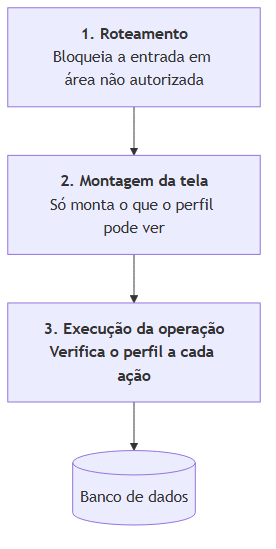

# 4.7 Segurança e controle de acesso

> Gerado a partir de `D-arquitetura/D4-matriz-rbac.md`, `E-qualidade/E4-modelagem-de-ameacas.md`, `E-qualidade/E5-mapeamento-lgpd.md`, `E-qualidade/E6-plano-backup-recuperacao.md`.
> **Não edite este arquivo**: edite o artefato de origem e rode `npm run docs:tcc`.

---

## 1. Os papéis

Três perfis de negócio, correspondentes às funções reais da empresa, mais um papel técnico.

| Papel | Corresponde a | Pessoas | Natureza |
|---|---|---|---|
| **Chefia** | Direção: vendas, finanças, decisões, entregas | 1 | Negócio |
| **Gerência** | Coordenação: operação, estoque, produção, tarefas | 2 | Negócio |
| **Colaborador** | Execução em campo | 6 | Negócio |
| **Administrador** | Manutenção do sistema e gestão de usuários | 1, acumulado | **Técnico** |

**O administrador não é uma função da empresa.** Não participa de nenhuma rotina de negócio: seu
escopo limita-se a criar usuários, atribuir perfis e manter o sistema. É representado à parte para
que a matriz de negócio reflita a operação real do viveiro, e não a estrutura interna do sistema.

**Princípio adotado:** o menor privilégio que permita à pessoa fazer o seu trabalho. Onde houve
dúvida, a decisão pendeu para conceder: um perfil restrito demais produz pedido de exceção
constante, e a exceção concedida caso a caso é pior que a permissão declarada.

### 1.1 Nota sobre o administrador na implementação (11/08/2026)

A coluna *Administrador* da matriz é, em algumas linhas, mais restrita que a da chefia, coerente
com o parágrafo acima, já que o administrador não é função de negócio. **Na implementação, porém,
o perfil `admin` recebe acesso irrestrito**, por um `if` explícito em
[`src/lib/permissions.ts`](../../../src/lib/permissions.ts) anterior à consulta da matriz.

A razão é operacional e não conceitual: há **uma pessoa** com esse perfil, ela é quem mantém o
sistema, e precisa conseguir destravar qualquer situação em produção. A alternativa real não é um
administrador mais restrito: é um administrador que troca o próprio perfil para resolver
incidente, o que destrói o registro de auditoria justamente no momento em que ele mais importa.

A matriz permanece como está: ela descreve o **projeto** do controle de acesso, e é a fonte do
teste que compara documento e código (`src/lib/__tests__/permissions.test.ts`). O override é uma
decisão de implantação, declarada aqui e em um único ponto do código.

---

## 2. Matriz por recurso e operação

Legenda: **C** criar · **L** ler · **A** atualizar · **E** excluir · **-** sem acesso

Os recursos estão agrupados pelos **quatro módulos** do sistema, com Acesso à frente por ser
transversal: o mesmo agrupamento de [`B2 §2`](../B-requisitos/B2-especificacao-requisitos.md)
e de [`src/lib/permissions.ts`](../../../src/lib/permissions.ts), onde esta matriz vira código.

**A permissão é do recurso, não do módulo.** Nenhuma linha abaixo é concedida por a tela ficar
sob `/financeiro` ou `/producao`: a guarda é por recurso, em toda operação (§4). O agrupamento
serve para ler a matriz, não para decidir acesso, é o que permite que o módulo restrito
contenha, sem contradição, recursos que a gerência lê (§3.2).

| Recurso | Chefia | Gerência | Colaborador | Administrador |
|---|:--:|:--:|:--:|:--:|
| **1 · Cadastros** | | | | |
| **Espécies** | C L A E | L | L | C L A E |
| **Recipientes** | C L A E | L | L | C L A E |
| **Tipos de embalagem** ⁶ | C L A | C L A | L | C L A E |
| **Protocolo de atividades** ⁶ | C L A | C L A | L | L |
| **Insumos** | C L A E | L | L | C L A E |
| **Clientes** | C L A E | L | - | C L A E |
| **Dados fiscais de cliente** | C L A | L | - | C L A |
| **Fornecedores** | C L A E | - | - | C L A E |
| **Funcionários** ² | C L A E | L | - | C L A E |
| **Tarefas** ² | C L | C L A E | L A ³ | L |
| **Áreas e canteiros** ⁵ | C L | C L A E | L | L |
| **Período de trabalho** ⁵ | C L A | C L A | L | C L A |
| **Centros de custo** ⁴ | C L A | - | - | C L A |
| **2 · Produção** | | | | |
| **Consumo de insumo** | L ¹ | L | **C L** | L |
| **Coleta de sementes** | C L A E | L | - | C L A E |
| **Lotes** ⁵ | L | C L A | **C L** | L |
| **Divisão de lote** ⁶ | L | **C** | - | L |
| **Apontamento** ⁵ | L | C L A E | L A ³ | L |
| **Atividades de produção** | L ¹ | C L A | **C L** | L |
| **Estoque** | L | C L A | L | L |
| **Estoque de insumo** ⁵ | C L A | C L A | L | L |
| **Gastos de tarefa** ⁵ | C L A E | C L | - | L |
| **Perdas** | L ¹ | L A | **C L** | L |
| **Análise de perdas** | L | L | - | L |
| **3 · Comercial** | | | | |
| **Pedidos** | C L A E | L A | L | C L A E |
| **Aprovação de pedido** | **A** | - | - | A |
| **Verificação de disponibilidade** | L | **C L A** | - | L |
| **Cargas** | L | C L A | L | L |
| **Separação de carga** | L | L A | **A** | L |
| **Entregas** | C L A | L | - | C L A |
| **Cotações** | C L A | - | - | C L A |
| **Escolha de proposta** | **A** | - | - | A |
| **4 · Financeiro: módulo restrito** | | | | |
| **Custos fixos** | C L A E | - | - | C L A E |
| **Financeiro: todos os recursos** | **C L A E** | **-** | **-** | C L A E |
| **Custo unitário** | L | L | **-** | L |
| **Margem por canal** | C L A | L | **-** | L |
| **Preço de venda** | C L A | L | **-** | L |
| **Indicadores** | L | L (parcial) | - | L |
| **Acesso: transversal aos quatro módulos** | | | | |
| **Usuários e perfis** | - | - | - | **C L A E** |
| **Configurações do sistema** ⁵ | L A | - | - | L A |
| **Sessões próprias** | L E | L E | L E | L E |
| **Auditoria de acesso** | - | - | - | L |

¹ **Emenda de 11/08/2026: a chefia também cria.** Ver [§3.10](#310-emenda-a-chefia-registra-em-campo-enquanto-o-colaborador-não-usa-o-sistema).

² **Recursos do [P13](../../../plans/P13-producao-agenda-cadastros.md), declarados antes da tela.**
`funcionario` e `tarefa` já existem em `src/lib/permissions.ts`: o primeiro porque a lista de
pessoas precisa saber quem pode ver o papel, o segundo porque a agenda de pessoal traz a
primeira regra que depende do registro e não só do perfil. Os requisitos que os justificam foram
escritos em 19/08/2026: **RF-69/RF-70** para funcionário e tipo de tarefa, **RF-71 a RF-75** para
a agenda; as tabelas e as telas vêm nas Fases 2 e 3 do P13.

³ **O colaborador atualiza apenas a tarefa atribuída a ele**, é a única regra da matriz que
depende do registro, e não do perfil. Ver §3.11.

⁴ **Recurso especificado, ainda sem tabela e sem tela.** `financeiro.cost_centers` e
`/cadastros/centros-de-custo` vêm nas tarefas T13.24 a T13.26 do
[P13](../../../plans/P13-producao-agenda-cadastros.md). Os requisitos que o justificam são
**RF-77 a RF-79**, escritos em 24/08/2026, e a regra de acesso está no §3.12.

⁵ **Recursos da rotina de produção, escritos em 24/08/2026**, todos ainda sem tabela e sem tela.
Requisitos: **RF-80/RF-81** para áreas e canteiros, **RF-83** para o período de trabalho,
**RF-84 a RF-91** para lotes, **RF-94 a RF-100** para o apontamento, **RF-101 a RF-103** para o
estoque de insumo e **RF-104** para gastos de tarefa. As regras de acesso que não se leem direto
da matriz estão em §3.13 e §3.14.

⁶ **Recursos do protocolo de atividades por lote, escritos em 26/08/2026**, todos ainda sem tabela
e sem tela. Requisitos: **RF-121** para tipos de embalagem, **RF-122 a RF-125 e RF-133** para o
protocolo, **RF-135** para a divisão de lote. As regras de acesso que não se leem direto da matriz
estão em §3.16.

---

## 3. As regras de exceção

A matriz não se explica sozinha. Onze decisões merecem justificativa: em oito delas a permissão
restringe alguém que aparentemente deveria ter acesso; as três últimas (§3.10, §3.11 e §3.12) são
emendas posteriores, datadas, feitas quando a transcrição para código, ou uma rotina nova, revelou
o que a especificação não tinha previsto.

### 3.1 O colaborador não vê custo nem preço

É a restrição mais ampla da matriz. O colaborador registra consumo de insumo, dado que **compõe** o
custo: e não pode consultar o custo resultante.

A razão não é desconfiança, é escopo: o colaborador não toma decisão de preço, e a informação de
margem não o ajuda em nenhuma de suas cinco tarefas. Expô-la aumentaria a superfície de dado sensível
em seis dispositivos que circulam em campo, sem contrapartida operacional.

### 3.2 O núcleo bancário do financeiro é exclusivo da chefia

Restrição total, e não parcial, sobre **a base bancária**: extrato, lançamento, compra, custo fixo
e fechamento não são acessíveis à gerência nem em modo de leitura. É a linha
**Financeiro: todos os recursos** da matriz, somada a **Custos fixos**.

A base mistura gasto do viveiro com gasto pessoal da família e da clínica. Separá-los por centro de
custo é justamente o objetivo do subsistema, mas, até que a separação exista e mesmo depois, o
acesso permanece restrito, porque a natureza pessoal do dado não desaparece com a classificação. É a
única restrição da matriz cuja motivação é de privacidade e não de escopo funcional.

**Por que a regra não diz "o módulo 4 é exclusivo da chefia".** Com o reagrupamento de
19/08/2026, o módulo Financeiro passou a abrigar também custo unitário, margem por canal, preço
de venda e indicadores: que a matriz sempre deu à gerência em leitura, e que a gerência precisa
para verificar pedido, cotar com fornecedor e acompanhar a produção. Enunciar a restrição pela
porta do módulo produziria uma de duas coisas ruins: ou fecharia para a gerência informação que
ela sempre teve, ou obrigaria a espalhar essas telas por módulos onde não pertencem, só para
escapar da regra.

A restrição, portanto, **é do recurso**, e o critério é preciso: fica restrito o que **expõe a
base bancária**; fica em leitura o que é **derivado dela**. Custo unitário é uma soma que não
revela para quem se pagou; o extrato revela. Essa é toda a diferença, e é o mesmo critério que o
§4 aplica: a verificação acontece na operação, e nenhuma tela é liberada por estar sob
determinado caminho de URL.

| No módulo 4, é… | Recursos | Quem |
|---|---|---|
| **base bancária**: restrito | Financeiro (extratos, lançamentos, compras, fechamento), Custos fixos | chefia, admin |
| **derivado**: leitura para a gerência | Custo unitário, Margem por canal, Preço de venda, Indicadores | chefia, gerência, admin |

O colaborador não vê nenhum dos dois grupos (§3.1).

### 3.3 Aprovar pedido é privativo da chefia

A gerência pode ler o pedido, editar quantidades e verificar disponibilidade, mas não aprová-lo. A
aprovação é o ato que fixa o preço, e preço é decisão de quem responde pela margem.

### 3.4 A gerência não registra custo fixo

Custo fixo é folha, energia, água e depreciação, dado financeiro, ainda que consumido pelo custeio.
Fica com a chefia pela mesma razão de 3.2.

### 3.5 O colaborador atualiza a separação, mas não a cria

A carga é gerada pelo sistema no fechamento do pedido. O colaborador **marca** itens como separados,
sem poder criar ou remover carga. A distinção evita que um erro de operação em campo altere o que foi
comercialmente acordado.

### 3.6 Verificar disponibilidade é privativo da gerência

Nem a chefia executa a verificação. É quem está no viveiro que sabe o que existe, e a verificação
feita à distância seria adivinhação registrada como fato, exatamente o problema que o sistema
existe para eliminar.

### 3.7 Ninguém administra os próprios usuários

Nenhum perfil de negócio cria usuário ou altera perfil, inclusive a chefia. A separação entre
autoridade de negócio e autoridade de sistema impede que a escalada de privilégio seja um caminho de
uso normal.

### 3.8 Os cadastros pertencem à chefia, não à gerência

Catálogo de espécies, recipientes, insumos, clientes e fornecedores são criados e alterados pela
chefia. À gerência resta a leitura.

A razão é que todos esses cadastros **alimentam o custeio ou o comercial**, e não a operação diária:
o preço de um insumo altera o custo de todas as espécies que o utilizam; um cliente cadastrado com
documento errado impede a emissão da nota. São dados de baixa frequência de alteração e alto custo de
erro, e quem responde pela consequência é quem os mantém.

A gerência lê tudo o que precisa para operar, para verificar disponibilidade é necessário conhecer
espécies e recipientes, e para acompanhar um pedido é necessário saber de quem ele é.

### 3.10 Emenda: a chefia registra em campo enquanto o colaborador não usa o sistema

*Acrescentada em 11/08/2026, ao transcrever a matriz para código.*

As três linhas marcadas com ¹ (**Consumo de insumo**, **Atividades de produção** e **Perdas**)
davam `C` exclusivamente ao colaborador. Combinada com o §3.9, que declara que o uso em campo pelo
colaborador é iteração posterior e que hoje os usuários efetivos são chefia e gerência, a
especificação literal produz um resultado que ninguém pretendeu: **o registro de consumo em campo
(`/producao/consumo-insumos`, à época `/insumos/registrar`) fica sem nenhum usuário capaz de
usá-lo**, e o consumo (dependência-raiz do custeio) não acontece.

A emenda concede `C` à chefia nessas três linhas. É restrição temporal, não permanente: vale
enquanto os colaboradores não estiverem em campo com o sistema. Quando estiverem, a permissão da
chefia pode ser reavaliada, mas não precisa ser removida: quem responde pelo custo pode registrar
o que o compõe.

A alternativa considerada e descartada foi abrir exceção apenas no código. Seria reproduzir
exatamente o problema que a matriz única existe para eliminar: uma regra que vale, mas que não
está escrita onde as regras se leem.

### 3.11 A tarefa é a primeira regra que depende do registro, e não do perfil

*Acrescentada em 19/08/2026, junto do reagrupamento em quatro módulos.*

Todas as demais linhas da matriz respondem a uma pergunta só: *que perfil é este usuário?* A
linha **Tarefas** acrescenta uma segunda: *esta tarefa é dele?* O colaborador atualiza a tarefa
que lhe foi atribuída na agenda da semana e nenhuma outra, pode concluir a sua, não a do
colega.

**A linha Apontamento herda a mesma regra**, e por isso repete a nota ³. O colaborador vê e
encerra o apontamento aberto em nome dele, não o do colega. Quem opera o apontamento de toda a
equipe é a gerência, de um aparelho só (UC-50 a UC-52): é ela que tem `C` e `E` na linha.

A distinção importa porque muda o mecanismo, não só o valor: a verificação deixa de ser uma
consulta à tabela de perfis e passa a precisar do registro em mãos. Por isso o recurso foi
declarado em `src/lib/permissions.ts` **antes** de existirem a tabela e a tela (P13 Fase 3).
para que o mecanismo nasça exercitado por teste, em vez de ser improvisado na primeira tela que
precisar dele.

---

### 3.12 Um cadastro do módulo 1 com acesso do módulo 4

*Acrescentada em 24/08/2026, com o cadastro de centros de custo.*

**Centros de custo** é a primeira linha do módulo 1 fechada para a gerência. As demais seguem o
§3.8: a criação é da chefia, e a gerência lê. Esta não deixa nem ler.

O motivo é o do §3.2, e não o do módulo: o nome do centro **é** a informação sensível. Casa e
clínica dizem, só de aparecer numa lista, como a família divide a vida entre negócio e pessoal, que
é exatamente o que a base bancária expõe e o RE-7 protege. A tela mora em `/cadastros` por ser
manutenção de cadastro (RF-77 a RF-79), a permissão acompanha o recurso e não a porta (§2), e o
atalho some do hub para quem não pode entrar.

**Exclusão não aparece em coluna alguma**, nem para o administrador: centro de custo não se exclui,
inativa-se (RN-72), porque o lançamento já classificado guarda o seu centro para sempre. O verbo
ausente aqui é decisão de domínio, não esquecimento.

---

### 3.13 O colaborador cria lote sem poder editá-lo

*Acrescentada em 24/08/2026, com a rotina de produção.*

A linha **Lotes** dá `C L` ao colaborador e nega `A`, o que parece contraditório: quem cria
deveria poder corrigir. Não é contradição, é o desenho da repicagem.

**O colaborador nunca cria lote de propósito.** O lote nasce como consequência de ele encerrar
uma tarefa de repicagem e dizer para onde as mudas foram (UC-48): o gesto é "repiquei tanto para o
canteiro tal", e o lote filho é o que o sistema deriva disso. Dar-lhe `A` seria permitir editar
espécie, recipiente e canteiro de qualquer lote do viveiro a partir de uma tela de campo, que é
justamente o tipo de operação que a matriz mantém na gerência.

**Corrigir um lote errado é da gerência**, e o mecanismo de correção não é editar o lote: é uma
contagem física (UC-16), que gera o movimento de ajuste. O saldo do lote **nunca** é editado à
mão, nem pela gerência: ele é a soma dos movimentos (RN-78).

### 3.14 O gasto de tarefa é dinheiro, e a matriz trata como tal

*Acrescentada em 24/08/2026, com a rotina de produção.*

**Gastos de tarefa** é a única linha do módulo 2 fechada para o colaborador. As demais o incluem,
porque o módulo 2 é o módulo dele.

O motivo é o do §3.1: valor em reais não aparece para quem executa. O colaborador registra o que
**consumiu** (insumo, quantidade), e a conversão disso em dinheiro acontece do outro lado, com o
custo unitário que ele não vê. Um campo de valor na tela de campo exporia, tarefa a tarefa, a
estrutura de custo do viveiro.

A gerência tem `C L` e não `A`: lança o gasto quando ele ocorre, e corrigir valor lançado é da
chefia, que é quem concilia com o extrato.

---

### 3.15 Configurações: ninguém cria e ninguém exclui

*Acrescentada em 24/08/2026, com a rotina de produção.*

A linha **Configurações do sistema** tem só `L` e `A`, em coluna alguma aparece `C` ou `E`. Não é
esquecimento: **a chave nasce por migration, junto do código que a lê**; o que o usuário altera é
o **valor**.

Dar `C` produziria chaves que nada consulta, e dar `E` permitiria remover uma chave de que o
sistema depende, com o efeito aparecendo longe dali, na tela que a lê. É a mesma decisão de
domínio do §3.12 sobre centro de custo, e pelo mesmo motivo: **o verbo ausente é a regra**, não a
omissão dela.

A chefia altera porque os parâmetros são regra de negócio (o limiar de mortalidade, a margem
mínima), não infraestrutura. A gerência não lê: um deles é a margem, que o §3.1 já fecha.

### 3.16 O protocolo é da gerência tanto quanto da chefia, e a divisão é só da gerência

*Acrescentada em 26/08/2026, com o protocolo de atividades por lote.*

**A gerência monta protocolo, e é a exceção ao §3.8.** A regra geral é que cadastro pertence à
chefia e a gerência apenas lê; aqui as duas têm `C L A`. O protocolo não é dado comercial nem
financeiro: é a **receita de manejo**, e quem sabe em quantos dias o ipê germina no tubete é quem
está no viveiro todo dia. Deixá-lo só com a chefia produziria protocolo desatualizado, e protocolo
desatualizado gera ordem na data errada, que é pior do que não gerar ordem nenhuma.

**Nenhum dos dois tem `E`, e a razão é a mesma do §3.15.** Excluir um protocolo em uso deixaria os
lotes que o seguem sem receita, com o efeito aparecendo longe dali: eles simplesmente parariam de
receber ordens, em silêncio. Encerrar um protocolo é desativá-lo (`A`), e os lotes em curso
continuam apontando para ele. O administrador tem `E` sobre tipos de embalagem apenas para o caso
de um tipo criado por engano que nada referencia.

**A divisão de lote tem só `C`, e só para a gerência.** Não é cadastro: é um **evento**, como a
repicagem, e por isso não admite alterar nem excluir. Dividir encerra o lote de origem e cria dois
novos, e desfazer isso não é apagar uma linha, é reconstruir três estados de protocolo. O
colaborador não divide porque a decisão é de condução da produção, e não de execução de tarefa: é
a mesma fronteira do §3.13, onde ele cria lote mas não o edita.

---

## 3.9 Nota sobre o alcance atual do perfil colaborador

A matriz especifica as permissões do colaborador em sua forma completa, mas o **uso do sistema em
campo pelos colaboradores está previsto para iteração posterior**. Na primeira etapa de implantação,
os usuários efetivos são a chefia e a gerência, três pessoas.

A decisão tem consequência direta sobre a avaliação de usabilidade: os sujeitos do instrumento
descrito em [`F3`](../F-ux/F3-plano-avaliacao-usabilidade.md) são chefia e gerência. A condição do
§3.6 da metodologia (usuários reconhecidamente sem formação técnica) permanece atendida, já que
nenhum dos três a possui.

Os requisitos e casos de uso do colaborador permanecem especificados, e não removidos: são projeto,
e o projeto antecede a implantação.

---

## 4. Onde a verificação ocorre

Três níveis, complementares e não substituíveis entre si.

**Figura 18**: Onde a verificação ocorre. Fonte: elaborado pelo autor (2026).

**O terceiro nível é o que de fato protege.** Os dois primeiros são conveniência de interface:
impedem que o usuário chegue a uma tela inútil e evitam apresentar botões que não funcionariam.
Podem ser contornados por quem acione a operação diretamente.

A verificação na execução da operação é a que não se contorna, e é por isso que o requisito RF-06
determina que a permissão seja verificada **a cada operação, e não apenas ocultando elementos da
interface**. Ocultar um botão não é controle de acesso, é o inverso: dá a impressão de proteção
onde não há.

### 4.1 Por que não há um quarto nível no banco

A pergunta reaparece a cada rodada, e a resposta é sempre a mesma: **Row Level Security não se
aplica a este sistema**, nem no Postgres local nem no Neon. Quatro razões, todas verificáveis:

1. **Não há identidade de usuário dentro do banco.** A aplicação abre a conexão com um papel só,
   o da `DATABASE_URL` (`src/lib/db.ts`), a partir de Server Components e Server Actions. Não
   existe token do usuário mapeado para papel de banco, nem API de dados exposta ao navegador: a
   sessão vive em `sessions` e só o servidor a lê. Uma política de linha não teria sobre o que
   discriminar.
2. **Fazê-la funcionar significaria duplicar esta matriz em SQL.** Seria preciso declarar o usuário
   corrente a cada requisição e reescrever os recursos da seção 2 como política de tabela: duas
   fontes da verdade para a mesma regra, que é exatamente o que produz divergência.
3. **O risco que ela mitigaria, ela não mitigaria aqui.** O papel de conexão é o **dono** das
   tabelas, e dono ignora RLS enquanto não houver `FORCE ROW LEVEL SECURITY`. Vazada a
   `DATABASE_URL`, vaza tudo, com política ou sem.
4. **O controle real existe e é conferido por teste.** `src/lib/permissions.ts` é a fonte única, e
   `src/lib/__tests__/permissions.test.ts` e `authz-cobertura.test.ts` comparam o código com a
   seção 2 deste documento.

É a mesma conclusão que `migrations/20260413000002_p1_rls.sql` registrou em 13/04/2026, quando o
conceito saiu do projeto, e que a conferência de 26/08/2026 confirmou no banco: nenhuma tabela com
RLS ligado, nenhuma política.

---

## 5. O compromisso entre proteção e produtividade

Sommerville (2011) observa que um sistema que exige múltiplas senhas frequentemente deixa o usuário
sem acesso, por não conseguir memorizá-las, e ilustra com isso que a proteção adicional cobra seu
preço em produtividade. Três decisões deste sistema explicitam onde o preço foi pago e onde não foi.

| Decisão | Proteção | Produtividade | Escolha |
|---|---|---|---|
| **Duração da sessão no dispositivo do colaborador** | Sessão longa amplia a janela de uso indevido de um aparelho perdido | Sessão curta exigiria autenticação a cada registro de perda, em campo, com as mãos sujas | **Sessão longa**, compensada pela possibilidade de encerrar sessões à distância (RF-07) e pelo registro de acesso (RF-04) |
| **Troca de senha no primeiro acesso** | Impede que a senha temporária, comunicada verbalmente, permaneça em uso | Acrescenta uma etapa ao primeiro acesso de cada usuário | **Exigida.** Custo pago uma única vez por pessoa |
| **Troca periódica obrigatória de senha** | Reduz a janela de uma credencial vazada | Senha trocada com frequência é senha anotada em papel: o próprio Sommerville usa este caso como exemplo de falha originada em decisão de projeto | **Não adotada** |

A capacidade de encerrar sessões à distância é o que torna a sessão longa defensável: o risco que ela
cria (aparelho perdido com sessão ativa) tem tratamento direto e ao alcance do usuário, sem
depender de administrador.

---

## 6. Rastreabilidade

| Requisito | Onde a matriz o realiza |
|---|---|
| RF-05 | Linha *Usuários e perfis*, exclusiva do administrador |
| RF-06 | Seção 4: verificação na execução da operação |
| RF-07 | Linha *Sessões próprias*, com leitura e exclusão para todos os perfis |
| RF-44 | Linha *Aprovação de pedido*, exclusiva da chefia (regra 3.3) |
| RF-62 | Linhas *Financeiro: todos os recursos* e *Custos fixos*, exclusivas da chefia (regra 3.2) |
| RF-77, RF-78, RF-79 | Linha *Centros de custo*, de chefia e administrador, sem exclusão (regra 3.12) |
| RNF-12 | Seção 4: verificação no servidor, nunca no navegador |

A matriz é insumo direto da modelagem de ameaças
([`E4`](../E-qualidade/E4-modelagem-de-ameacas.md)): cada permissão concedida é uma superfície a
avaliar, e cada restrição é um controle já aplicado.

---

## 1. Ativos a proteger

Antes das ameaças, o que há a perder. A coluna de sensibilidade orienta a prioridade dos controles.

| Ativo | Conteúdo | Sensibilidade |
|---|---|---|
| **Dados financeiros** | Lançamentos de nove contas, incluindo gasto pessoal da família e da clínica | **Máxima**: dado pessoal de terceiros não usuários do sistema |
| **Dados pessoais de clientes** | Nome, documento, telefone, endereço, correio eletrônico | **Alta**: sujeitos à legislação de proteção de dados |
| **Estrutura de custo e margem** | Custo unitário por espécie e margem por canal | **Alta**: informação concorrencialmente sensível |
| **Cadastro de fornecedores** | Contatos e preços da rede de terceiros | **Alta**: construída ao longo de anos, de difícil reconstituição |
| **Dados operacionais** | Produção, perdas, estoque | **Média**: sem valor externo, mas irreprodutíveis |
| **Credenciais de acesso** | Senhas e identificadores de sessão | **Máxima**: chave de todo o restante |

---

## 2. Ameaças e controles

Formato: ativo → ameaça → vulnerabilidade → impacto → controle, classificado pelo tipo de ameaça e
pelo tipo de controle de Sommerville.

### A-01 · Senha fraca escolhida pelo usuário

| | |
|---|---|
| **Tipo de ameaça** | Confidencialidade |
| **Vulnerabilidade** | Usuários sem formação técnica tendem a escolher senha curta e previsível |
| **Impacto** | Acesso completo ao perfil comprometido. Se for a chefia, inclui o financeiro |
| **Probabilidade** | Alta |

**Controles:**
- *Prevenção*: política de senha verificada no momento da definição, recusando as previsíveis.
- *Prevenção*: troca obrigatória no primeiro acesso (RF-02), para que a senha temporária comunicada
  verbalmente não permaneça em uso.
- *Detecção*: contagem de tentativas malsucedidas consecutivas, com bloqueio temporário.

> **Não adotada:** troca periódica obrigatória. Sommerville usa exatamente este caso como exemplo de
> falha originada em decisão de projeto: a senha trocada com frequência é anotada em papel, e o
> controle produz a vulnerabilidade que pretendia evitar.

### A-02 · Vazamento de credencial

| | |
|---|---|
| **Tipo de ameaça** | Confidencialidade |
| **Vulnerabilidade** | Senha compartilhada verbalmente entre colegas, ou anotada |
| **Impacto** | Acesso indevido indistinguível de acesso legítimo |
| **Probabilidade** | Média |

**Controles:**
- *Prevenção*: senha individual por pessoa, jamais compartilhada por perfil.
- *Detecção*: registro de toda tentativa de autenticação com origem e dispositivo (RF-04),
  permitindo identificar acesso de local ou aparelho incomum.
- *Limitação*: lista de sessões ativas com encerramento à distância (RF-07).

### A-03 · Aparelho perdido com sessão ativa

| | |
|---|---|
| **Tipo de ameaça** | Confidencialidade |
| **Vulnerabilidade** | Sessão de duração longa nos dispositivos de campo, adotada por razão de usabilidade |
| **Impacto** | Acesso ao perfil até que a sessão seja encerrada |
| **Probabilidade** | Média: celular em ambiente de trabalho rural |

**Controles:**
- *Limitação*: encerramento de sessão à distância pelo próprio usuário, sem depender de
  administrador (RF-07).
- *Detecção*: registro de dispositivo e origem em cada sessão, que permite reconhecer o aparelho na
  lista.
- *Prevenção*: o perfil colaborador não acessa preço, custo nem financeiro (ver
  [`D4`](../D-arquitetura/D4-matriz-rbac.md)), o que limita o alcance de um aparelho de campo
  comprometido.

> Este é o caso em que o compromisso entre proteção e produtividade foi resolvido a favor da
> produtividade: e o controle compensatório é o que torna a decisão defensável.

### A-04 · Escalada de privilégio

| | |
|---|---|
| **Tipo de ameaça** | Confidencialidade e integridade |
| **Vulnerabilidade** | Verificação de permissão feita apenas na interface, e não na operação |
| **Impacto** | Perfil operacional alcançando dados financeiros ou de margem |
| **Probabilidade** | Baixa, dado o controle adotado |

**Controles:**
- *Prevenção*: verificação de permissão **a cada operação**, e não por ocultação de elementos da
  interface (RF-06). Ocultar um botão não é controle de acesso.
- *Prevenção*: regras de acesso executadas exclusivamente no servidor (RNF-12).
- *Prevenção*: nenhum perfil de negócio administra usuários ou perfis, o que remove a escalada do
  conjunto de caminhos de uso normal.

### A-05 · Injeção de comando em consulta ao banco

| | |
|---|---|
| **Tipo de ameaça** | Confidencialidade e integridade |
| **Vulnerabilidade** | Concatenação de entrada do usuário em consulta |
| **Impacto** | Leitura ou destruição de qualquer dado do sistema |
| **Probabilidade** | Baixa, dado o controle adotado |

**Controles:**
- *Prevenção*: consultas parametrizadas em todo acesso ao banco, sem exceção. Entrada de usuário é
  sempre parâmetro, nunca texto concatenado à consulta.
- *Prevenção*: validação de tipo nas entradas antes de chegarem à camada de dados.

### A-06 · Exposição de credencial de banco no código

| | |
|---|---|
| **Tipo de ameaça** | Confidencialidade |
| **Vulnerabilidade** | Credencial versionada por engano, ou entregue ao navegador |
| **Impacto** | Acesso direto ao banco, contornando todo o controle da aplicação |
| **Probabilidade** | Média: é erro comum e de consequência máxima |

**Controles:**
- *Prevenção*: credenciais em configuração de ambiente, jamais no código (RNF-22).
- *Prevenção*: acesso ao banco restrito à camada de servidor; o navegador nunca recebe credencial
  (RNF-12).
- *Detecção*: verificação automática antes de cada envio ao repositório, que bloqueia o envio ao
  identificar arquivo sensível (RNF-21).

> A detecção automática é o controle que importa aqui, porque este é um risco de **erro humano**, e
> não de ataque. Sommerville observa que a maioria das falhas de segurança decorre de erro humano.
> o controle eficaz é o que não depende de o humano lembrar.

### A-07 · Interceptação de tráfego

| | |
|---|---|
| **Tipo de ameaça** | Confidencialidade |
| **Vulnerabilidade** | Uso em rede sem fio de terceiros, fora do viveiro |
| **Impacto** | Leitura de dados em trânsito, incluindo identificador de sessão |
| **Probabilidade** | Baixa |

**Controles:**
- *Prevenção*: comunicação cifrada obrigatória em todas as fronteiras (RNF-13).
- *Prevenção*: cookie de sessão marcado para trafegar somente por canal cifrado e para não ser
  legível por código de página (RNF-11).

### A-08 · Dado sensível retido no dispositivo

| | |
|---|---|
| **Tipo de ameaça** | Confidencialidade |
| **Vulnerabilidade** | Aplicação que funciona sem conexão precisa reter dado localmente |
| **Impacto** | Dado acessível a quem tenha o aparelho |
| **Probabilidade** | Média |

**Controles:**
- *Prevenção*: a fila local retém **apenas registros pendentes de envio**, e não cópia do banco. Um
  registro de perda em fila não revela custo, margem nem dado de cliente.
- *Prevenção*: o dispositivo do colaborador não recebe dado financeiro nem de precificação, por
  decisão da matriz de acesso.

> É a razão de a sincronização ser por fila e não por réplica local do banco. A réplica seria mais
> confortável de programar e colocaria a base inteira em seis celulares que circulam em campo.

### A-09 · Alteração indevida de dado financeiro consolidado

| | |
|---|---|
| **Tipo de ameaça** | Integridade |
| **Vulnerabilidade** | Edição de lançamento de período já conferido |
| **Impacto** | Divergência entre saldo do sistema e saldo do banco, que invalida os indicadores |
| **Probabilidade** | Média: o risco é de erro, não de má-fé |

**Controles:**
- *Prevenção*: mês fechado não aceita alteração (RF-60). A reabertura é ato explícito e registrado.
- *Prevenção*: descrição e data de movimentação nunca são editáveis: são a prova de que a linha veio
  do banco.
- *Detecção*: conferência do saldo calculado contra o saldo do extrato no fechamento.

### A-10 · Perda de dados por falha de infraestrutura

| | |
|---|---|
| **Tipo de ameaça** | **Disponibilidade** |
| **Vulnerabilidade** | Ponto único de falha na aplicação em nuvem, aceito em [`D3`](../D-arquitetura/D3-diagrama-implantacao.md) |
| **Impacto** | Perda do levantamento primário, irreprodutível a custo razoável |
| **Probabilidade** | Baixa |

**Controles:** *limitação de exposição e recuperação*, ver
[`E6`](E6-plano-backup-recuperacao.md).

### A-11 · Indisponibilidade temporária do sistema

| | |
|---|---|
| **Tipo de ameaça** | **Disponibilidade** |
| **Vulnerabilidade** | Dependência de conexão e de provedor externo |
| **Impacto** | Registros adiados; operação do viveiro não interrompida |
| **Probabilidade** | Média |

**Controles:**
- *Limitação*: a fila local permite continuar registrando em campo durante a indisponibilidade.
- *Aceitação declarada*: o sistema é ferramenta de gestão, não de controle de processo em tempo
  real. Algumas horas fora do ar adiam registro, não param a produção de mudas.

---

## 3. Síntese pelos três tipos de ameaça

| Tipo (Sommerville) | Ameaças | Concentração dos controles |
|---|---|---|
| **Confidencialidade** | A-01, A-02, A-03, A-04, A-05, A-06, A-07, A-08 | Prevenção, com detecção onde o erro humano é a causa provável |
| **Integridade** | A-04, A-05, A-09 | Prevenção por restrição estrutural: o dado consolidado simplesmente não é editável |
| **Disponibilidade** | A-10, A-11 | Limitação e recuperação; nenhuma prevenção, por decisão de custo |

**Oito das onze ameaças são de confidencialidade.** A concentração reflete a natureza do sistema:
seu ativo mais sensível não é a operação, é o dado financeiro que mistura empresa e família, e o
risco predominante é de acesso indevido, não de destruição.

---

## 4. Síntese pelos três tipos de controle

| Tipo (Sommerville) | Exemplos neste sistema |
|---|---|
| **Prevenção de vulnerabilidade** | Senha e sessão armazenadas apenas como resumo; verificação de permissão por operação; consultas parametrizadas; cifra em trânsito; dado consolidado não editável; fila local sem cópia do banco |
| **Detecção e neutralização** | Registro de tentativas de autenticação; bloqueio por tentativas sucessivas; verificação automática de arquivo sensível antes do envio; conferência de saldo no fechamento |
| **Limitação de exposição e recuperação** | Encerramento de sessão à distância; restrição do alcance de cada perfil; backup e procedimento de restauração |

---

## 5. O que este sistema deliberadamente não faz

Registrar os controles **descartados** e o motivo evita que a ausência seja lida como esquecimento.

| Controle não adotado | Motivo |
|---|---|
| **Autenticação em dois fatores** | Nove usuários sem formação técnica, em ambiente rural com conexão instável. O custo em produtividade excede o ganho, e a alternativa provável seria o compartilhamento de aparelho |
| **Troca periódica obrigatória de senha** | Produz a vulnerabilidade que pretende evitar: o próprio Sommerville o exemplifica |
| **Restrição de acesso por dispositivo previamente aprovado** | Sommerville a menciona como redução de risco possível. Descartada porque a equipe troca de aparelho sem aviso e a administração recairia sobre quem não tem perfil técnico |
| **Cifra dos dados em repouso, além da já provida pelo serviço** | O ganho marginal não compensa a complexidade de gestão de chaves num projeto sem administrador dedicado |
| **Redundância de infraestrutura** | Ponto único de falha aceito e declarado, por incompatibilidade com o orçamento de uma microempresa |

---

## 6. Rastreabilidade

| Ameaça | Requisitos que a tratam |
|---|---|
| A-01 | RF-02, RNF-09 |
| A-02 | RF-04, RF-07, RNF-09 |
| A-03 | RF-07, RF-04, RF-62 |
| A-04 | RF-06, RNF-12 |
| A-05 | RNF-12 |
| A-06 | RNF-12, RNF-21, RNF-22 |
| A-07 | RNF-11, RNF-13 |
| A-08 | RNF-05, RF-62 |
| A-09 | RF-59, RF-60, RF-61 |
| A-10 | RNF-14 |
| A-11 | RNF-05 |

---

## 1. Por que este artefato existe

O sistema trata dados pessoais de três grupos distintos, clientes, fornecedores e os próprios
usuários: e um deles inclui **pessoas que não são usuárias do sistema nem clientes da empresa**: as
contrapartes que aparecem nos lançamentos financeiros, incluindo membros da família e pacientes
identificáveis por transferência recebida na conta da clínica.

Essa última categoria é a que torna o mapeamento necessário e não meramente formal. Um sistema que
importa nove extratos bancários pessoais e empresariais trata dado pessoal de terceiros que jamais
consentiram nada: e a análise de quem são, para quê e por quanto tempo precisa ser feita antes de o
sistema entrar em operação, não depois.

---

## 2. Inventário do tratamento

### 2.1 Dados de clientes

| Dado | Finalidade | Base legal | Retenção |
|---|---|---|---|
| Nome | Identificação comercial e emissão de nota fiscal | Execução de contrato (art. 7º, V) | Enquanto houver relação comercial; dado fiscal, 5 anos |
| Telefone | Contato sobre pedidos e entregas | Execução de contrato (art. 7º, V) | Idem |
| CPF ou CNPJ | Emissão de nota fiscal | **Obrigação legal** (art. 7º, II) | 5 anos, por exigência fiscal |
| Razão social, inscrição estadual | Emissão de nota fiscal a pessoa jurídica | Obrigação legal (art. 7º, II) | 5 anos |
| Endereço completo | Emissão de nota fiscal e entrega | Execução de contrato e obrigação legal | 5 anos |
| Correio eletrônico | Envio de documentos da venda | Execução de contrato (art. 7º, V) | Enquanto houver relação comercial |

**Titulares:** clientes pessoa física. Clientes pessoa jurídica não são titulares, mas o nome do
contato e o documento do responsável, quando informados, são dado pessoal.

**Minimização aplicada:** os campos fiscais são **todos opcionais** no cadastro. Só são exigidos
quando há nota fiscal a emitir (RF-40). O cliente de atacado que não pede nota permanece cadastrado
apenas com nome e telefone: coleta-se o mínimo necessário à finalidade, e apenas quando a finalidade
existe.

### 2.2 Dados de fornecedores

| Dado | Finalidade | Base legal | Retenção |
|---|---|---|---|
| Nome, contato, telefone, mensageria | Consulta de preço e disponibilidade | **Legítimo interesse** (art. 7º, IX) | Enquanto houver relação, ou até oposição do titular |
| Correio eletrônico, perfil em rede social | Idem | Legítimo interesse (art. 7º, IX) | Idem |
| Cidade e estado | Cálculo de distância e apresentação em mapa | Legítimo interesse (art. 7º, IX) | Idem |
| Coordenadas geográficas | Idem: obtidas por geocodificação da cidade | Legítimo interesse (art. 7º, IX) | Idem |

**Ponto de atenção: legítimo interesse exige contrapartida.** O contato comercial com fornecedores
apoia-se em legítimo interesse, e não em consentimento. A lei condiciona essa base à garantia do
**direito de oposição** do titular, e o sistema o implementa de forma estrutural:

- O cadastro de fornecedor tem um estado **"não contatar"**, que registra a oposição manifestada.
- Fornecedor nesse estado é **excluído da seleção de cotação pelo sistema**, e não apenas sinalizado
: ver [`C2`, UC-32, FE-1](../C-modelagem/C2-especificacao-casos-de-uso.md).
- O envio de qualquer mensagem é **ação manual do usuário**, jamais disparo automático. Não existe
  caminho pelo qual o sistema contate alguém sozinho.

> A geocodificação merece registro específico: cidade e estado do fornecedor são enviados a serviço
> externo para obter coordenadas. É **transferência de dado a terceiro**, ainda que de granularidade
> municipal e não de endereço. O resultado é armazenado localmente justamente para que a consulta
> ocorra uma única vez por fornecedor, e não a cada exibição do mapa.

### 2.3 Dados de usuários do sistema

| Dado | Finalidade | Base legal | Retenção |
|---|---|---|---|
| Nome de exibição e identificador de acesso | Identificação no sistema | Execução de contrato de trabalho (art. 7º, V) | Enquanto durar o vínculo |
| Resumo criptográfico da senha | Autenticação | Execução de contrato (art. 7º, V) | Idem |
| Endereço de origem e descrição do dispositivo | **Segurança da informação**: auditoria de acesso e identificação de aparelho | Legítimo interesse (art. 7º, IX) | 12 meses |
| Registro de tentativas de autenticação | Detecção de acesso indevido | Legítimo interesse (art. 7º, IX) | 12 meses |

**Transparência devida.** O registro de endereço de acesso e de dispositivo é monitoramento de
pessoa identificada, ainda que com finalidade de segurança. Os usuários devem ser informados de que
esse registro existe, do que ele contém e de por quanto tempo é mantido. A tela de sessões ativas
cumpre parte dessa transparência ao exibir ao próprio usuário os dados registrados sobre ele.

### 2.4 Dados de contrapartes financeiras: **o caso mais sensível**

| Dado | Finalidade | Base legal | Retenção |
|---|---|---|---|
| Nome da contraparte do lançamento | Classificação do gasto por destinatário | Legítimo interesse e obrigação legal contábil | 5 anos |
| Documento da contraparte, quando informado | Identificação inequívoca | Legítimo interesse (art. 7º, IX) | 5 anos |
| Descrição original do lançamento bancário | **Prova de origem**: jamais editada | Obrigação legal (art. 7º, II) | 5 anos |

Três características tornam este o tratamento de maior risco do sistema:

1. **A coleta não é declarada pelo titular.** O nome entra pela importação do extrato, escrito pelo
   banco. Ninguém preencheu formulário algum.
2. **O escopo excede a atividade empresarial.** A base cobre nove contas, das quais parte é pessoal.
   Aparecem nela pessoas sem qualquer relação com o viveiro, familiares, prestadores de serviço
   pessoal, e transferências recebidas na conta da clínica de fonoaudiologia, que podem identificar
   pacientes.
3. **Dado de paciente é dado sensível.** Informação referente à saúde recebe proteção reforçada pelo
   art. 11 da lei. Uma transferência recebida de pessoa física na conta da clínica, ainda que o
   sistema não registre diagnóstico algum, associa uma pessoa a um serviço de saúde.

**Controles aplicados:**

- **Acesso exclusivo da chefia e do administrador à base bancária** (RF-62): extrato, lançamento,
  compra, custo fixo e fechamento. Gerência e colaborador não abrem nenhuma dessas telas, nem em
  leitura: é a restrição mais rígida do sistema, e sua motivação é de privacidade, não de escopo
  funcional. O que **deriva** dessa base sem expô-la, custo unitário, margem, preço, indicadores
  operacionais: permanece legível para a gerência: são agregados que não dizem para quem se pagou
  (ver [`D4 §3.2`](../D-arquitetura/D4-matriz-rbac.md)).
- **Esquema de banco separado**, o que torna a fronteira de acesso estrutural e não apenas
  procedimental (ver [`C6`, §3.5](../C-modelagem/C6-modelo-entidade-relacionamento.md)).
- **Separação por centro de custo**, que permite distinguir o que é da empresa do que é pessoal, e
  é pré-requisito para qualquer decisão futura de restringir ou eliminar o tratamento do que não é
  empresarial.

> **Recomendação registrada:** a conta da clínica deveria ficar **fora do escopo de importação**. Sua
> presença acrescenta dado potencialmente sensível a um sistema de gestão de viveiro, sem
> contrapartida: a clínica não é objeto deste trabalho, e sua exclusão não prejudica nenhum
> indicador do viveiro. É decisão do titular do negócio, e fica aqui documentada como recomendação
> técnica.

---

## 3. Direitos dos titulares e como o sistema os atende

| Direito (art. 18) | Situação no sistema |
|---|---|
| **Confirmação e acesso** | Consulta ao cadastro atende. Não há tela de autoatendimento: a solicitação é processada manualmente pela chefia |
| **Correção** | Cadastros de cliente e fornecedor são editáveis |
| **Anonimização ou eliminação** | Parcialmente atendido. O arquivamento lógico preserva o dado; a eliminação efetiva depende de operação manual no banco |
| **Portabilidade** | Não implementado. Registrado como pendência |
| **Informação sobre compartilhamento** | Este documento identifica o único compartilhamento: cidade e estado enviados ao serviço de geocodificação |
| **Revogação de consentimento** | Não aplicável: nenhum tratamento se apoia em consentimento |
| **Oposição** | Atendido para fornecedores, pelo estado "não contatar" |

### Pendências reconhecidas

Registrá-las é preferível a declarar conformidade que não existe:

1. **Não há rotina de eliminação por prazo de retenção.** Os prazos estão declarados neste documento;
   sua aplicação é manual.
2. **Não há aviso de privacidade apresentado aos titulares.** Clientes e fornecedores não são
   informados formalmente sobre o tratamento.
3. **Portabilidade não implementada.**
4. **A transparência aos usuários sobre o registro de acesso é parcial**, limitada à tela de sessões
   ativas.

Nenhuma das quatro impede a operação, e todas são de baixo custo de implementação. Ficam registradas
como escopo de continuidade.

---

## 4. Síntese das bases legais

| Base legal | Onde se aplica |
|---|---|
| **Obrigação legal** (art. 7º, II) | Documento fiscal do cliente, dados de nota fiscal, guarda de registro contábil |
| **Execução de contrato** (art. 7º, V) | Nome, contato e endereço de cliente; dados de usuário do sistema |
| **Legítimo interesse** (art. 7º, IX) | Contato de fornecedor, registro de acesso, classificação de contraparte financeira |
| **Consentimento** | **Não utilizado em nenhum tratamento** |

A ausência de consentimento como base é deliberada e vale explicitar: consentimento exige coleta,
registro e possibilidade de revogação, e é a base mais frágil quando o tratamento é necessário à
operação. Onde o tratamento é indispensável ao contrato ou à obrigação fiscal, a base adequada é
outra: e apoiá-lo em consentimento criaria a situação absurda de o cliente poder revogar o dado
exigido pela nota fiscal que ele mesmo pediu.

---

## 1. O que se perde, e por que importa

O sistema torna-se progressivamente a **única fonte de dados que a empresa jamais teve**. A distinção
relevante não é entre dado importante e dado secundário, mas entre **dado reproduzível** e **dado
irreproduzível**.

| Conjunto de dados | Reprodutível? | Custo de reconstituição |
|---|---|---|
| **Levantamento primário**: consumo de insumo por espécie, tempos de produção, custos de coleta | **Não** | Meses de nova medição em campo |
| **Histórico de perdas e produção** | **Não** | Impossível. O evento passou |
| **Classificação financeira** | **Não** | A memória do gasto se perde em semanas: é a razão da rotina semanal |
| **Pedidos e clientes** | Parcialmente | Reconstituível a partir de conversas e notas fiscais, a custo alto |
| **Cadastro de fornecedores** | Parcialmente | Rede construída ao longo de anos |
| **Catálogo de espécies e recipientes** | Sim | Recadastramento trabalhoso, mas viável |

**As três primeiras linhas são o que este plano protege.** Perdê-las não significa refazer trabalho.
significa que o dado deixa de existir, e com ele o objetivo do trabalho.

---

## 2. Objetivos declarados

| Métrica | Objetivo | Significado |
|---|---|---|
| **RPO**: perda máxima aceitável | **24 horas** | Em um desastre, admite-se perder até um dia de registros |
| **RTO**: tempo máximo de restabelecimento | **8 horas** | Prazo para o sistema voltar a operar |
| **Retenção** | **30 dias** de cópias diárias | Janela para detectar e reverter corrupção não percebida de imediato |

### Por que estes números

**RPO de 24 horas** é adequado ao volume real: o viveiro gera dezenas de registros por dia, não
milhares. Um dia perdido é reconstituível pela memória recente da equipe: a perda de uma semana não
seria. O número não é ambicioso porque não precisa ser, e um RPO menor exigiria arquitetura de custo
incompatível com o porte da empresa.

**RTO de 8 horas** decorre da natureza do sistema: é ferramenta de gestão, não de controle de
processo em tempo real. Um dia sem o sistema adia registros, que a fila local do dispositivo
preserva: e não interrompe a produção de mudas nem a expedição.

**Retenção de 30 dias** é dimensionada pelo modo de falha mais provável, que **não é o desastre**. É
a corrupção silenciosa: uma importação de extrato equivocada, uma exclusão em massa por engano, um
erro de migração. Esse tipo de falha é percebido dias depois, e a cópia de ontem já a contém. Trinta
dias cobrem o intervalo entre o erro e sua percepção.

---

## 3. Estratégia

### 3.1 Cópia automatizada do banco

Cópia diária automática mantida pelo serviço gerenciado de banco de dados, com retenção de 30 dias.
Sendo automática e externa à aplicação, não depende de ninguém lembrar de executá-la: o que é
decisivo numa organização sem administrador de sistemas.

Complementarmente, **exportação mensal completa armazenada fora do provedor**. Esta é a cópia que
protege contra o modo de falha que a cópia do próprio provedor não cobre: perda da conta,
encerramento do serviço ou indisponibilidade prolongada do fornecedor. Uma cópia que vive apenas
dentro do sistema que ela deveria substituir não é cópia de segurança.

### 3.2 Fotografias das espécies

Armazenadas junto ao código, e portanto versionadas e replicadas com ele. Não dependem do backup do
banco.

### 3.3 Código e estrutura do banco

O repositório é distribuído por natureza: cada cópia de trabalho é uma réplica completa do histórico.
As migrações versionadas permitem reconstruir a estrutura do banco do zero: o que significa que a
recuperação precisa restaurar **dados**, nunca esquema.

### 3.4 O que não é copiado, e por quê

| Item | Motivo |
|---|---|
| Fila local de sincronização nos dispositivos | Transitória por natureza. Seu conteúdo é enviado em minutos, e sua perda equivale à perda de um registro não enviado |
| Sessões ativas | Reconstituíveis por nova autenticação. Restaurá-las seria restaurar credencial antiga |
| Arquivos de extrato originais | Rebaixáveis do banco a qualquer momento. A informação relevante já está nos lançamentos |

---

## 4. Procedimento de recuperação

Sequência a executar. Escrita em passos verificáveis porque, no momento em que for necessária, quem a
executar estará sob pressão.

| # | Passo | Verificação |
|---|---|---|
| 1 | **Identificar o momento a restaurar.** Em desastre, a cópia mais recente. Em corrupção, a última cópia anterior ao erro | Momento escolhido é anterior ao primeiro registro corrompido |
| 2 | **Restaurar em instância nova**, sem sobrescrever a existente | A instância original permanece intacta e disponível para comparação |
| 3 | **Conferir a integridade** contando registros das entidades críticas: espécies, lançamentos, pedidos, perdas | As contagens são compatíveis com o esperado para a data |
| 4 | **Conferir o saldo financeiro** do último mês fechado contra o extrato bancário | Os saldos coincidem: é a verificação mais forte, porque confronta o sistema com fonte externa |
| 5 | **Apontar a aplicação** para a instância restaurada | Sistema responde e autentica |
| 6 | **Verificar as migrações pendentes** e aplicá-las, se a cópia for anterior a alguma alteração de esquema | Estrutura compatível com a versão do código em produção |
| 7 | **Comunicar a equipe** sobre o intervalo perdido, para relançamento manual | Equipe sabe o que precisa relançar |

**O passo 4 é o que valida a restauração.** As contagens do passo 3 detectam perda grosseira; a
conferência do saldo contra o extrato é a única verificação que confronta o sistema com uma fonte
externa e independente. É, não por acaso, o mesmo princípio que sustenta todo o subsistema
financeiro.

---

## 5. Teste de restauração

**Backup não testado não é backup.** Uma cópia que nunca foi restaurada é uma hipótese, não um
controle: e o momento de descobrir que ela não funciona não pode ser o do desastre.

| Aspecto | Definição |
|---|---|
| **Periodicidade** | Semestral, e obrigatoriamente após qualquer alteração relevante de infraestrutura |
| **Escopo** | Procedimento completo da seção 4, em instância descartável |
| **Critério de aprovação** | Sistema operante, contagens compatíveis e **saldo do último mês fechado coincidente com o extrato** |
| **Registro** | Data, momento restaurado, tempo decorrido e resultado |

O tempo decorrido no teste é o que valida (ou refuta) o RTO declarado de 8 horas. Um objetivo de
recuperação nunca medido é uma intenção.

---

## 6. Relação com os riscos e ameaças

| Origem | Item tratado |
|---|---|
| [`E3`](E3-analise-de-riscos.md) | **R-07**: perda de dados, impacto crítico |
| [`E4`](E4-modelagem-de-ameacas.md) | **A-10**: perda por falha de infraestrutura, ameaça à disponibilidade |
| [`E4`](E4-modelagem-de-ameacas.md) | **A-09**: alteração indevida de dado consolidado; a retenção de 30 dias é o que permite reverter |
| [`B2`](../B-requisitos/B2-especificacao-requisitos.md) | **RNF-14**: rotina de backup com objetivos declarados |
| [`D3`](../D-arquitetura/D3-diagrama-implantacao.md) | Ponto único de falha aceito; este plano é a contrapartida que torna a aceitação defensável |

---

## 7. Limites deste plano

Declarados para que a proteção não seja lida como maior do que é:

- **Não há alta disponibilidade.** Falha do provedor derruba o sistema até que a restauração termine.
  A aceitação é declarada em [`D3`](../D-arquitetura/D3-diagrama-implantacao.md).
- **O RPO de 24 horas admite perda real.** Registros de um dia podem se perder, e o passo 7 do
  procedimento existe justamente para tratá-la.
- **A restauração é manual.** Não existe automação de recuperação; o procedimento depende de uma
  pessoa executá-lo.
- **O teste semestral é o único que valida a cadeia.** Entre dois testes, a confiança no backup é
  presumida, não verificada.

