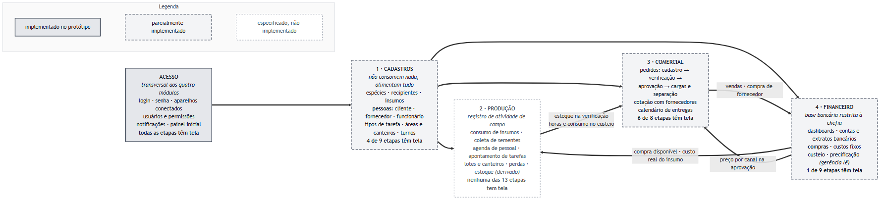
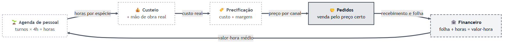
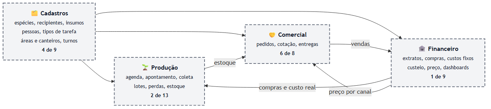
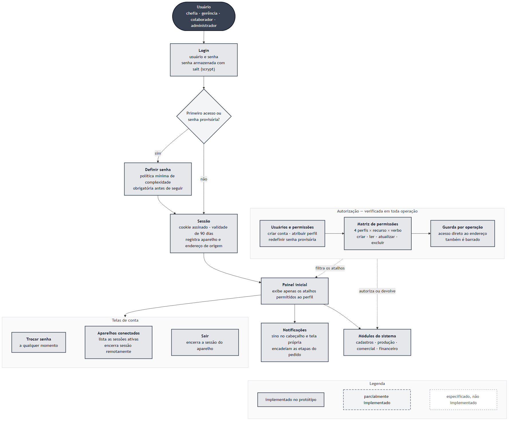
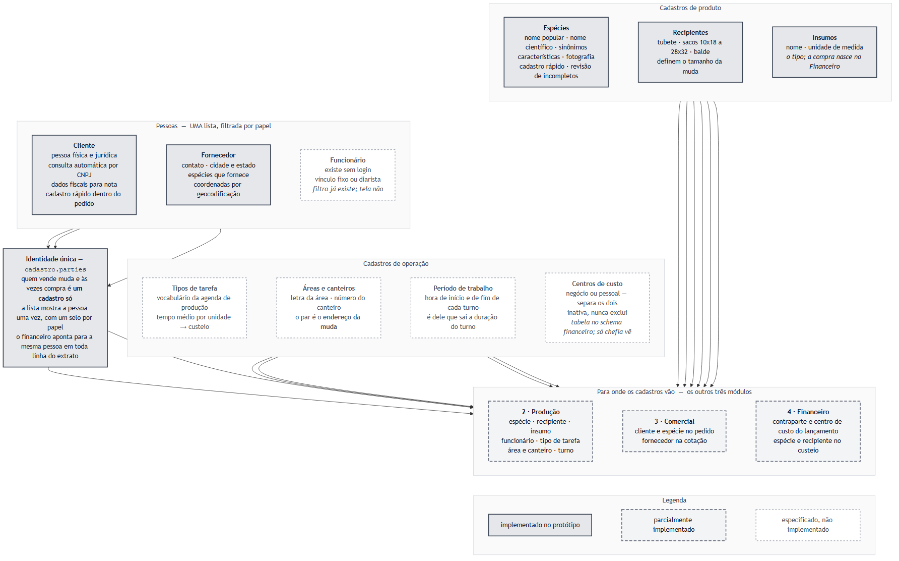
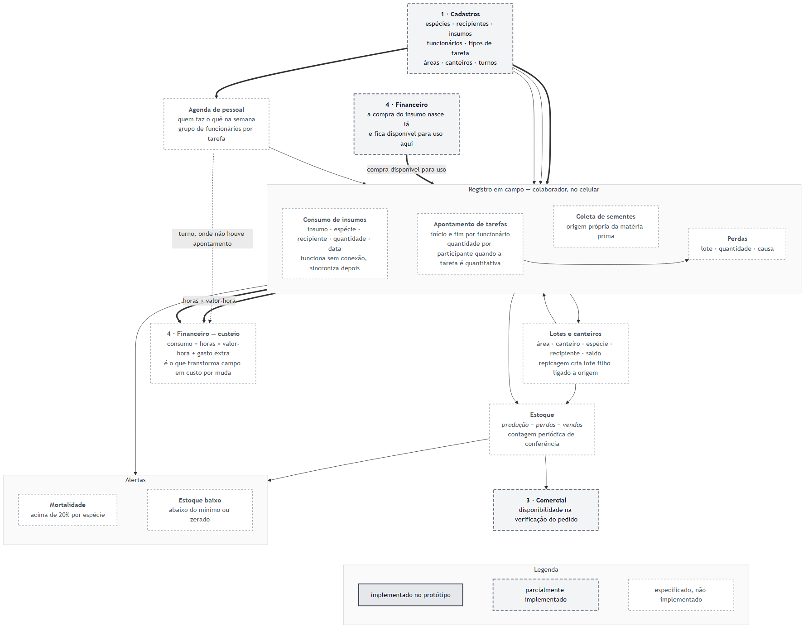
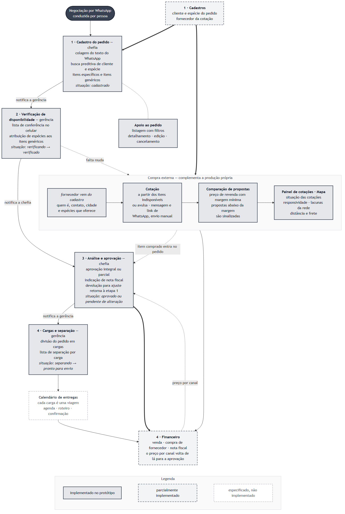
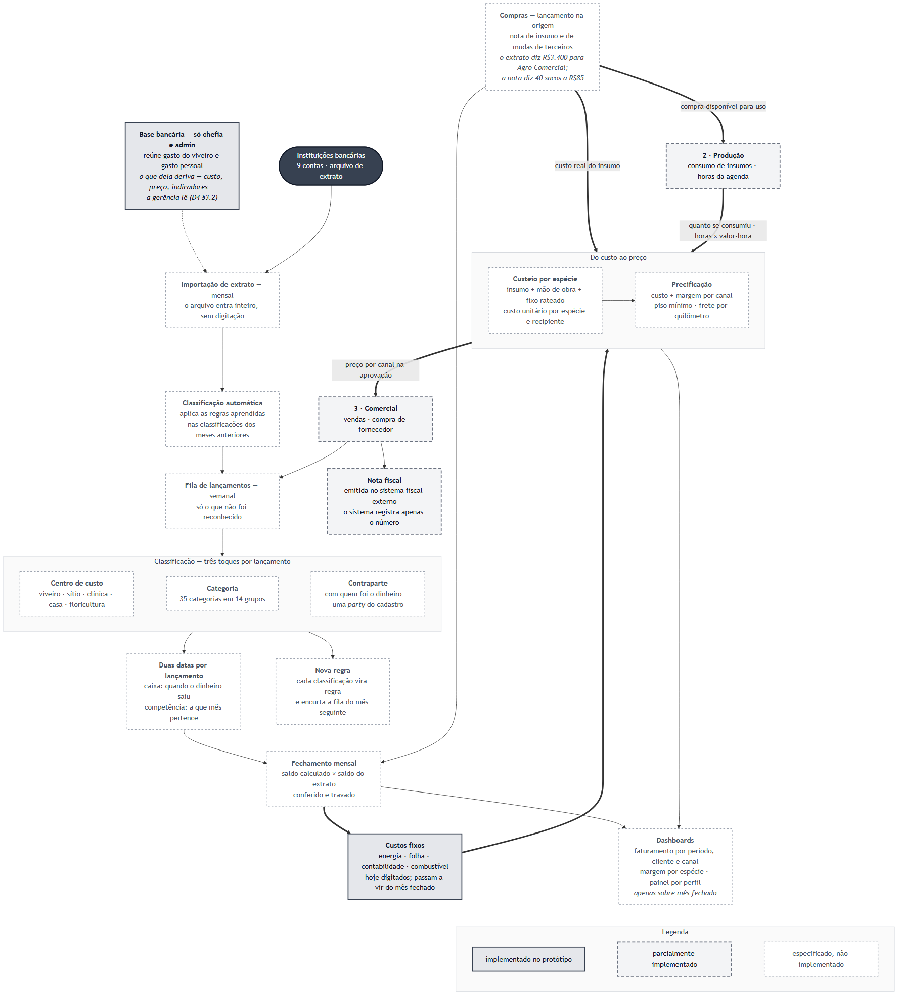

# Mapa de Rotinas

> **O sistema tem quatro módulos**: Cadastros, Produção, Comercial, Financeiro.
> Acesso (login, senha, aparelhos, usuários, notificações) é **transversal**, atravessa os
> quatro e não é módulo de negócio.
>
> Esta é a taxonomia única. Ela está espelhada em quatro lugares que não podem divergir:
> os diagramas desta página, as pastas desta própria pasta (`1-cadastros/` … `4-financeiro/`),
> `src/lib/modules.ts` (a navegação do app) e os comentários de seção de
> `src/lib/permissions.ts` (a matriz do D4). O teste `src/lib/__tests__/modules.test.ts`
> quebra se a navegação sair de linha.
>
> Nos artefatos de engenharia, o mesmo agrupamento organiza os requisitos
> ([`B2 §2`](../engenharia/B-requisitos/B2-especificacao-requisitos.md)), a rastreabilidade
> ([`B5 §2`](../engenharia/B-requisitos/B5-matriz-rastreabilidade.md)), os casos de uso
> ([`C1 §2`](../engenharia/C-modelagem/C1-diagrama-casos-de-uso.md)), o modelo de dados
> ([`C6 §3`](../engenharia/C-modelagem/C6-modelo-entidade-relacionamento.md)), os componentes
> ([`D1 §4`](../engenharia/D-arquitetura/D1-arquitetura-c4.md)) e a matriz de acesso
> ([`D4 §2`](../engenharia/D-arquitetura/D4-matriz-rbac.md)).

## Perfis

| Perfil | Quem | Foco |
|--------|------|------|
| **Chefia** | Gilberto | Vendas, finanças, decisões, entregas |
| **Gerência** | Débora, João | Operação, coordenação, estoque, tarefas |
| **Colaborador** | Rogério, Amélia, Jaison, Mathias, Santilha, Carolayne | Execução no campo |

---

## Como os quatro módulos se relacionam



**Como ler o status.** O critério é contado sobre a tabela de etapas de cada módulo, mais
abaixo nesta página: **cinza sólido** = toda etapa tem tela · **tracejado largo** = parte tem ·
**tracejado fino, sem preenchimento** = nenhuma tem. A fração aparece no próprio nó, porque
"parte tem" cobre tanto o Comercial (6 de 8) quanto o Financeiro (1 de 9).

**Três leituras que o diagrama torna imediatas:**

- **Cadastros não consome nada e alimenta todo mundo.** É o único módulo sem entrada. Por
  isso é rotina própria, e não um canto do `/admin`.
- **O fluxo entre os módulos é um ciclo, não uma fila.** A compra nasce no Financeiro e volta
  para a Produção; o consumo e as horas voltam para o custeio; o preço volta para o Comercial
  na hora de aprovar. Quebrar qualquer elo faz o preço voltar a ser chute.
- **Estoque não é tabela.** É produção menos perdas menos vendas; por isso mora na Produção,
  como resultado, e não em Cadastros.

### O ciclo do dinheiro

O único anel fechado do sistema: hoje quebrado na agenda de pessoal e no apontamento, que são a
única fonte possível de horas. Sem eles, custeio e precificação continuam sendo estimativa.



### A visão do dono



<details>
<summary>Fonte dos diagramas (Mermaid)</summary>

Os arquivos `.mmd` ficam em [`img/`](img/). Para regenerar:

```bash
npm run docs:mapas                    # todos
npm run docs:mapas mapa-2-producao    # só um
```

**A cor mora no `.mmd`; o cinza mora no `.png`.** Os arquivos-fonte usam verde, amarelo e
vermelho: é o que faz sentido num preview de Mermaid, na tela. O
[`scripts/render-mapas.mjs`](../../scripts/render-mapas.mjs) troca essa paleta por uma escala
de cinza numa cópia temporária, renderiza e joga a cópia fora. O que vai para o repositório e
para o TCC é o cinza, que sobrevive à impressão em preto e branco; o que se edita continua
colorido.

As três classes de status chamam-se `ok`, `meio` e `falta` nos oito diagramas: quem
acrescentar um mapa deve usar os mesmos nomes, senão o script não encontra o que trocar. A
largura também mora no script, uma só para todos: antes disso cada mapa tinha sido gerado com
um `-w` diferente, e regerar com o valor errado reescalava a figura sem ninguém perceber.

O PNG é a fonte para leitura e para o TCC; o `.mmd` é a fonte para edição.

`img/mapa-sistema.mmd` é a versão anterior, mantida só como registro do que o mapa dizia antes
da reconciliação dos quatro módulos, e o próprio arquivo abre declarando isso. **Não editar.**
Atenção a um detalhe do gerador: `npm run docs:mapas` sem argumento rerenderiza *todos* os `.mmd`
da pasta, este inclusive, então o PNG superado continua nascendo junto. Ele não é referenciado por
nenhum documento; quem quiser gerar só os vivos passa os nomes na linha de comando.

</details>

---

## 0 · Acesso: transversal



Login, definição e troca de senha, aparelhos conectados, usuários e permissões, notificações
e painel inicial. Não é módulo de negócio: guarda os quatro.

Telas em `/login`, `/trocar-senha`, `/conta/sessoes`, `/notificacoes` e `/admin/usuarios`.
`/admin` ficou **só** com administração de sistema, usuários e sessões.

---

## 1 · Cadastros ([`1-cadastros/`](1-cadastros/00-visao-geral.md))



Rotina **agrupadora**, sem processo próprio. Reúne o que é estável e se repete.

> **Regra de corte: é cadastro se, ao apagá-lo, um movimento passado ficar sem sentido.**

| Etapa | Perfil |
|-------|--------|
| Cadastrar/editar espécie, recipiente, insumo | Gerência |
| Consultar pessoas por papel (`/cadastros/pessoas`) | Chefia / Gerência |
| Cadastrar/editar cliente ([`1-cadastros/clientes.md`](1-cadastros/clientes.md)) | Chefia / Gerência |
| Cadastrar/editar fornecedor | Chefia |
| Cadastrar/editar funcionário | Chefia |
| Cadastrar/editar tipo de tarefa | Gerência |
| Cadastrar/editar área e canteiro ([`2-producao/04-lotes-e-canteiros.md`](2-producao/04-lotes-e-canteiros.md)) | Gerência |
| Definir o período de trabalho ([`2-producao/01-agenda-de-pessoal.md`](2-producao/01-agenda-de-pessoal.md)) | Gerência |
| Cadastrar/inativar centro de custo ([`1-cadastros/centros-de-custo.md`](1-cadastros/centros-de-custo.md)) | Chefia |

**Pessoas são uma identidade só.** Cliente, fornecedor e funcionário são papéis de
`cadastro.parties`: quem vende muda e às vezes compra é um cadastro só. Por isso
`/cadastros/pessoas` é **uma lista com filtro por papel**, e não uma aba por papel: a pessoa
aparece uma vez, com um selo por papel que leva à tela daquele papel. O nome abre a **ficha**
(`/cadastros/pessoas/[id]`), com o histórico dos dois lados, é onde o *quanto compramos e
quanto vendemos* vai aparecer quando o Financeiro existir.

Os papéis vêm filtrados do servidor pelo que o usuário pode ler, `fornecedor:ler` é só de
chefia e admin, então a gerência não vê a rede de fornecedores nem de relance. Funcionário
é filtro sem tela até o P13 T13.3/T13.7.

Área `/cadastros`. As telas de papel mantiveram as URLs antigas (`/clientes`,
`/fornecedores`) porque a rotina de pedidos aponta para elas e `notifications.link` guarda
caminho gravado no banco; o agrupamento é de navegação, não de rota.

## 2 · Produção ([`2-producao/`](2-producao/00-visao-geral.md))



Registro de atividade de campo. Absorve a antiga rotina de Tarefas Diárias e recebe do
Financeiro as compras que ficam disponíveis para uso.

| Etapa | Perfil |
|-------|--------|
| Registrar consumo de insumo (funciona offline) | Colaborador |
| Registrar coleta de sementes | Gerência |
| Montar a agenda da semana ([`2-producao/01-agenda-de-pessoal.md`](2-producao/01-agenda-de-pessoal.md)) | Gerência |
| Ver minhas tarefas de hoje / concluir | Colaborador |
| Apontar início e fim de tarefa na agenda do dia ([`2-producao/05-apontamento-de-tarefas.md`](2-producao/05-apontamento-de-tarefas.md)) | Gerência |
| Montar o protocolo de atividades por tipo de embalagem ([`2-producao/06-protocolo-de-atividades.md`](2-producao/06-protocolo-de-atividades.md)) | Gerência |
| Registro de atividade (semeadura, repicagem, irrigação, adubação) | Colaborador |
| Criar lote e consultar a ocupação do viveiro ([`2-producao/04-lotes-e-canteiros.md`](2-producao/04-lotes-e-canteiros.md)) | Gerência |
| Repicar lote, gerando o lote de destino | Colaborador |
| Registrar entrada de insumo e consultar saldo | Gerência |
| Registro de perda no campo ([`2-producao/03-perdas.md`](2-producao/03-perdas.md)) | Colaborador |
| Análise de perdas por espécie/causa | Gerência |
| Visão geral de estoque por espécie ([`2-producao/02-estoque.md`](2-producao/02-estoque.md)) | Chefia |
| Contagem e atualização de estoque | Gerência |

Área `/producao`.

## 3 · Comercial ([`3-comercial/`](3-comercial/00-visao-geral.md))



| Etapa | Perfil |
|-------|--------|
| Cadastro de pedido (recebe via WhatsApp) | Chefia |
| Verificação de disponibilidade (checklist) | Gerência |
| Aprovação de venda / preço | Chefia |
| Cargas e separação física das mudas | Colaborador |
| Cotação com fornecedor quando falta muda | Chefia |
| Comparação de propostas e escolha | Chefia |
| Agenda de entregas / roteiro | Chefia |
| Confirmação de entrega | Chefia |

Área `/comercial`; as telas continuam em `/pedidos` e `/fornecedores/*`.

## 4 · Financeiro ([`4-financeiro/`](4-financeiro/00-visao-geral.md))



**Este é o módulo restrito do sistema.** A base bancária mistura gasto do viveiro com gasto
pessoal da família e da clínica: extrato, lançamento, compra, custo fixo e fechamento são
de chefia/admin, e a gerência não os abre nem em leitura.

A restrição vale para a **base**, não para tudo que mora aqui. Com os quatro módulos,
custeio, precificação e os painéis vieram para cá, são dinheiro, e quem os alimenta é o
extrato. Mas são números **derivados**: não expõem lançamento nenhum, a gerência precisa
deles para operar e sempre pôde lê-los. É por isso que a matriz do
[`D4`](../engenharia/D-arquitetura/D4-matriz-rbac.md) restringe **por recurso**, e não pela
porta do módulo.

| Etapa | Perfil |
|-------|--------|
| Lançar compra (nota de insumo, mudas de terceiros) | Chefia |
| Classificar a fila de lançamentos (semanal, sexta) | Chefia |
| Importar extrato bancário (mensal, dia 1) | Chefia |
| Fechar o mês (conferir saldo × extrato e travar) | Chefia |
| Manter custos fixos | Chefia |
| Emissão de nota fiscal (sistema do Sebrae; app registra o número) | Chefia |
| Ver faturamento e margem (só sobre mês fechado) | Chefia |
| Consulta de preço, custo unitário e margem por canal | Gerência *(leitura)* |
| Painel de indicadores operacionais: IND-01, 02, 03, 05 | Gerência *(leitura)* |

Área `/financeiro`. **É aqui que a compra nasce**, e é de onde ela fica disponível para a
Produção usar.

---

> **Rotina de Tarefas Diárias:** absorvida pela Produção.
> [`2-producao/99-tarefas-diarias-historico.md`](2-producao/99-tarefas-diarias-historico.md)
> permanece apenas como registro histórico.

---

## Onde cada rotina mora

As pastas seguem os módulos: uma por módulo, na ordem em que o fluxo os percorre. Antes os
arquivos eram `rotina-*.md` soltos na raiz, herança das oito rotinas planas.

```
docs/rotinas/
├── 00-mapa-de-rotinas.md          ← você está aqui
├── img/                            ← os diagramas (.mmd é a fonte, .png é a leitura)
├── 1-cadastros/
│   ├── 00-visao-geral.md           a rotina agrupadora e a regra de corte
│   ├── clientes.md  +  clientes/   cadastro fiscal e o portão da nota
│   ├── centros-de-custo.md         cadastro daqui, tabela no schema `financeiro`
│   └── (fornecedores: plano P11)
├── 2-producao/
│   ├── 00-visao-geral.md           as três subrotinas e o ciclo
│   ├── 01-agenda-de-pessoal.md     o planejamento da semana
│   ├── 02-estoque.md               derivado: produção − perdas − vendas
│   ├── 03-perdas.md
│   ├── 04-lotes-e-canteiros.md     onde a muda está e de que leva veio
│   ├── 05-apontamento-de-tarefas.md  a fonte das horas
│   ├── 06-protocolo-de-atividades.md  o que o lote tem de receber
│   └── 99-tarefas-diarias-historico.md   absorvida; fica como registro
├── 3-comercial/
│   ├── 00-visao-geral.md           pedidos + cotação + entregas
│   ├── pedidos.md  +  pedidos/     as quatro etapas, uma por documento
│   └── entregas.md                 cada carga é uma viagem
└── 4-financeiro/
    ├── 00-visao-geral.md           o extrato é a verdade; quem vê o quê
    ├── 01-cadastro-unico.md        o schema `cadastro`
    ├── 02-schema-financeiro.md     tabelas, listas fechadas e as 8 regras
    └── 03-relacao-com-rotinas.md   como amarra nos outros três módulos
```

**Acesso não tem pasta.** É transversal e não tem rotina de negócio própria: está descrito na
seção 0 desta página e especificado em [`D4`](../engenharia/D-arquitetura/D4-matriz-rbac.md).
